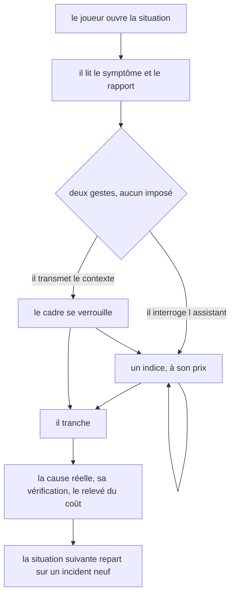
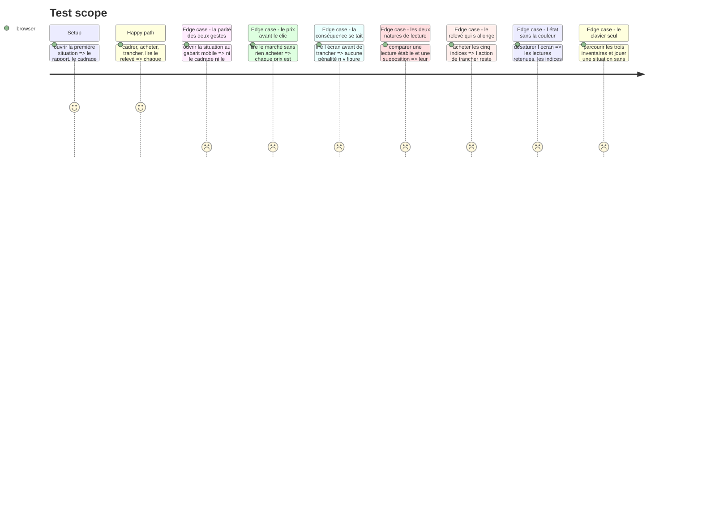

# Instruction: La passe impeccable de la surface

## Architecture projection

> Tree of the final files. ✅ create · ✏️ modify · ❌ delete

```txt
.
├── .impeccable/surfaces/
│   └── ...hint-budget-components-composites-hint-budget-game-tsx.md   ✅ la surface du jeu
├── aidd_docs/tasks/2026_08/2026_08_30_jeu-hint-budget/qa/             ✅ la tournée aux deux gabarits
├── src/games/hint-budget/
│   ├── hooks/use-hint-budget.hook.ts                                  ✏️ si la passe a besoin d une lecture de plus
│   └── components/
│       ├── elements/                                                  ✏️ les trois éléments, resserrés
│       └── composites/                                                ✏️ les trois compositions
└── __tests__/unit/games/hint-budget/
    └── hint-budget-game.test.tsx                                      ✏️ les tests qui verrouillent la passe
```

## Le cadrage de la passe

La passe se lance par `/impeccable craft` sur `src/games/hint-budget/components/composites/hint-budget-game.tsx`. Chaque jeu du parcours a sa propre surface : aucun jeu n'est le gabarit visuel d'un autre. `hint-budget` ouvre le deuxième groupe et sa teinte ; les six surfaces déjà posées ne lui dictent rien qu'une convention de projet ne dicte déjà.

Ce que la passe doit résoudre, et qui est propre à ce jeu :

1. **Deux gestes doivent être pairs, et aucun ne doit être l'étape d'avant l'autre.** C'est la contrainte centrale, et elle est de mesure, pas de goût : le critère `c2` lit *dans quel ordre* le joueur a choisi d'agir. Une surface qui place le cadrage au-dessus du marché d'indices fait le choix à sa place, et le critère ne mesure plus que la capacité à lire de haut en bas. Sur desktop, deux colonnes de même poids répondent. **Sur mobile, l'empilement impose un ordre par construction** : c'est le vrai problème à traiter, et la réponse n'est pas de le décréter résolu.
2. **Trois inventaires de cinq entrées sur un même écran**, plus le rapport d'incident. C'est la surface la plus dense du parcours à ce jour. Elle ne doit pas devenir un mur, et aucun des trois ne doit écraser les deux autres.
3. **Le coût engagé est une quantité, pas un nombre posé dans un coin.** `DESIGN.md` : un état est une quantité — remplissage, taille, épaisseur du filet, jamais une couleur seule ni une opacité. Il doit rester lisible quand il monte, y compris après le relevé d'une situation ratée.
4. **Le relevé des indices achetés s'allonge à mesure qu'on paie.** `DESIGN.md` est explicite : un relevé qui s'allonge ne pousse jamais la décision courante hors de l'écran. Il se plafonne et se replie.
5. **L'achat est unitaire, payant et irréversible.** Le prix se lit avant le clic, sur chaque indice, sans survol ni dépliage. Rien ne doit ressembler à une action qui prendrait plusieurs indices d'un coup.
6. **Une lecture établie et une supposition se rendent exactement pareil.** Une nuance de ton, de longueur ou de position suffirait à faire gagner le cadrage sans lire le rapport, et le corpus n'y peut rien — c'est la surface qui trahirait.
7. **La révélation pose la cause et le relevé, jamais une note sur le cadrage.** La tentation sera forte d'y ajouter « vous aviez transmis deux suppositions » : ce serait annoncer le critère, et rendre les situations 2 et 3 sans objet.

## La ligne à ne pas franchir

`DESIGN.md` : « Un jeu ne dit jamais ce qu'il note. Le contrat annonce le cadre, jamais les critères. »

| S'énonce | Se tait |
| --- | --- |
| Que le cadre se transmet une seule fois, et se verrouille | Que l'ordre des deux gestes est lu |
| Le prix de chaque indice, avant l'achat | Qu'acheter beaucoup coûte un critère |
| Que l'ordre des deux gestes est libre | Qu'il en existe un qui vaut mieux |
| La situation courante sur le total | Le compte des situations déjà résolues, et les seuils |
| Le coût engagé, à mesure qu'il monte | Qu'une tranche fausse est pénalisée, et qu'une tranche à l'aveugle l'est davantage |

Avant la révélation, l'écran ne doit porter **aucune** trace de la cause réelle, de la nature d'une lecture de cadrage, ni du contenu d'un indice non acheté. La phase 3 le tient par construction — le hook ne les expose pas — et la passe ne doit pas rouvrir ce chemin pour un effet visuel.

## User Journey



## Test Scope



## Tasks to do

### `1)` La fiche de surface

1. Lancer `/impeccable craft` sur `src/games/hint-budget/components/composites/hint-budget-game.tsx`.
2. La passe produit sa fiche sous `.impeccable/surfaces/`, comme les six surfaces déjà posées.

### `2)` La passe elle-même

1. Traiter les sept points du cadrage, dans cet ordre de priorité : la parité des deux gestes au gabarit mobile, la densité des trois inventaires, le relevé qui s'allonge.
2. Ne rien exposer de neuf depuis le hook sans le justifier : une lecture de plus est une fuite potentielle.
3. Si la parité mobile ne se tient pas sans introduire un motif d'interface propre à ce jeu, l'écrire dans la fiche et dans ce fichier plutôt que de la déclarer acquise — le produit compte vingt jeux, et un motif introduit pour un seul se paie ailleurs.

### `3)` Les tests qui verrouillent la passe

1. Étendre `hint-budget-game.test.tsx` avec les situations du Test Scope vérifiables en test unitaire : le prix lisible avant l'achat, l'absence de toute mention de pénalité avant la tranche, l'identité de présentation des deux natures de lecture, l'ordre de parcours au clavier.
2. Un test doit casser si la présentation d'une lecture de cadrage dépend de sa nature.
3. Un test doit casser si la révélation se met à qualifier le cadrage.

### `4)` La tournée navigateur

1. Jouer `s1` et `s3` aux deux gabarits, `1440×900` et `390×844`, sur `npm run dev`. Session posée directement sur `g2-1` par un instantané de `laivel-eval.session`.
2. Mesurer à `scrollY = 0` **vérifié explicitement** : l'application est une SPA, et un clic précédent laisse le document défilé. C'est l'erreur de mesure qui a contaminé la tournée de `lie-detector`, corrigée après revue.
3. Mesurer la position du marché d'indices et celle du cadrage au gabarit mobile, et la position de l'action de trancher après cinq achats.
4. Déposer les captures et les mesures dans `qa/`.

## Test acceptance criteria

| Task | Acceptance criteria |
| --- | --- |
| 1 | La fiche de surface existe et nomme la stratégie retenue pour ce jeu |
| 2 | Au gabarit mobile, le cadrage et le marché d'indices sont atteignables au même coût de geste — ou l'écart est mesuré, nommé et assumé par écrit |
| 2 | Une lecture établie et une supposition sont rendues avec exactement la même structure et le même ton |
| 2 | Après cinq achats, l'action de trancher reste atteignable sans défilement aux deux gabarits |
| 3 | Un test échoue si la présentation d'une lecture de cadrage dépend de sa nature |
| 3 | Un test échoue si la révélation qualifie le cadrage |
| 3 | `npm run lint`, `npm run typecheck` et `npm run test` passent |
| 4 | La tournée aux deux gabarits est déposée dans `qa/`, mesurée à `scrollY = 0` vérifié |

## Correction du 30/08, après revue

La revue indépendante a bloqué cette phase sur deux critères d'acceptation, tous deux de la ligne 2 ci-dessus, et sur la tournée de la ligne 4. Les trois sont repris ici avec leur état réel, sans les déclarer acquis par défaut.

**« Au même coût de geste » (mobile) — repris, tenu partiellement, l'écart restant assumé par écrit plutôt que caché.**

Le premier livrable posait `grid-cols-2` sans point de rupture : la parité visuelle qu'il tenait était une tautologie de `align-items: stretch` entre deux frères d'une même rangée CSS Grid, pas une propriété de la mise en page. Elle ne tenait ni la lisibilité (chaque colonne à ~170px sur mobile repliait une lecture de cadrage sur sept lignes d'une quatorzaine de caractères) ni le clavier (le marché restait six arrêts de tabulation derrière le cadrage, dans toutes les situations, sans exception — donc un biais systématique sur la mesure même que `c2` observe).

Repris ainsi :
- `hint-budget-game.tsx` passe à `grid-cols-1 sm:grid-cols-2`, le même point de rupture que `CutPanel` applique déjà à ses causes — l'incohérence entre les deux grilles du même écran est résolue dans le même geste. Lisibilité vérifiée : plus aucune ligne repliée caractère par caractère (`aidd_docs/tasks/2026_08/2026_08_30_jeu-hint-budget/qa/mobile-1-s1-ouverture.png`).
- L'ordre DOM des deux panneaux **alterne selon la parité de la situation** plutôt que de fixer le cadrage en tête partout : mesuré sur le corpus réel, `s1` et `s3` cadrage en tête, `s2` marché en tête. Le clavier suit : 6 arrêts du cadrage au marché sur `s1`, 5 arrêts du marché au cadrage sur `s2` — le marché n'est plus *systématiquement* le plus loin.

Ce que ça ne tient pas, et qui n'est pas caché : sur un **même écran**, empilé sur une colonne, l'un des deux panneaux est nécessairement rendu avant l'autre — c'est une conséquence structurelle de l'empilement à une colonne, pas un oubli de cette passe. Introduire un motif capable de vraiment égaliser les deux gestes sur un seul écran (onglets, bascule, disposition en grille CSS forcée à deux colonnes même très étroites) aurait été un motif d'interface propre à ce seul jeu — ce que le mandat de la phase interdit explicitement (« le produit compte vingt jeux, un motif introduit pour un seul se paie ailleurs »). L'alternance retenue reste dans le vocabulaire déjà posé par le produit (l'ordre DOM d'une liste de contenus équivalents) et élimine le biais systématique, sans prétendre à une parité par écran qu'aucune solution sans motif propre ne peut tenir. Mesures complètes : `qa/README.md`, « Point 1 ».

**« Après cinq achats, trancher reste atteignable sans défilement » — non tenu, à l'ouverture déjà, aux deux gabarits, et le renvoi au défaut transverse était inexact.**

Mesuré : 610px de dépassement desktop et 1436px mobile **dès l'ouverture** d'une situation, avant tout achat — acheter cinq indices ne fait qu'améliorer légèrement la situation (delta de hauteur documentaire négatif aux deux gabarits, voir `qa/README.md` « Point 3 »), il ne peut pas corriger un dépassement déjà présent à l'ouverture.

Le renvoi initial à `aidd_docs/backlog/defects/la-revelation-pousse-l-action-hors-de-l-ecran.md` était inexact : ce ticket est délimité à l'état *révélation* et à l'action de *passage*, chez `lie-detector` et `defect-hunt` seuls, et son Impact repose sur le fait qu'aucun critère ne dépend de la position du bouton de passage. Ici, le geste hors écran à l'ouverture est **trancher** — le geste que `c1` observe, via `solved` — et `hint-budget` n'y est pas listé. Un défaut propre a été ouvert : `aidd_docs/backlog/defects/l-ouverture-de-hint-budget-pousse-le-tranchage-hors-de-l-ecran.md`, qui cite ce ticket comme voisin plutôt que comme couverture. Non corrigé dans cette branche : la densité du corpus (rapport + deux colonnes + trois causes) est un plancher fixé en phase 4, que cette passe ne peut pas réduire sans rouvrir le corpus.

**Ce que la tournée a aussi corrigé** : les six captures mobiles de la première tournée étaient prises en viewport à `scrollY = 0`, alors que la grille cadrage/marché commence sous le pli aux deux gabarits — elles n'en montraient aucun pixel, malgré un README qui affirmait le contraire. La tournée reprise capture en page pleine (`fullPage: true`) partout où une mesure de contenu est en jeu, et ne garde le viewport que pour une capture d'ouverture explicitement nommée « ce qu'un joueur voit sans défiler ». Détail dans `qa/README.md`.
