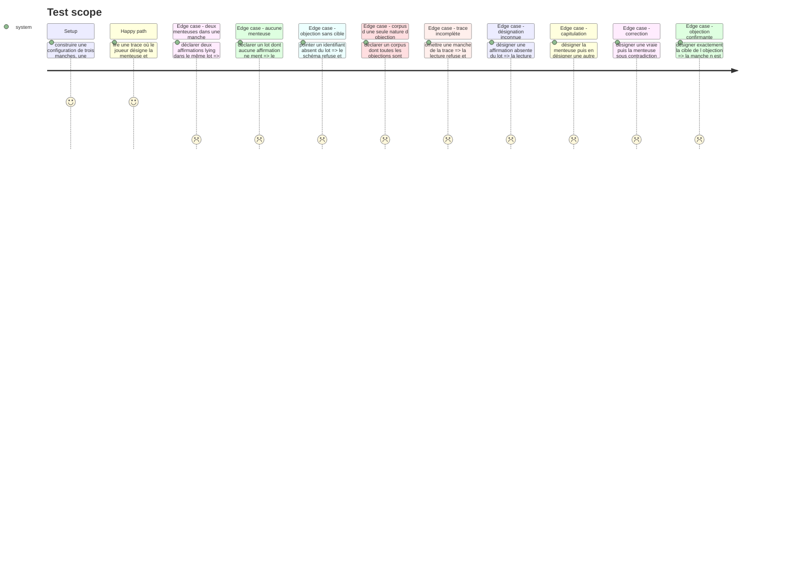

# Instruction: Les contrats et la lecture pure des manches

## Architecture projection

> Tree of the final files. ✅ create · ✏️ modify · ❌ delete

```txt
.
├── src/games/lie-detector/
│   ├── schema/
│   │   ├── config.schema.ts                    ✅ ce qu un auteur de parcours écrit, et ses six refus
│   │   └── answer.schema.ts                    ✅ la trace des désignations, et sa vérification contre la config
│   └── helpers/
│       └── read-rounds.helper.ts               ✅ la lecture pure, partagée par l écran et l évaluateur
└── __tests__/unit/games/lie-detector/
    ├── config.schema.test.ts                   ✅
    ├── answer.schema.test.ts                   ✅
    └── read-rounds.test.ts                     ✅
```

## Test Scope



## Tasks to do

### `1)` Le schéma de configuration

> Ce qu'un auteur de parcours écrit pour ce jeu, et rien de plus.

1. Créer `src/games/lie-detector/schema/config.schema.ts`.
2. Poser `claimSchema` : `id` non vide, `text` non vide, `lying` booléen, `verification` non vide. Documenter que `verification` porte **les deux sens** — à quoi l'affirmation se vérifie quand elle est vraie, pourquoi elle est fausse quand elle ment — et qu'elle n'est montrée qu'à la révélation.
3. Poser `objectionSchema` : `targetId` non vide, `argument` non vide.
4. Poser `roundSchema` : `id` non vide, `prompt` non vide (la mise en situation du lot), `claims` (au moins 4), `objection`.
5. Poser le schéma de base : `statement` non vide — même nom que les cinq autres jeux, deux jeux ne nomment pas différemment la même chose — et `rounds` (au moins 3).
6. Ajouter les six refus au chargement, en `superRefine`, chacun avec son `path` et sa phrase en français :
   - deux manches de même `id` ;
   - deux affirmations de même `id` dans une manche ;
   - une manche sans aucune affirmation `lying` ;
   - une manche avec plus d'une affirmation `lying` ;
   - une `objection.targetId` absente des affirmations de sa manche ;
   - un corpus dont **toutes** les objections sont de la même nature — que des fondées, ou que des creuses.
7. Documenter le dernier refus comme le garde-fou anti-triche du jeu : sans lui, une politique fixe gagne sans lire.
8. Exporter les types `Claim`, `Objection`, `Round`, `LieDetectorConfig`.

### `2)` Le schéma de trace

> La suite des désignations est la réponse.

1. Créer `src/games/lie-detector/schema/answer.schema.ts`.
2. Poser `pickSchema` : `roundId`, `firstPickId`, `finalPickId`, tous non vides.
3. Poser `lieDetectorAnswerSchema` : `picks`, au moins une entrée.
4. Documenter qu'aucun champ dérivé n'entre dans la trace : démasquée, contredite et capitulation se recalculent depuis ces trois identifiants et la configuration.
5. Poser trois erreurs nommées, sur le modèle de `confidence-bet` : `IncompleteTraceError` (une manche de la configuration n'est pas couverte), `UnknownRoundError` (une désignation vise une manche absente), `UnknownClaimError` (une désignation vise une affirmation absente de sa manche — porter l'identifiant fautif **et** la manche).
6. Poser `parseLieDetectorTrace(answer, config)` : parse le schéma, puis vérifie la trace contre la configuration — une entrée par manche, exactement, aucune en double, chaque désignation connue de sa manche.
7. Documenter pourquoi une manche sans désignation n'est **pas** recevable ici, contrairement à la revue vide de `defect-hunt` : désigner est le geste même du jeu, l'écran ne laisse pas passer une manche sans désignation, donc une trace qui en porte une est forgée.

### `3)` La lecture pure des manches

> Une seule lecture, que l'écran et l'évaluateur partagent.

1. Créer `src/games/lie-detector/helpers/read-rounds.helper.ts`.
2. Exporter `RoundReading` : `roundId`, `liarId`, `firstPickId`, `finalPickId`, `objectionTargetId`, `contradicted`, `unmasked`, `capitulated`.
3. Définir chaque lecture en une ligne de code et une ligne de commentaire :
   - `contradicted` : la cible de l'objection diffère de la première désignation ;
   - `unmasked` : la désignation **finale** vise la menteuse ;
   - `capitulated` : la manche est contredite, la première désignation visait la menteuse, la finale ne la vise plus.
4. Exporter `Reading` : `rounds`, `unmaskedCount`, `contradictedCount`, `capitulationCount`.
5. Exporter `readRounds(config, trace): Reading`.
6. Documenter que `capitulated` ne peut être vrai que si `contradicted` l'est : une objection qui confirme n'exerce aucune pression, et une manche non contredite ne peut donc pas produire de capitulation.

### `4)` Les tests

1. `config.schema.test.ts` : une configuration valide passe ; chacun des six refus est vérifié séparément, sur son message et son `path`.
2. `answer.schema.test.ts` : une trace complète passe ; les trois erreurs nommées sont levées sur leur cas ; une trace qui couvre deux fois la même manche est refusée.
3. `read-rounds.test.ts` : les quatre situations de la story — maintien juste, capitulation, correction, objection confirmante — plus le décompte agrégé.

## Test acceptance criteria

| Task | Acceptance criteria |
| --- | --- |
| 1 | Une configuration dont toutes les objections pointent une affirmation vraie est refusée au chargement, en nommant le corpus |
| 1 | Une manche à zéro ou deux menteuses est refusée, en nommant la manche |
| 2 | Une trace qui omet une manche, ou qui désigne une affirmation absente du lot, lève l'erreur nommée qui porte l'identifiant fautif |
| 3 | La lecture d'une manche où le joueur a désigné exactement la cible de l'objection rend `contradicted: false` et `capitulated: false` |
| 3 | La lecture d'une manche où une désignation juste est abandonnée sous contradiction rend `capitulated: true` et `unmasked: false` |
| 3 | La lecture d'une manche où une désignation fausse est corrigée vers la menteuse rend `capitulated: false` et `unmasked: true` |
| 4 | `npm run lint`, `npm run typecheck` et `npm run test` passent |
