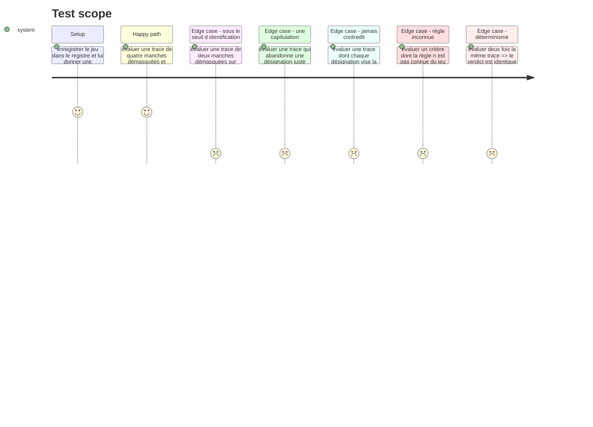

# Instruction: L'évaluateur et ses deux règles

## Architecture projection

> Tree of the final files. ✅ create · ✏️ modify · ❌ delete

```txt
.
├── src/games/
│   ├── lie-detector/
│   │   └── lie-detector.evaluator.ts           ✅ le point de contact public avec le port
│   └── register-games.ts                       ✏️ un bloc de plus, rien d autre ne bouge
└── __tests__/unit/games/lie-detector/
    └── evaluator.test.ts                       ✅
```

## Test Scope



## Tasks to do

### `1)` L'évaluateur

> Il interprète des règles déclaratives : déplacer un seuil se fait dans le parcours, pas ici.

1. Créer `src/games/lie-detector/lie-detector.evaluator.ts`, à la **racine** du dossier du jeu et non sous `actions/` : c'est le point de contact public avec le port `GameEvaluator`.
2. Parser la configuration, puis la trace via `parseLieDetectorTrace`, puis lire les manches **une seule fois** via `readRounds` — jamais un recalcul propre à chaque règle.
3. Poser `lies-unmasked-at-least` : `unmaskedCount >= threshold`, borne incluse, le seuil lu dans la règle.
4. Poser `no-capitulation` : satisfait quand `opportunityCount >= minOpportunities` **et** `capitulationCount === 0`, le seuil lu dans la règle — sur le modèle de `lies-unmasked-at-least`. La règle ne tolère toujours aucune capitulation, et son nom le dit toujours ; ce qui change est le plancher d'occasions requis pour que « ne pas capituler » démontre quelque chose. **Corrigé le 30/08, après revue (F1) :** la première écriture comptait `contradictedCount`, les manches contredites. Or être contredit ne suppose que d'avoir désigné autre chose que la cible de l'objection — un joueur qui se trompe partout est contredit partout et ne peut jamais capituler, faute d'avoir eu raison. Il décrochait le critère sans avoir rien lu. `opportunityCount` compte les manches où, en plus d'être contredit, la première désignation visait déjà la menteuse — le seul cas où tenir démontre quelque chose. **Second arbitrage du 30/08, après le challenge :** le seuil était fixé à une occasion (`opportunityCount > 0`), codé en dur. Passé en force brute sur les 256 parties possibles d'un joueur qui désigne au hasard et ne bouge jamais, une seule occasion suffisait dans 57,8 % des cas. `minOpportunities: 2`, porté par la règle plutôt que par le code, fait tomber ce taux à 15,6 %.
5. Documenter en commentaire le refus de la vacuité sur `no-capitulation` — un joueur que l'assistant n'a jamais contredit n'a rien démontré, et la jurisprudence du projet est `kinds-found-including` chez `defect-hunt`, où un critère sans matière ressort manqué.
6. Poser `UnknownRuleError` sur le modèle des cinq autres jeux, avec le type de règle et le nom du jeu dans le message.
7. Grouper les lectures que les règles consomment dans un type `VerdictInputs` local plutôt que d'allonger la signature : la limite du projet est de cinq paramètres.

### `2)` Le câblage domaine

1. Ajouter le bloc `lie-detector` dans `src/games/register-games.ts` : évaluateur, `configSchema`, `answerSchema`. Rien d'autre ne bouge dans ce fichier.

### `3)` Les tests

1. `evaluator.test.ts` : les six situations du Test Scope, chacune sur une trace construite à la main.
2. Vérifier le déterminisme explicitement : deux appels sur la même trace rendent le même tableau de verdicts.

## Test acceptance criteria

| Task | Acceptance criteria |
| --- | --- |
| 1 | Une trace de quatre manches démasquées sans capitulation satisfait les deux critères |
| 1 | Une trace dont aucune manche n'a été contredite fait ressortir `no-capitulation` manqué |
| 1 | Une règle absente du jeu lève `UnknownRuleError` en nommant la règle et le jeu |
| 2 | Le registre résout `lie-detector` vers son évaluateur et ses deux schémas |
| 3 | `npm run lint`, `npm run typecheck` et `npm run test` passent |
