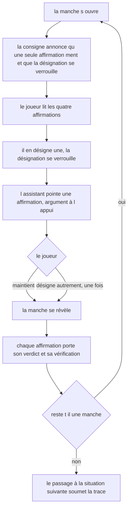
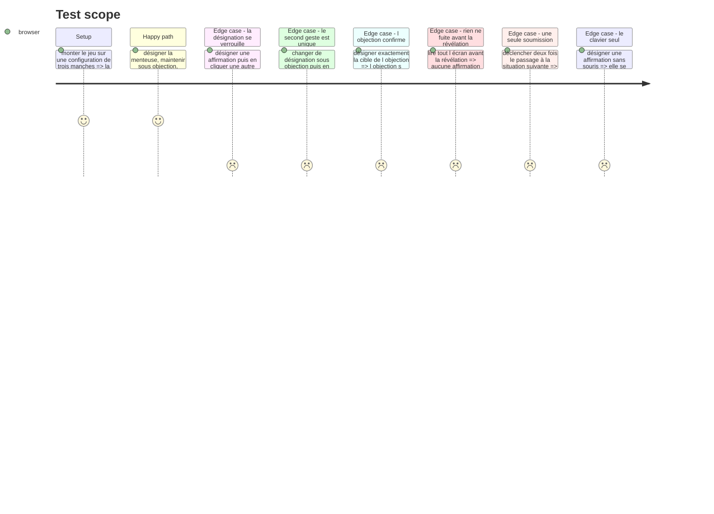

# Instruction: Le jeu à l'écran, sa désignation et son objection

## Architecture projection

> Tree of the final files. ✅ create · ✏️ modify · ❌ delete

```txt
.
├── src/games/
│   ├── lie-detector/
│   │   ├── actions/
│   │   │   └── build-lie-detector-answer.action.ts   ✅ la trace, testable hors React
│   │   ├── hooks/
│   │   │   └── use-lie-detector.hook.ts              ✅ le cycle de vie de la partie
│   │   └── components/
│   │       ├── elements/
│   │       │   ├── claim-card.tsx                    ✅ une affirmation, son état, son verdict
│   │       │   └── objection-note.tsx                ✅ ce que l assistant rétorque
│   │       └── composites/
│   │           ├── round-sheet.tsx                   ✅ le lot, l objection, la révélation
│   │           └── lie-detector-game.tsx             ✅ la racine du jeu
│   └── register-components.ts                        ✏️ le jumeau interface du câblage
└── __tests__/unit/games/lie-detector/
    ├── build-answer.test.ts                          ✅
    ├── use-lie-detector.test.ts                      ✅
    └── lie-detector-game.test.tsx                    ✅
```

## User Journey



## Test Scope



## Wireframe

```txt
Temps 1 — désigner

┌──────────────────────────────────────────────────────────────────┐
│ (1) Consigne                                    (2) MANCHE 2 / 4  │
├──────────────────────────────────────────────────────────────────┤
│ (3) La mise en situation du lot                                   │
├──────────────────────────────────────────────────────────────────┤
│ (4) Les quatre affirmations                                       │
│   ┌────┬────────────────────────────────────────────────────┐     │
│   │ ○  │ Un contexte de projet transféré à un autre …        │     │
│   ├────┼────────────────────────────────────────────────────┤     │
│   │ ○  │ Un code qui compile est un code correct …           │     │
│   └────┴────────────────────────────────────────────────────┘     │
├──────────────────────────────────────────────────────────────────┤
│ (5) Votre désignation se verrouille au clic                       │
└──────────────────────────────────────────────────────────────────┘

Temps 2 — tenir ou se dédire

┌──────────────────────────────────────────────────────────────────┐
│ (1) Consigne                                    (2) MANCHE 2 / 4  │
├──────────────────────────────────────────────────────────────────┤
│ (4) Les quatre affirmations, la vôtre marquée                     │
│   ┌────┬────────────────────────────────────────────────────┐     │
│   │ ◉  │ …                                    désignée      │     │
│   └────┴────────────────────────────────────────────────────┘     │
├──────────────────────────────────────────────────────────────────┤
│ (6) L assistant : « je pense que c est la troisième qui ment,     │
│     parce que … »                                                 │
├──────────────────────────────────────────────────────────────────┤
│ (7) [ Je maintiens ]      ou désignez-en une autre, une fois      │
└──────────────────────────────────────────────────────────────────┘

Temps 3 — la révélation

┌──────────────────────────────────────────────────────────────────┐
│ (8) Le relevé de la manche : ce que vous avez désigné, puis tenu  │
├──────────────────────────────────────────────────────────────────┤
│ (9) Les quatre affirmations figées, chacune avec sa vérification  │
│   ┌────┬────────────────────────────────────────────────────┐     │
│   │ ✖  │ …                    c est elle qui ment · parce…  │     │
│   ├────┼────────────────────────────────────────────────────┤     │
│   │ ✔  │ …                    vraie · se vérifie à …        │     │
│   └────┴────────────────────────────────────────────────────┘     │
├──────────────────────────────────────────────────────────────────┤
│ (10) [ Manche suivante ]   ·   [ Situation suivante ] à la fin    │
└──────────────────────────────────────────────────────────────────┘
```

1. Consigne : le cadre — une seule affirmation ment par manche, la désignation se verrouille, l'assistant donnera son avis ensuite et il sera alors possible de désigner autrement une fois. **Jamais** que l'assistant se trompe parfois, jamais les seuils.
2. La manche courante sur le total. Le joueur sait où il en est, jamais ce qu'il a marqué jusque-là : un compteur de réussites transformerait les dernières manches en calcul de seuil.
3. La mise en situation : ce sur quoi l'assistant affirme. Elle rend les affirmations comparables entre elles.
4. Les affirmations : le moment focal. Chaque ligne est une cible, l'état désigné est porté par un signe, jamais par la seule couleur.
5. Le coût du geste, annoncé avant qu'il soit posé, comme l'exige `DESIGN.md`.
6. L'objection : du texte de configuration, présenté comme un avis de l'assistant. Une seule formulation, qu'elle contredise ou qu'elle confirme.
7. Le second geste : maintenir explicitement, ou désigner autrement. Les deux chemins mènent à la révélation, et aucun n'est présenté comme le bon.
8. Le relevé de la manche : des faits — ce qui a été désigné, ce qui a été tenu. Aucun verdict de critère.
9. La révélation : chaque affirmation, la menteuse comme les vraies, avec sa vérification. C'est ce que le joueur emporte.
10. Le passage à la manche suivante, ou à la situation suivante — qui soumet la trace déjà figée.

## Tasks to do

### `1)` L'action de construction de trace

> Testable hors React, comme les cinq autres jeux.

1. Créer `src/games/lie-detector/actions/build-lie-detector-answer.action.ts`.
2. `buildLieDetectorAnswer(config, picks)` construit la trace dans l'**ordre des manches de la configuration**, jamais dans l'ordre où le joueur a joué : la trace ne doit pas dépendre d'un ordre d'écran.
3. Elle repasse par `parseLieDetectorTrace` avant de rendre : ce que l'écran produit se vérifie contre le même contrat que ce que l'évaluateur consomme.

### `2)` Le hook du jeu

> Le cycle de vie React de la partie, et rien d'autre.

1. Créer `src/games/lie-detector/hooks/use-lie-detector.hook.ts`.
2. Valider la configuration une seule fois, en `useMemo` : elle ne change pas en cours de partie.
3. Tenir trois états : l'index de la manche courante, la phase de la manche (`picking` · `objection` · `revealed`), et les désignations déjà posées.
4. Exposer `designate(claimId)` : elle ne fait rien si la phase ne l'autorise pas. En phase `picking` elle pose la première désignation et bascule sur `objection` ; en phase `objection` elle remplace la désignation finale et bascule sur `revealed`. Le verrou tient par **l'absence de chemin**, jamais par une garde décorative.
5. Exposer `hold()` : maintient la désignation courante et bascule sur `revealed`.
6. Exposer `advance()` : passe à la manche suivante, ou soumet la trace **une seule fois** à la dernière manche, via un `useRef` d'appel unique, sur le modèle de `useDefectHunt`.
7. Le hook **n'expose jamais** `lying`, ni la nature de l'objection, avant que la manche soit révélée. Ce qui n'est pas exposé ne peut pas fuiter à l'écran.
8. Exposer, pour la révélation seulement, la lecture de la manche courante issue de `readRounds` — jamais un calcul refait ici.

### `3)` Les composants

> Muets, sans logique. La logique vit dans le hook et le helper.

1. `elements/claim-card.tsx` : une affirmation, son état (`libre` · `désignée` · `pointée par l'assistant`), et après révélation son verdict et sa vérification. Un bouton, pour l'atteignabilité au clavier native.
2. `elements/objection-note.tsx` : l'avis de l'assistant, sa cible et son argument. Une seule formulation, qui ne change pas selon ce que le joueur a désigné.
3. `composites/round-sheet.tsx` : la manche — la mise en situation, les quatre affirmations, l'objection quand elle est là, la révélation quand elle est là.
4. `composites/lie-detector-game.tsx` : la racine — la consigne, la manche courante sur le total, la feuille de manche, l'action de passage.

### `4)` Le câblage interface

1. Ajouter le bloc `lie-detector` dans `src/games/register-components.ts`. Rien d'autre ne bouge.

### `5)` Les tests

1. `build-answer.test.ts` : l'ordre de la trace suit la configuration ; une désignation inconnue est refusée à la construction.
2. `use-lie-detector.test.ts` : les trois phases, le verrou de la première désignation, l'unicité du second geste, la soumission unique.
3. `lie-detector-game.test.tsx` : les huit situations du Test Scope, dont la fuite — avant la révélation, le DOM rendu ne contient ni la vérification d'une affirmation, ni aucun mot qui distingue la menteuse.

## Test acceptance criteria

| Task | Acceptance criteria |
| --- | --- |
| 1 | La trace soumise porte une entrée par manche, dans l'ordre de la configuration |
| 2 | Cliquer une seconde affirmation en phase `picking` ne déplace pas la désignation |
| 2 | Après le second geste, aucune fonction exposée ne change plus la désignation de la manche |
| 2 | Deux appels à `advance()` sur la dernière manche ne soumettent qu'une fois |
| 3 | Avant la révélation, le texte rendu ne contient aucune vérification et ne nomme pas la menteuse |
| 3 | L'état d'une affirmation se lit sans la couleur : un signe et un libellé le portent |
| 4 | Le parcours résout `lie-detector` vers son composant |
| 5 | `npm run lint`, `npm run typecheck` et `npm run test` passent |
