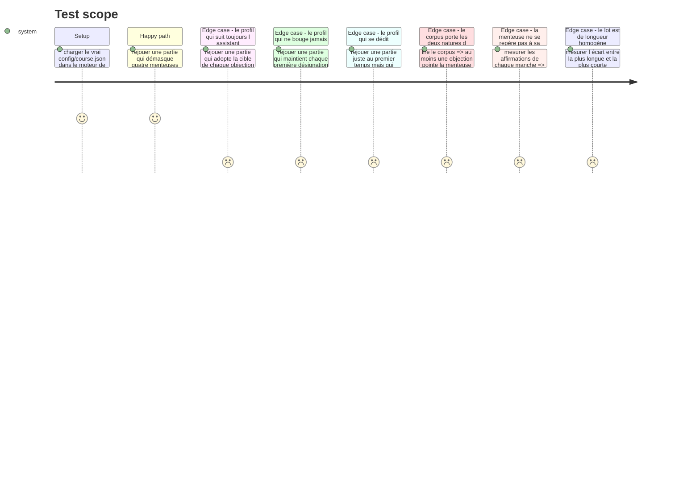

# Instruction: Le jeu dans le parcours, et son corpus

## Architecture projection

> Tree of the final files. ✅ create · ✏️ modify · ❌ delete

```txt
.
├── config/course.json                                  ✏️ la situation g1-3 remplace son placeholder test-bench
└── __tests__/integration/course-run/
    └── lie-detector-run.test.ts                        ✅ le parcours réel, joué de bout en bout
```

## Test Scope



## Le corpus

Quatre manches, quatre affirmations chacune. Les textes ci-dessous sont **définitifs** : les recopier mot pour mot dans `config/course.json`, sans les reformuler.

Chaque affirmation porte sa `verification` — à quoi elle se vérifie quand elle est vraie, pourquoi elle est fausse quand elle ment. Elle n'apparaît qu'à la révélation.

### La longueur est une contrainte du corpus, pas un détail de rédaction

**Correction du 30/08, après la première transcription.** La première écriture de ce corpus posait des textes libres, et deux menteuses sur quatre se trouvaient être l'affirmation **la plus longue** de leur lot — 143 caractères contre 111 à 133 autour. Un joueur pressé y trouve la bonne réponse sans lire : le lot le plus argumenté est celui qui se défend, donc celui qui ment. Le jeu mesurait alors la reconnaissance d'un motif de mise en forme, ce qu'il est justement écrit pour ne pas mesurer.

Deux garde-fous en sortent, tous deux mesurés sur `text.length` — les caractères, une seule métrique, parce qu'un décompte de mots compte la ponctuation isolée comme un mot et rend le test bruité :

1. Dans chaque manche, la menteuse n'est **ni la plus longue ni la plus courte** du lot.
2. Dans chaque manche, l'écart entre la plus longue et la plus courte ne dépasse pas **un quart** de la plus longue. Le premier garde-fou seul autorisait encore un lot allant de 80 à 168 caractères, où la menteuse est au milieu mais où deux affirmations se signalent par leur taille.

Les textes ci-dessous ont été réécrits pour les tenir, sens inchangé. Une retouche future d'un seul mot peut rouvrir le trou : c'est le rôle des deux tests.

**Ajout du 30/08, après revue (constat mobile).** Ces deux garde-fous bornent un écart *interne* à la manche : ils empêchent la menteuse de se trahir par sa forme, mais ne bornent aucune longueur absolue. Un corpus réécrit dans les clous du quart pouvait donc faire passer une affirmation de trois à quatre lignes sur mobile (390×844), ce qui coûte environ 19px — plus du double des 9px de marge mesurés sur ce même corpus — sans qu'aucun des deux tests ne rougisse. Un troisième garde-fou en sort, cette fois posé au schéma plutôt qu'au test d'intégration, pour être appris au chargement :

3. Aucune affirmation ne dépasse **133 caractères** — le maximum mesuré du corpus actuel (`r1-b`/`r2-a`). Refusé par `claimSchema` dans `config.schema.ts`, pas seulement testé ici : un auteur de parcours qui le dépasse doit l'apprendre au chargement, pas devant le jury. **Correction du 30/08, après le challenge :** la borne avait d'abord été posée à 135 (133 mesuré, plus deux caractères jamais mesurés), ramenée à 133 exactement.

### Manche 1 — `r1` · le contexte de projet

> `prompt` : « Vous demandez à un assistant ce que change un fichier de contexte versionné dans le dépôt. Il répond ceci. »

| id | Affirmation | Ment | Vérification |
| --- | --- | --- | --- |
| `r1-a` | « Un fichier de contexte versionné profite à toute personne qui utilise l'assistant sur ce dépôt, pas seulement à celle qui l'a écrit. » | non | « Il est lu depuis le dépôt : quiconque le clone l'obtient, sans avoir rien à reconfigurer. » |
| `r1-b` | « Un contexte trop long finit par diluer ce qui compte : il occupe la fenêtre sans rendre les instructions importantes plus saillantes. » | non | « L'effet est documenté et mesuré sur les longues fenêtres, où une instruction placée au milieu est moins suivie qu'en tête ou en fin. » |
| `r1-c` | « Une fois le contexte posé, l'assistant s'y conforme sans qu'on ait à le vérifier : c'est ce qui le distingue d'un prompt. » | **oui** | « Un contexte oriente, il ne contraint pas. Ce qui contraint est exécutable : un hook, un test, une commande qui échoue. Le contexte réduit la fréquence des écarts, il ne les supprime pas, et la vérification reste due. » |
| `r1-d` | « Un contexte écrit pour l'assistant sert aussi à un nouveau venu humain : c'est le même besoin, décrit une seule fois. » | non | « Se vérifie en donnant le même fichier à un nouveau venu humain, sans rien y ajouter : s'il y trouve ce qu'il cherchait, le texte a servi aux deux publics sans être réécrit. » |

> `objection` → cible `r1-b`, **creuse** : « Je pense que c'est celle sur la dilution qui ment. Les modèles récents tiennent des fenêtres de plusieurs centaines de milliers de jetons : la longueur du contexte n'est plus un facteur. »

**Correction du 30/08, après le challenge.** La `verification` de `r1-d` invoquait le référentiel du produit (« le cran haut de l'échelle de pilotage du contexte ») au lieu de nommer un contrôle : la story exige une phrase qui dit à quoi l'affirmation se vérifie, pas à quoi elle se rattache. Réécrite sur le ton des vérifications du corpus (« Se vérifie en… »), sans toucher au `text` de l'affirmation, sous garde-fou de longueur.

### Manche 2 — `r2` · la vérification

> `prompt` : « Vous demandez à un assistant à quoi se reconnaît une réponse sur laquelle on peut s'appuyer. Il répond ceci. »

| id | Affirmation | Ment | Vérification |
| --- | --- | --- | --- |
| `r2-a` | « Un test écrit par le même assistant que le code peut passer pour une mauvaise raison : il décrit ce que le code fait, pas la demande. » | non | « Se vérifie en cassant le comportement attendu : un test qui reste vert testait le code, pas la demande. » |
| `r2-b` | « Quand l'assistant détaille son raisonnement pas à pas, la réponse est plus fiable : le niveau de détail indique sa justesse. » | **oui** | « L'explication est produite par le même processus que la réponse et peut la justifier après coup. Une explication longue et une réponse fausse coexistent sans difficulté. Ce qui indique la justesse est une vérification indépendante : une exécution, une source ouverte. » |
| `r2-c` | « Un assistant qui cite une source ne l'a pas nécessairement lue : la citation ne vaut que si on l'ouvre soi-même. » | non | « Se vérifie en ouvrant la source citée et en y cherchant l'affirmation qu'elle est censée porter. » |
| `r2-d` | « Faire échouer un test avant de le faire passer est ce qui prouve qu'il teste réellement quelque chose. » | non | « Un test qui n'a jamais été vu rouge peut être vert parce qu'il n'assure rien. Le voir échouer sur le comportement absent est ce qui le qualifie. » |

> `objection` → cible `r2-b`, **fondée** : « Je pense que c'est celle sur le raisonnement détaillé qui ment. Une explication est une reconstruction : elle est produite en même temps que la réponse et peut la justifier après coup. »

### Manche 3 — `r3` · la taille de ce qu'on confie

> `prompt` : « Vous demandez à un assistant comment découper une feature avant de la lui confier. Il répond ceci. »

| id | Affirmation | Ment | Vérification |
| --- | --- | --- | --- |
| `r3-a` | « Découper une feature en lots plus petits rend chaque retour vérifiable séparément, sans attendre les lots suivants. » | non | « Se vérifie en jouant les tests d'un lot sans attendre les suivants : le verdict porte sur ce lot seul. » |
| `r3-b` | « Plus le lot confié est petit, meilleur est le résultat : découper au maximum reste toujours la bonne stratégie. » | **oui** | « Un découpage trop fin fait repayer le cadrage à chaque passe et perd le contexte partagé entre les tranches. Le référentiel décrit un cran de taille qui **monte** avec la maîtrise. Il existe une taille juste ; elle n'est pas le minimum. » |
| `r3-c` | « Un lot ne se vérifie pas tant que celui dont il dépend n'existe pas : l'ordre n'est pas une préférence. » | non | « Se vérifie en confiant le lot dépendant en premier : rien n'y est exécutable tant que ce dont il dépend n'existe pas. » |
| `r3-d` | « Un lot dont on ne sait pas dire ce qui prouverait qu'il est fini n'est pas prêt à être confié à un assistant. » | non | « Se vérifie en essayant d'énoncer son critère d'acceptation avant de le confier : s'il ne s'énonce pas, il ne se vérifiera pas non plus au retour. » |

> `objection` → cible `r3-c`, **creuse** : « Je pense que c'est celle sur les dépendances qui ment. Un assistant à qui on donne le dépôt entier retrouve seul ce qui manque : l'ordre des lots n'a rien d'absolu. »

**Correction du 30/08, après revue (F10).** `r3-c` disait « quel que soit le soin mis à le formuler » — un absolu qu'un assistant disposant du dépôt entier peut défaire, précisément la contre-attaque que porte l'objection creuse ci-dessus, et elle tenait : la phrase devenait défendable plutôt que vraie sans discussion, contre la contrainte de rédaction du corpus. Le texte retenu porte sur ce qui est **exécutable**, un fait technique que le soin de formulation ne change pas : longueur 103, entre la menteuse (111) et le reste du lot (115/109), dispersion 10 %.

### Manche 4 — `r4` · l'échec et la reprise en main

> `prompt` : « Vous demandez à un assistant quoi faire quand ce qu'il produit échoue deux fois de suite. Il répond ceci. »

| id | Affirmation | Ment | Vérification |
| --- | --- | --- | --- |
| `r4-a` | « Un échec qui se répète sur la même demande est un signal sur le cadre donné, pas seulement sur le modèle. » | non | « Se vérifie en changeant le cadre — la consigne, le contexte, le critère de fin — sans changer de modèle : l'échec bouge. » |
| `r4-b` | « Un hook qui bloque une action rend la main au développeur : il signale l'écart, il ne poursuit pas le travail à sa place. » | non | « Se vérifie en le déclenchant : l'action s'arrête et rien d'autre ne se produit. C'est une boucle de relance, pas un hook, qui reprend le travail. » |
| `r4-c` | « Reprendre la main sur le code produit signe un échec de la délégation : un usage mature se mesure au code non touché. » | **oui** | « Le référentiel mesure l'intervention comme un cran qui monte : savoir où reprendre la main est une compétence, pas un aveu. Ce qui se mesure est la part produite par l'IA rapportée au volume, jamais l'absence de reprise. » |
| `r4-d` | « Une boucle de relance sur une commande en échec ne vaut que si la commande dit vraiment si le travail est fini. » | non | « Se vérifie en la lançant sur une commande qui passe pour une mauvaise raison : la boucle s'arrête sur un vert qui ne prouve rien. » |

> `objection` → cible `r4-b`, **creuse** : « Je pense que c'est celle sur le hook qui ment. Un hook peut parfaitement corriger le format d'un fichier puis laisser passer : il fait donc bien le travail à votre place. »

## Tasks to do

### `1)` La situation dans le parcours

> Remplacer le placeholder `test-bench` de `g1-3` par le vrai jeu.

1. Dans `config/course.json`, situation `g1-3` du groupe `groupe-jugement` : passer `type` à `lie-detector`.
2. Garder le `label` existant, « Laquelle de ces affirmations ment ? ».
3. Écrire `config.statement` : il annonce le cadre, jamais les critères. Il dit qu'une seule affirmation ment par manche, que la désignation se verrouille au clic, que l'assistant donnera ensuite son avis et qu'il sera alors possible de désigner autrement, une fois. Il ne dit **pas** que l'assistant se trompe parfois.
4. Écrire les quatre manches du corpus ci-dessus, textes recopiés mot pour mot.
5. Remplacer les deux critères du placeholder :
   - `g1-3-c1`, question « La fausse affirmation a-t-elle été identifiée ? », règle `lies-unmasked-at-least` de seuil **3**, mapping `verification` poids **2** ;
   - `g1-3-c2`, question « Le choix est-il resté stable sous la contradiction ? », règle `no-capitulation` sans paramètre, mapping `verification` poids **2**.
6. Le mapping `intervention` du placeholder disparaît des deux critères : les six premiers groupes portent la signature, seul le septième porte les axes officiels.

### `2)` Le test d'intégration du parcours

> Le vrai `course.json`, dans le moteur de production, jamais une fixture.

1. Créer `__tests__/integration/course-run/lie-detector-run.test.ts`, sur le modèle de `defect-hunt-run.test.ts`.
2. Vérifier la situation : type, nombre de manches, seuil du premier critère, absence de mapping hors `verification`.
3. Rejouer les quatre profils du Test Scope, chacun construit depuis le corpus lu — jamais des identifiants écrits en dur, qui survivraient à une réécriture du corpus.
4. Poser les trois garde-fous de rédaction du corpus, en tests :
   - au moins une objection pointe la menteuse de sa manche, et au moins une pointe une affirmation vraie ;
   - dans chaque manche, la menteuse n'est ni l'affirmation la plus longue ni la plus courte du lot — un joueur qui trouve par la mise en forme ne lit pas ;
   - dans chaque manche, l'écart entre la plus longue et la plus courte affirmation ne dépasse pas un quart de la plus longue.
   Les deux derniers se mesurent sur `text.length`, jamais sur un décompte de mots : un `split` sur les espaces compte la ponctuation isolée comme un mot et rend le verdict bruité.
5. Vérifier que chaque affirmation porte une `verification` non vide : l'acceptance de la story exige que les vraies soient vérifiables.

## Test acceptance criteria

| Task | Acceptance criteria |
| --- | --- |
| 1 | Le parcours réel se charge sans refus, avec `g1-3` en `lie-detector` |
| 1 | Aucun critère de `g1-3` ne mappe un axe du référentiel officiel |
| 2 | Le profil qui adopte la cible de chaque objection ressort sous le seuil d'identification |
| 2 | Le profil qui tient chacune de ses désignations justes satisfait le critère de stabilité |
| 2 | Le profil juste au premier temps qui capitule sur ses occasions garde l'identification et rate la stabilité — corrigé le 30/08 après le challenge : l'identification se lit désormais sur la première désignation, jamais la finale |
| 2 | Un corpus réécrit avec des objections d'une seule nature fait échouer le test, pas seulement le schéma |
| 2 | Dans chaque manche, la menteuse n'est ni la plus longue ni la plus courte, et le lot ne s'étale pas de plus d'un quart |
| 2 | **Ajouté le 30/08, après le challenge.** Un joueur qui identifie juste quatre fois sur quatre mais capitule sur deux occasions garde `g1-3-c1`, rate `g1-3-c2` — le profil que le challenge a trouvé mal noté avant la correction de lecture de `c1` |
| 2 | **Ajouté le 30/08, après le challenge.** Un joueur qui ne capitule jamais mais ne tient qu'une seule occasion rate `g1-3-c2` ; le seuil `minOpportunities` de `g1-3-c2` est épinglé à 2, sondé des deux côtés comme celui de `g1-3-c1` |
| 2 | `npm run lint`, `npm run typecheck` et `npm run test` passent |
