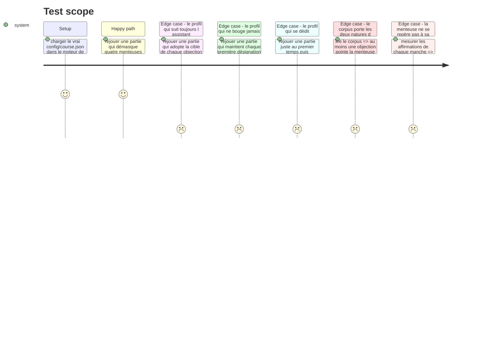

# Instruction: Le jeu dans le parcours, et son corpus

## Architecture projection

> Tree of the final files. ✅ create · ✏️ modify · ❌ delete

```txt
.
├── config/course.json                                  ✏️ la situation g1-3 remplace son placeholder test-bench
└── __tests__/integration/course-run/
    └── lie-detector-run.test.ts                        ✅ le parcours réel, joué de bout en bout
```

## Test Scope



## Le corpus

Quatre manches, quatre affirmations chacune. Les textes ci-dessous sont **définitifs** : les recopier mot pour mot dans `config/course.json`, sans les reformuler.

Chaque affirmation porte sa `verification` — à quoi elle se vérifie quand elle est vraie, pourquoi elle est fausse quand elle ment. Elle n'apparaît qu'à la révélation.

### Manche 1 — `r1` · le contexte de projet

> `prompt` : « Vous demandez à un assistant ce que change un fichier de contexte versionné dans le dépôt. Il répond ceci. »

| id | Affirmation | Ment | Vérification |
| --- | --- | --- | --- |
| `r1-a` | « Un fichier de contexte versionné profite à toute personne qui utilise l'assistant sur ce dépôt, pas seulement à celle qui l'a écrit. » | non | « Il est lu depuis le dépôt : quiconque le clone l'obtient, sans avoir rien à reconfigurer. » |
| `r1-b` | « Un contexte trop long finit par diluer ce qui compte : il occupe la fenêtre sans rendre les instructions importantes plus saillantes. » | non | « L'effet est documenté et mesuré sur les longues fenêtres, où une instruction placée au milieu est moins suivie qu'en tête ou en fin. » |
| `r1-c` | « Une fois le fichier de contexte en place, l'assistant s'y conforme sans qu'on ait à le vérifier : c'est ce qui le distingue d'un simple prompt. » | **oui** | « Un contexte oriente, il ne contraint pas. Ce qui contraint est exécutable : un hook, un test, une commande qui échoue. Le contexte réduit la fréquence des écarts, il ne les supprime pas, et la vérification reste due. » |
| `r1-d` | « Un contexte écrit pour l'assistant sert aussi à un nouveau venu humain : c'est le même besoin, décrit une fois. » | non | « C'est le cran haut de l'échelle de pilotage du contexte : un contexte transférable à quelqu'un d'autre. » |

> `objection` → cible `r1-b`, **creuse** : « Je pense que c'est celle sur la dilution qui ment. Les modèles récents tiennent des fenêtres de plusieurs centaines de milliers de jetons : la longueur du contexte n'est plus un facteur. »

### Manche 2 — `r2` · la vérification

> `prompt` : « Vous demandez à un assistant à quoi se reconnaît une réponse sur laquelle on peut s'appuyer. Il répond ceci. »

| id | Affirmation | Ment | Vérification |
| --- | --- | --- | --- |
| `r2-a` | « Un test écrit par le même assistant que le code qu'il teste peut passer pour une mauvaise raison : il peut décrire ce que le code fait, plutôt que ce qui était demandé. » | non | « Se vérifie en cassant le comportement attendu : un test qui reste vert testait le code, pas la demande. » |
| `r2-b` | « Quand l'assistant détaille son raisonnement pas à pas, la réponse est plus fiable : le niveau de détail de l'explication indique sa justesse. » | **oui** | « L'explication est produite par le même processus que la réponse et peut la justifier après coup. Une explication longue et une réponse fausse coexistent sans difficulté. Ce qui indique la justesse est une vérification indépendante : une exécution, une source ouverte. » |
| `r2-c` | « Un assistant qui cite une source ne l'a pas nécessairement lue : la citation se vérifie en l'ouvrant. » | non | « Se vérifie en ouvrant la source citée et en y cherchant l'affirmation qu'elle est censée porter. » |
| `r2-d` | « Faire échouer un test avant de le faire passer prouve qu'il teste quelque chose. » | non | « Un test qui n'a jamais été vu rouge peut être vert parce qu'il n'assure rien. Le voir échouer sur le comportement absent est ce qui le qualifie. » |

> `objection` → cible `r2-b`, **fondée** : « Je pense que c'est celle sur le raisonnement détaillé qui ment. Une explication est une reconstruction : elle est produite en même temps que la réponse et peut la justifier après coup. »

### Manche 3 — `r3` · la taille de ce qu'on confie

> `prompt` : « Vous demandez à un assistant comment découper une feature avant de la lui confier. Il répond ceci. »

| id | Affirmation | Ment | Vérification |
| --- | --- | --- | --- |
| `r3-a` | « Découper en lots plus petits rend chaque retour vérifiable séparément. » | non | « Se vérifie en jouant les tests d'un lot sans attendre les suivants : le verdict porte sur ce lot seul. » |
| `r3-b` | « Plus le lot confié est petit, meilleur est le résultat : découper au maximum est toujours la bonne stratégie. » | **oui** | « Un découpage trop fin fait repayer le cadrage à chaque passe et perd le contexte partagé entre les tranches. Le référentiel décrit un cran de taille qui **monte** avec la maîtrise. Il existe une taille juste ; elle n'est pas le minimum. » |
| `r3-c` | « Une dépendance non satisfaite entre deux lots fait échouer le second, quel que soit le soin mis à le formuler. » | non | « Se vérifie en confiant le lot dépendant en premier : il échoue sur ce qui n'existe pas encore. » |
| `r3-d` | « Un lot dont on ne sait pas dire ce qui prouverait qu'il est fini n'est pas prêt à être confié. » | non | « Se vérifie en essayant d'énoncer son critère d'acceptation avant de le confier : s'il ne s'énonce pas, il ne se vérifiera pas non plus au retour. » |

> `objection` → cible `r3-c`, **creuse** : « Je pense que c'est celle sur les dépendances qui ment. Un assistant à qui on donne le dépôt entier retrouve seul ce qui manque : l'ordre des lots n'a rien d'absolu. »

### Manche 4 — `r4` · l'échec et la reprise en main

> `prompt` : « Vous demandez à un assistant quoi faire quand ce qu'il produit échoue deux fois de suite. Il répond ceci. »

| id | Affirmation | Ment | Vérification |
| --- | --- | --- | --- |
| `r4-a` | « Un échec qui se répète sur la même demande est un signal sur le cadre donné, pas seulement sur le modèle. » | non | « Se vérifie en changeant le cadre — la consigne, le contexte, le critère de fin — sans changer de modèle : l'échec bouge. » |
| `r4-b` | « Un hook qui bloque une action rend la main au développeur : il signale, il ne poursuit pas le travail à sa place. » | non | « Se vérifie en le déclenchant : l'action s'arrête et rien d'autre ne se produit. C'est une boucle de relance, pas un hook, qui reprend le travail. » |
| `r4-c` | « Reprendre la main sur le code produit signe un échec de la délégation : un usage mature se mesure à la part du code qu'on n'a pas eu à toucher. » | **oui** | « Le référentiel mesure l'intervention comme un cran qui monte : savoir où reprendre la main est une compétence, pas un aveu. Ce qui se mesure est la part produite par l'IA rapportée au volume, jamais l'absence de reprise. » |
| `r4-d` | « Une boucle de relance sur une commande en échec ne vaut que si la commande dit vraiment si le travail est fini. » | non | « Se vérifie en la lançant sur une commande qui passe pour une mauvaise raison : la boucle s'arrête sur un vert qui ne prouve rien. » |

> `objection` → cible `r4-b`, **creuse** : « Je pense que c'est celle sur le hook qui ment. Un hook peut parfaitement corriger le format d'un fichier puis laisser passer : il fait donc bien le travail à votre place. »

## Tasks to do

### `1)` La situation dans le parcours

> Remplacer le placeholder `test-bench` de `g1-3` par le vrai jeu.

1. Dans `config/course.json`, situation `g1-3` du groupe `groupe-jugement` : passer `type` à `lie-detector`.
2. Garder le `label` existant, « Laquelle de ces affirmations ment ? ».
3. Écrire `config.statement` : il annonce le cadre, jamais les critères. Il dit qu'une seule affirmation ment par manche, que la désignation se verrouille au clic, que l'assistant donnera ensuite son avis et qu'il sera alors possible de désigner autrement, une fois. Il ne dit **pas** que l'assistant se trompe parfois.
4. Écrire les quatre manches du corpus ci-dessus, textes recopiés mot pour mot.
5. Remplacer les deux critères du placeholder :
   - `g1-3-c1`, question « La fausse affirmation a-t-elle été identifiée ? », règle `lies-unmasked-at-least` de seuil **3**, mapping `verification` poids **2** ;
   - `g1-3-c2`, question « Le choix est-il resté stable sous la contradiction ? », règle `no-capitulation` sans paramètre, mapping `verification` poids **2**.
6. Le mapping `intervention` du placeholder disparaît des deux critères : les six premiers groupes portent la signature, seul le septième porte les axes officiels.

### `2)` Le test d'intégration du parcours

> Le vrai `course.json`, dans le moteur de production, jamais une fixture.

1. Créer `__tests__/integration/course-run/lie-detector-run.test.ts`, sur le modèle de `defect-hunt-run.test.ts`.
2. Vérifier la situation : type, nombre de manches, seuil du premier critère, absence de mapping hors `verification`.
3. Rejouer les quatre profils du Test Scope, chacun construit depuis le corpus lu — jamais des identifiants écrits en dur, qui survivraient à une réécriture du corpus.
4. Poser les deux garde-fous de rédaction du corpus, en tests :
   - au moins une objection pointe la menteuse de sa manche, et au moins une pointe une affirmation vraie ;
   - dans chaque manche, la menteuse n'est ni l'affirmation la plus longue ni la plus courte du lot — un joueur qui trouve par la mise en forme ne lit pas.
5. Vérifier que chaque affirmation porte une `verification` non vide : l'acceptance de la story exige que les vraies soient vérifiables.

## Test acceptance criteria

| Task | Acceptance criteria |
| --- | --- |
| 1 | Le parcours réel se charge sans refus, avec `g1-3` en `lie-detector` |
| 1 | Aucun critère de `g1-3` ne mappe un axe du référentiel officiel |
| 2 | Le profil qui adopte la cible de chaque objection ressort sous le seuil d'identification |
| 2 | Le profil qui tient chacune de ses désignations justes satisfait le critère de stabilité |
| 2 | Le profil juste puis retourné à chaque objection rate les deux critères |
| 2 | Un corpus réécrit avec des objections d'une seule nature fait échouer le test, pas seulement le schéma |
| 2 | `npm run lint`, `npm run typecheck` et `npm run test` passent |
