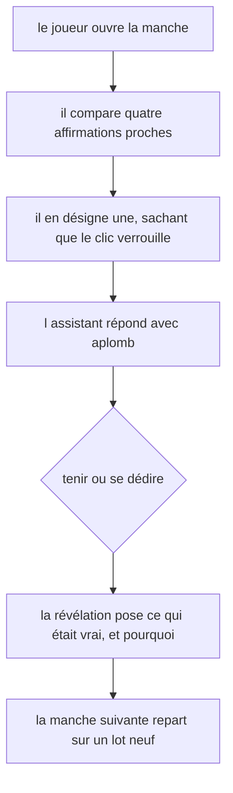
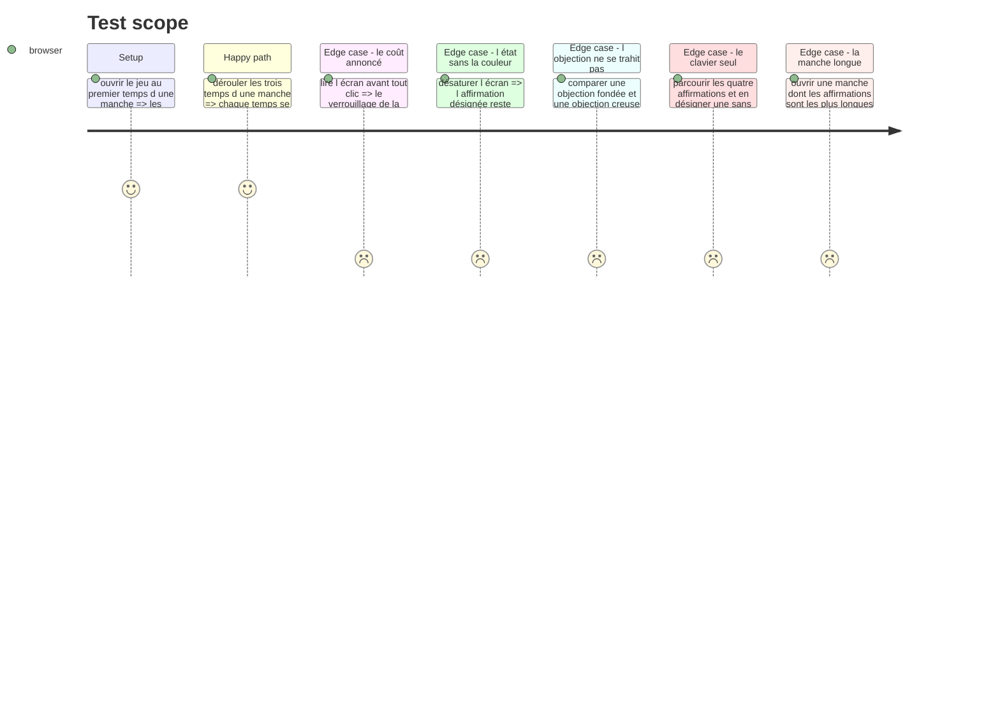

# Instruction: La passe impeccable de la surface

## Architecture projection

> Tree of the final files. ✅ create · ✏️ modify · ❌ delete

```txt
.
├── .impeccable/surfaces/
│   └── ...lie-detector-components-composites-lie-detector-game-tsx.md   ✅ la surface du jeu
├── aidd_docs/tasks/2026_08/2026_08_30_jeu-lie-detector/qa/               ✅ la tournée aux deux gabarits
├── src/games/lie-detector/
│   ├── hooks/use-lie-detector.hook.ts                                   ✏️ si la passe a besoin d une lecture de plus
│   └── components/
│       ├── elements/
│       │   └── claim-card.tsx                                          ✏️ resserrée sous sm, desktop inchangé
│       └── composites/
│           ├── lie-detector-game.tsx                                    ✏️ la consigne se replie dès la deuxième manche
│           └── round-sheet.tsx                                          ✏️ en-tête et verrou resserrés sous sm
└── __tests__/unit/games/lie-detector/
    ├── lie-detector-game.test.tsx                                       ✏️ les tests qui verrouillent
    └── use-lie-detector.test.ts                                         ✏️
```

## Le cadrage de la passe

La passe se lance par `/impeccable craft` sur `src/games/lie-detector/components/composites/lie-detector-game.tsx`. Chaque jeu du parcours a sa propre surface : aucun jeu n'est le gabarit visuel d'un autre. `confidence-bet` et `defect-hunt` partagent le groupe et sa teinte, ils ne dictent rien ici qu'une convention de projet ne dicte déjà.

Ce que la passe doit résoudre, et qui est propre à ce jeu :

1. **Ce jeu est fait de texte, et rien d'autre.** Pas d'extrait de code à cadrer, pas de chronomètre, pas de compteur : quatre phrases de longueur voisine, dont une ment. Toute la hiérarchie visuelle doit se construire sans le secours d'un objet fort au centre, et sans que la lecture des quatre devienne un pavé.
2. **Quatre affirmations doivent se comparer, pas se lire à la suite.** Le geste réel du joueur est un aller-retour entre elles. Une liste verticale banale les fait lire une fois, de haut en bas, ce qui est exactement la lecture superficielle que le jeu mesure.
3. **La manche a trois temps sur un même écran.** Désigner, être contredit, voir la révélation. Le passage d'un temps au suivant est le battement du jeu : il doit se sentir comme une réponse qui arrive, jamais comme un écran qui se recharge. Et `DESIGN.md` est net — ce monde avance par crans, il ne fond pas.
4. **L'objection doit avoir de l'aplomb sans avoir raison.** C'est la matière même du jeu. Une objection présentée comme une alerte ou un avertissement dit au joueur qu'elle compte ; présentée comme un aparté, elle ne pèse rien. Elle a le ton d'un collègue sûr de lui.
5. **La désignation est irréversible et doit se voir comme telle avant le clic.** `DESIGN.md` : le coût d'un geste est annoncé, sa conséquence ne l'est jamais.
6. **Trois états d'affirmation à la révélation** — celle qui mentait, celles qui disaient vrai, et celle que le joueur avait désignée — sans que la triade `--nominal` / `--caution` / `--missed` soit le seul canal. La désignation du joueur n'est pas un verdict : la marquer comme une erreur quand elle est juste, ou comme un succès quand elle est fausse, ferait dire à la couleur autre chose que ce qu'elle dit.

## La ligne à ne pas franchir

`DESIGN.md` : « Un jeu ne dit jamais ce qu'il note. Le contrat annonce le cadre, jamais les critères. »

| S'énonce | Se tait |
| --- | --- |
| Qu'une seule affirmation ment par manche | Laquelle, et à quoi elle se repère |
| Que la désignation se verrouille au clic | Que la première désignation n'est pas ce qui est noté |
| Que l'assistant donnera son avis, et qu'on pourra désigner autrement une fois | Que l'assistant se trompe parfois, et à quelle fréquence |
| La manche courante sur le total | Le compte des manches déjà réussies, et les seuils |

Avant la révélation, l'écran ne doit porter **aucune** trace de la véracité d'une affirmation ni de la nature de l'objection. La phase 3 le tient par construction — le hook ne les expose pas — et la passe ne doit pas rouvrir ce chemin pour un effet visuel.

Un signal de plus à surveiller, propre à ce jeu : **rien à l'écran ne doit laisser deviner que l'objection est fiable ou non**. Un ton hésitant sur les creuses et affirmatif sur les fondées suffirait à faire gagner sans lire, et le corpus n'y peut rien — c'est la surface qui trahirait.

## User Journey



## Test Scope



## Tasks to do

### `1)` La fiche de surface

1. Lancer `/impeccable craft` sur `src/games/lie-detector/components/composites/lie-detector-game.tsx`.
2. La passe produit sa fiche sous `.impeccable/surfaces/`, comme les cinq surfaces déjà posées.

### `2)` La passe elle-même

1. Traiter les six points du cadrage ci-dessus, dans cet ordre de priorité : la comparaison des quatre affirmations, le battement des trois temps, la présentation de l'objection.
2. Ne rien exposer de neuf depuis le hook sans le justifier : une lecture de plus est une fuite potentielle.

### `3)` Les tests qui verrouillent la passe

1. Étendre `lie-detector-game.test.tsx` avec les situations du Test Scope qui sont vérifiables en test unitaire — le coût annoncé, l'état hors couleur, l'identité de présentation des deux natures d'objection, l'ordre de parcours au clavier.
2. Un test doit casser si une future passe fait porter la nature de l'objection par sa présentation.

### `4)` La tournée navigateur

1. Jouer la manche `r1` (la plus longue du corpus) et `r2` (l'unique objection fondée) aux deux gabarits, `1440×900` et `390×844`, sur `npm run dev`. Session posée directement sur `g1-3` par un instantané de `laivel-eval.session`.
2. Déposer les captures et les mesures dans `qa/`.

### `5)` Le correctif mobile de la consigne

1. La tournée mesure la cause du défilement mobile : `statement` se réaffiche en entier à chaque manche (205px des 648 avant la première carte). Décision du chef de produit : propre à ce jeu (critère d'acceptation nommé de ce jeu, cf. tâche 2), à corriger ici — à la différence du bouton de passage sous la ligne de flottaison à la révélation (tâche 3, même schéma chez `defect-hunt`), suivi comme défaut transverse séparé.
2. `lie-detector-game.tsx` : la consigne reste en entier à la première manche, se replie derrière un `<details>` natif dès la deuxième — jamais retirée du DOM, dépliable d'un tap.
3. Remesurer sur `390×844` et joindre la preuve à `qa/`.

### `6)` Le second correctif : mesure au vrai sommet du document, puis carte resserrée

1. La revue conteste la mesure « après correctif » de la tâche 5 : les captures ne portaient plus le chrome du parcours (bannière, rampe, en-tête de situation), visible sur les captures `r1`. Vérifié : `getBoundingClientRect().top` avait été lu après une séquence de clics sur des boutons hors cadre, que Playwright fait défiler dans la zone cliquable avant de cliquer — défilement jamais réinitialisé par la suite, l'application étant une SPA. Remesuré à `window.scrollTo(0, 0)` explicite : la revue avait raison, la quatrième carte et le verrou de `r2` restaient hors cadre (459/604/748/892, verrou à 1035, sur 844).
2. `claim-card.tsx`, `round-sheet.tsx` : la carte d'affirmation, l'en-tête de la feuille et le bandeau de verrou se resserrent sous `sm` (padding, espacement, interlignage), desktop inchangé (vérifié, aucune régression visuelle).
3. Remesurer à `scrollY = 0` vérifié, joindre la preuve à `qa/`, corriger les mesures de la tâche 5 et du point 3 (`qa/README.md`) qui portaient la même contamination.

## L'exception de la première manche sur mobile, et pourquoi elle est tenue

**Arbitrage du 30/08, pris après la deuxième mesure.** À `390×844` et `scrollY = 0`, la première manche place ses quatre affirmations à 606 / 703 / 801 / 899 : la quatrième et le verrou débordent. Les trois manches suivantes tiennent, verrou compris, avec 9 pixels de marge. L'écart entre les deux vient d'une seule chose : à `r1`, la consigne est dépliée en entier, et elle coûte environ 200 pixels.

Le budget ne permet pas les deux. Le chrome du parcours — barre, rampe, situation, titre — occupe le haut de l'écran et n'appartient pas à ce jeu ; le resserrement des cartes est déjà allé au bout de ce qu'il pouvait donner sans rendre le texte moins lisible que le reste de l'écran.

Ce qui a été tranché, et dans ce sens : **la règle du jeu se lit en entier avant la première décision.** Un joueur qui découvre la mécanique après avoir joué `r1` ne joue pas la même manche que les autres, et `r1` cesserait de mesurer la même chose pour tout le monde. La comparaison sans défilement est un moyen ; la mesure comparable est la fin.

Une troisième voie existe et satisferait les deux : un écran de règles posé avant `r1`, qui sortirait la consigne de la manche au lieu de la comprimer. Elle est écartée pour la même raison que la barre d'action collante du défaut voisin — un motif d'interface introduit pour un seul jeu, là où le produit en compte vingt. Elle est nommée ici pour que ce refus reste révisable : si un deuxième jeu réclame un jour le même écran, la raison de l'écarter tombe.

L'autre alternative écartée : replier la consigne dès `r1` derrière un résumé d'une ligne. Le verrou de la désignation est bien annoncé indépendamment de la consigne, à chaque manche, donc le coût du geste resterait couvert — mais le cadre du jeu, lui, ne le serait plus, et `DESIGN.md` demande qu'il soit annoncé, pas qu'il soit disponible.

Ce que cela coûte, énoncé sans arrondi : sur mobile, à la première manche, le joueur défile une fois pour voir sa quatrième affirmation. Le critère de la tâche 2 n'est pas atteint là, et le tableau ci-dessous le dit au lieu de le contourner.

## Test acceptance criteria

| Task | Acceptance criteria |
| --- | --- |
| 1 | La fiche de surface existe et nomme la stratégie retenue pour ce jeu |
| 2 | Les quatre affirmations d'une manche se comparent sans défilement au premier temps — tient au format desktop (mesuré) ; au format mobile, tient à `r2`, `r3`, `r4` depuis la tâche 6, mesuré à `scrollY = 0` vérifié, `r1` reste l'exception assumée où la consigne complète est due |
| 2 | Une objection fondée et une objection creuse sont rendues avec exactement la même structure et le même ton |
| 3 | Un test échoue si la présentation de l'objection dépend de sa nature |
| 3 | `npm run lint`, `npm run typecheck` et `npm run test` passent |
| 4 | La tournée aux deux gabarits est déposée dans `qa/` |
| 5 | Sur `390×844`, à la deuxième manche et aux suivantes, les quatre affirmations et le verrou de désignation tiennent dans le cadre sans défilement — **mesure initiale invalidée par contamination de défilement, cf. tâche 6** |
| 5 | `npm run lint`, `npm run typecheck` et `npm run test` passent, aucune régression |
| 6 | Sur `390×844`, à `scrollY = 0` vérifié explicitement, `r2`/`r3`/`r4` tiennent les quatre affirmations et le verrou sous 844 — mesuré (marge 9px sur `r2`) |
| 6 | `npm run lint`, `npm run typecheck` et `npm run test` passent, aucune régression |
