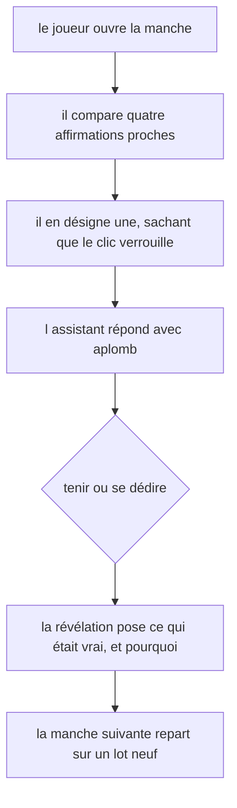
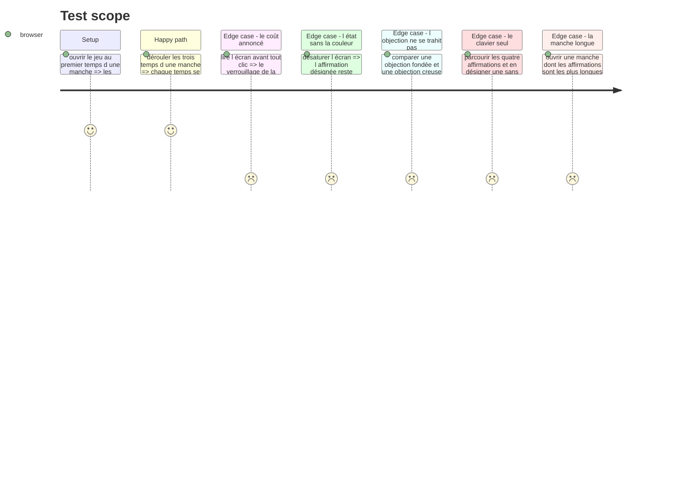

# Instruction: La passe impeccable de la surface

## Architecture projection

> Tree of the final files. ✅ create · ✏️ modify · ❌ delete

```txt
.
├── .impeccable/surfaces/
│   └── ...lie-detector-components-composites-lie-detector-game-tsx.md   ✅ la surface du jeu
├── src/games/lie-detector/
│   ├── hooks/use-lie-detector.hook.ts                                   ✏️ si la passe a besoin d une lecture de plus
│   └── components/
│       ├── elements/                                                    ✏️ affirmation, objection
│       └── composites/                                                  ✏️ feuille de manche et racine
└── __tests__/unit/games/lie-detector/
    ├── lie-detector-game.test.tsx                                       ✏️ les tests qui verrouillent
    └── use-lie-detector.test.ts                                         ✏️
```

## Le cadrage de la passe

La passe se lance par `/impeccable craft` sur `src/games/lie-detector/components/composites/lie-detector-game.tsx`. Chaque jeu du parcours a sa propre surface : aucun jeu n'est le gabarit visuel d'un autre. `confidence-bet` et `defect-hunt` partagent le groupe et sa teinte, ils ne dictent rien ici qu'une convention de projet ne dicte déjà.

Ce que la passe doit résoudre, et qui est propre à ce jeu :

1. **Ce jeu est fait de texte, et rien d'autre.** Pas d'extrait de code à cadrer, pas de chronomètre, pas de compteur : quatre phrases de longueur voisine, dont une ment. Toute la hiérarchie visuelle doit se construire sans le secours d'un objet fort au centre, et sans que la lecture des quatre devienne un pavé.
2. **Quatre affirmations doivent se comparer, pas se lire à la suite.** Le geste réel du joueur est un aller-retour entre elles. Une liste verticale banale les fait lire une fois, de haut en bas, ce qui est exactement la lecture superficielle que le jeu mesure.
3. **La manche a trois temps sur un même écran.** Désigner, être contredit, voir la révélation. Le passage d'un temps au suivant est le battement du jeu : il doit se sentir comme une réponse qui arrive, jamais comme un écran qui se recharge. Et `DESIGN.md` est net — ce monde avance par crans, il ne fond pas.
4. **L'objection doit avoir de l'aplomb sans avoir raison.** C'est la matière même du jeu. Une objection présentée comme une alerte ou un avertissement dit au joueur qu'elle compte ; présentée comme un aparté, elle ne pèse rien. Elle a le ton d'un collègue sûr de lui.
5. **La désignation est irréversible et doit se voir comme telle avant le clic.** `DESIGN.md` : le coût d'un geste est annoncé, sa conséquence ne l'est jamais.
6. **Trois états d'affirmation à la révélation** — celle qui mentait, celles qui disaient vrai, et celle que le joueur avait désignée — sans que la triade `--nominal` / `--caution` / `--missed` soit le seul canal. La désignation du joueur n'est pas un verdict : la marquer comme une erreur quand elle est juste, ou comme un succès quand elle est fausse, ferait dire à la couleur autre chose que ce qu'elle dit.

## La ligne à ne pas franchir

`DESIGN.md` : « Un jeu ne dit jamais ce qu'il note. Le contrat annonce le cadre, jamais les critères. »

| S'énonce | Se tait |
| --- | --- |
| Qu'une seule affirmation ment par manche | Laquelle, et à quoi elle se repère |
| Que la désignation se verrouille au clic | Que la première désignation n'est pas ce qui est noté |
| Que l'assistant donnera son avis, et qu'on pourra désigner autrement une fois | Que l'assistant se trompe parfois, et à quelle fréquence |
| La manche courante sur le total | Le compte des manches déjà réussies, et les seuils |

Avant la révélation, l'écran ne doit porter **aucune** trace de la véracité d'une affirmation ni de la nature de l'objection. La phase 3 le tient par construction — le hook ne les expose pas — et la passe ne doit pas rouvrir ce chemin pour un effet visuel.

Un signal de plus à surveiller, propre à ce jeu : **rien à l'écran ne doit laisser deviner que l'objection est fiable ou non**. Un ton hésitant sur les creuses et affirmatif sur les fondées suffirait à faire gagner sans lire, et le corpus n'y peut rien — c'est la surface qui trahirait.

## User Journey



## Test Scope



## Tasks to do

### `1)` La fiche de surface

1. Lancer `/impeccable craft` sur `src/games/lie-detector/components/composites/lie-detector-game.tsx`.
2. La passe produit sa fiche sous `.impeccable/surfaces/`, comme les cinq surfaces déjà posées.

### `2)` La passe elle-même

1. Traiter les six points du cadrage ci-dessus, dans cet ordre de priorité : la comparaison des quatre affirmations, le battement des trois temps, la présentation de l'objection.
2. Ne rien exposer de neuf depuis le hook sans le justifier : une lecture de plus est une fuite potentielle.

### `3)` Les tests qui verrouillent la passe

1. Étendre `lie-detector-game.test.tsx` avec les situations du Test Scope qui sont vérifiables en test unitaire — le coût annoncé, l'état hors couleur, l'identité de présentation des deux natures d'objection, l'ordre de parcours au clavier.
2. Un test doit casser si une future passe fait porter la nature de l'objection par sa présentation.

## Test acceptance criteria

| Task | Acceptance criteria |
| --- | --- |
| 1 | La fiche de surface existe et nomme la stratégie retenue pour ce jeu |
| 2 | Les quatre affirmations d'une manche se comparent sans défilement au premier temps |
| 2 | Une objection fondée et une objection creuse sont rendues avec exactement la même structure et le même ton |
| 3 | Un test échoue si la présentation de l'objection dépend de sa nature |
| 3 | `npm run lint`, `npm run typecheck` et `npm run test` passent |
