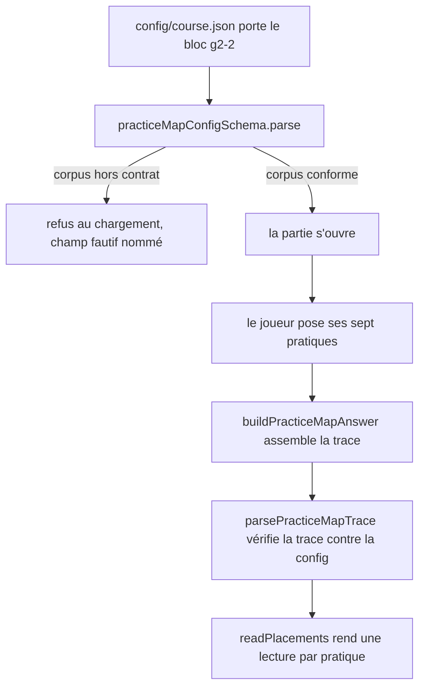
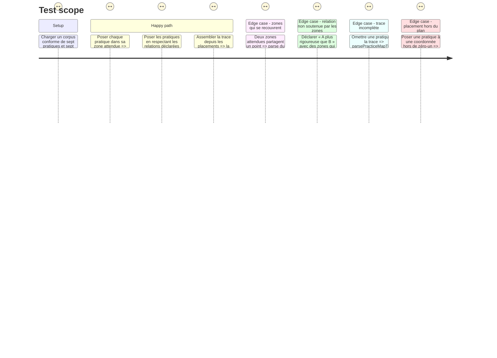

# Instruction: Les contrats et la lecture pure des placements

## Architecture projection

> Tree of the final files. ✅ create · ✏️ modify · ❌ delete

```txt
.
├── src/games/practice-map/
│   ├── schema/
│   │   ├── config.schema.ts        ✅ ce qu'un auteur de parcours écrit, et les refus au chargement
│   │   └── answer.schema.ts        ✅ la trace du joueur, ses refus propres, et `parsePracticeMapTrace`
│   ├── helpers/
│   │   └── read-placements.helper.ts ✅ la lecture pure, partagée par l'écran et l'évaluateur
│   └── actions/
│       └── build-practice-map-answer.action.ts ✅ assemble la trace à soumettre
└── __tests__/unit/games/practice-map/
    ├── config.schema.test.ts       ✅
    ├── answer.schema.test.ts       ✅
    ├── read-placements.test.ts     ✅
    └── build-answer.test.ts        ✅
```

## User Journey



## Test Scope



## Tasks to do

### `1)` Le schéma de configuration et ses refus

> Rendre les fuites inexprimables par le contrat, pas par une consigne de relecture du corpus.

1. Créer `src/games/practice-map/schema/config.schema.ts`.
2. `zoneSchema` : `{ intensityFrom, intensityTo, rigorFrom, rigorTo }`, chacun `z.number().min(0).max(1)`. Refus de schéma si `From >= To` sur l'un des deux axes — une zone plate ou inversée n'est pas une zone.
3. `practiceSchema` : `{ id, label, expected: zoneSchema, marker }`. `label` est ce qui est écrit sur le jeton ; `marker` est le repère montré à la révélation, jamais avant. Aucun champ ne dit au joueur où la pratique se tient.
4. `orderingSchema` : `{ id, axis: z.enum(['intensity', 'rigor']), higherId, lowerId }`. Une relation dit « `higherId` se tient plus haut que `lowerId` sur cet axe », rien d'autre.
5. `baseConfigSchema` : `{ statement, highRigorFrom: z.number().min(0).max(1), practices: z.array(practiceSchema).min(4), orderings: z.array(orderingSchema).min(3) }`. `statement` porte le même nom que dans les sept autres jeux.
6. Poser les refus en `superRefine`, chacun nommant le champ fautif :
   - deux pratiques de même `id`, ou deux relations de même `id` ;
   - une relation dont `higherId` ou `lowerId` est absent des pratiques — référence pendante ;
   - une relation dont `higherId === lowerId` ;
   - deux relations qui portent la même paire sur le même axe, dans un sens ou dans l'autre ;
   - **zones disjointes** : deux zones attendues qui partagent le moindre point. C'est le refus qui ferme la fuite principale — sans lui, empiler les sept jetons au même endroit poserait plusieurs pratiques « dans leur zone » d'un seul geste ;
   - **plafond de surface** : une zone qui couvre plus de 12 % du plan. Une zone plus large qu'un huitième du plan n'est pas une lecture, c'est une moitié, et un dépôt au hasard y tombe trop souvent ;
   - **plafond d'emprise** : la somme des surfaces des zones dépasse la moitié du plan. Les zones étant déjà disjointes, la somme *est* l'union ;
   - **répartition sur les deux axes** : il faut au moins une zone dont `rigorFrom >= highRigorFrom` et au moins une dont `rigorTo < highRigorFrom` ; au moins une dont `intensityFrom >= 0.5` et au moins une dont `intensityTo < 0.5`. Sans quoi « tout poser en haut » ou « tout poser à droite » tiendrait le placement sans lecture ;
   - **relations soutenues par les zones** : pour chaque relation, la zone de `higherId` doit se tenir **strictement au-dessus** de celle de `lowerId` sur l'axe visé — `higher.From > lower.To`. Une relation que les zones ne soutiennent pas rendrait `c3` inatteignable pour un joueur pourtant parfait sur `c1`, et le décalage ne se verrait qu'au verdict.
7. Exporter les types inférés : `Zone`, `Practice`, `Ordering`, `PracticeMapConfig`.

### `2)` Le schéma de trace et `parsePracticeMapTrace`

> La trace porte ce que le joueur a posé, jamais ce qu'on en déduit.

1. Créer `src/games/practice-map/schema/answer.schema.ts`.
2. `placementSchema` : `{ practiceId: z.string().min(1), intensity: z.number().min(0).max(1), rigor: z.number().min(0).max(1) }`. Aucun champ dérivé : `inZone`, la tenue des relations et le compte de haute rigueur se recalculent tous depuis ces deux nombres et la configuration.
3. `practiceMapAnswerSchema` : `{ placements: z.array(placementSchema).min(1) }`, plus un `superRefine` qui refuse deux placements visant la même pratique.
4. Déclarer les erreurs de vérification contre la configuration, sur le modèle de `hint-budget` — chacune porte l'identifiant fautif :
   - `IncompletePlacementError` : une pratique de la configuration n'est couverte par aucun placement. L'écran ne laisse jamais soumettre une réserve non vide, donc une trace qui en porte une est forgée ;
   - `UnknownPracticeError` : un placement vise une pratique absente de la configuration.
5. `parsePracticeMapTrace(answer, config)` : parse, puis vérifie la couverture pratique par pratique, puis chaque référence. Rend la trace typée.

### `3)` La lecture pure des placements

> Une seule source pour ce que l'écran montre et pour ce que l'évaluateur note.

1. Créer `src/games/practice-map/helpers/read-placements.helper.ts`.
2. `PlacementReading` : `{ practiceId, intensity, rigor, inZone, inHighRigorZone }`. `inZone` est vrai quand le point tombe dans la zone attendue de **sa** pratique, bornes incluses — la règle des bornes inclusives du projet vaut ici comme ailleurs. `inHighRigorZone` est vrai quand `inZone` l'est **et** que la zone attendue de cette pratique se tient en haute rigueur (`expected.rigorFrom >= config.highRigorFrom`).
3. `OrderingReading` : `{ orderingId, axis, held }`. `held` est vrai quand la coordonnée du `higherId` posé dépasse **strictement** celle du `lowerId` sur l'axe de la relation. L'égalité ne tient pas la relation : deux pratiques posées au même niveau ne disent pas laquelle est au-dessus, et c'est bien cela qu'on demande de lire.
4. `readPlacements(config, trace)` rend `{ placements, orderings, inZoneCount, highRigorHit, heldOrderingCount }`. Aucun seuil n'entre ici : les seuils sont déclarés dans le parcours et lus par les règles, jamais par le helper — le helper est aussi lu par l'écran, qui ne doit rien savoir des seuils.

### `4)` L'action d'assemblage

> Le seul endroit où des placements d'écran deviennent une trace.

1. Créer `src/games/practice-map/actions/build-practice-map-answer.action.ts`.
2. `buildPracticeMapAnswer(config, placements)` rend l'objet de trace dans l'ordre des pratiques de la configuration, et le passe par `parsePracticeMapTrace` avant de le rendre : ce qui sort de l'action est déjà vérifié contre la configuration.

### `5)` Les tests des quatre fichiers

> Chaque refus a son test, sinon le contrat n'est qu'un commentaire.

1. `config.schema.test.ts` : un corpus conforme passe ; chacun des dix refus est déclenché par un corpus minimal qui ne viole que lui, et le message nomme le champ fautif.
2. `answer.schema.test.ts` : trace conforme ; doublon de pratique ; coordonnée hors de `[0,1]` ; `IncompletePlacementError` ; `UnknownPracticeError`.
3. `read-placements.test.ts` : point au centre d'une zone, point sur la bordure exacte d'une zone (compté dedans), point juste dehors ; relation tenue, relation inversée, relation à égalité (non tenue) ; `inHighRigorZone` faux pour une pratique bien posée mais dont la zone n'est pas en haute rigueur.
4. `build-answer.test.ts` : l'ordre des placements rendus suit celui des pratiques de la configuration, quel que soit l'ordre d'entrée ; une réserve incomplète fait lever `IncompletePlacementError`.

## Test acceptance criteria

| Task | Acceptance criteria |
| --- | --- |
| 1 | Un corpus dont deux zones se touchent, dont une zone dépasse 12 % du plan, dont les zones couvrent plus de la moitié du plan, dont toutes les zones sont du même côté d'un axe, ou dont une relation n'est pas soutenue par les zones, est refusé au chargement en nommant le champ fautif |
| 2 | Une trace à laquelle il manque une pratique lève `IncompletePlacementError` en nommant la pratique ; une trace qui vise une pratique inconnue lève `UnknownPracticeError` |
| 3 | Un point posé exactement sur la bordure de sa zone est lu dedans ; deux pratiques posées au même niveau sur l'axe d'une relation ne la tiennent pas ; le helper ne lit aucun seuil |
| 4 | La trace rendue par l'action suit l'ordre des pratiques de la configuration et ne porte aucun champ dérivé |
| 5 | `npm run test` passe, et chacun des refus du schéma est couvert par un test qui ne viole que lui |

## Correction du 30/08, ajout du champ `shortLabel`

Arbitrage du chef pendant la phase 5, après refus de la passe de surface : le plan ne peut pas rendre `label` en entier — les libellés réels vont de 46 à 77 caractères, et deux pratiques partageant un préfixe long (« Écrire le fichier... », « Écrire la fonction... ») devenaient indiscernables une fois tronquées au même endroit à l'écran, rendant impossible de relire son propre placement avant de soumettre.

`practiceSchema` porte désormais un cinquième champ : `shortLabel: z.string().min(1).max(18)`. Requis, plafonné à 18 caractères **par le contrat**, refusé au chargement au-delà — pas une consigne de corpus, un onzième refus au même rang que les dix déjà déclarés en `superRefine`. `label` reste ce qui est écrit dans la réserve et le nom accessible du jeton partout (`aria-label`) ; `shortLabel` est ce que le plan affiche à la place de `label` une fois le jeton posé ou saisi. Aucun autre champ, aucune autre règle de `practiceSchema` ne bouge.

Testé dans `config.schema.test.ts` : `rejects a shortLabel longer than 18 characters, naming the field`.

Les sept `shortLabel` du corpus réel de `g2-2` sont écrits dans `config/course.json`, documentés dans `phase-4.md`.

## Correction du 30/08, ajout du champ `quadrants`

Second arbitrage du chef, un tour plus tard, sur un défaut mesuré à l'écran plutôt que décrit : les quatre libellés de quadrant du plan combinaient jusque-là les deux pôles déjà affichés à son bord (« vous le faites, un garde-fou la tient sans vous ») — une conjonction de deux phrases entières qui débordait toute cellule du plan, y compris par-dessus la médiane qui sépare les quadrants.

`baseConfigSchema` porte désormais un champ `quadrants: quadrantsSchema`, un objet à quatre chaînes requises — `highRigorLowIntensity`, `highRigorHighIntensity`, `lowRigorLowIntensity`, `lowRigorHighIntensity` — chacune plafonnée à 24 caractères **par le contrat**, refusée au chargement au-delà, comme `shortLabel` l'est à 18. Les quatre noms sont écrits par le corpus, jamais dérivés des pôles à l'affichage : une matrice SWOT nomme ses quadrants parce que le nom porte un sens que les axes seuls ne donnent pas, pas en recopiant les deux extrémités d'axe.

Testé dans `config.schema.test.ts` : `rejects a quadrant label longer than 24 characters, naming the field`.

Les quatre valeurs du corpus réel de `g2-2` sont écrites dans `config/course.json`, documentées dans `phase-4.md`.
