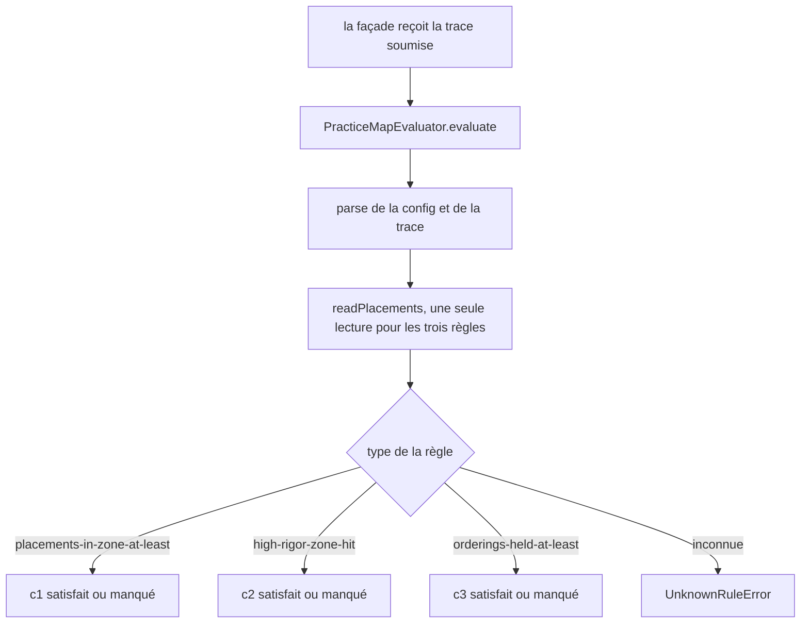
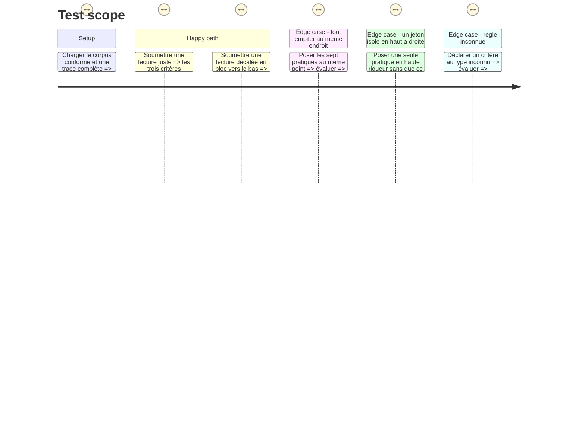

# Instruction: L'évaluateur et ses trois règles

## Architecture projection

> Tree of the final files. ✅ create · ✏️ modify · ❌ delete

```txt
.
├── src/games/practice-map/
│   └── practice-map.evaluator.ts   ✅ le point de contact public avec le port GameEvaluator
└── __tests__/unit/games/practice-map/
    └── evaluator.test.ts           ✅
```

## User Journey



## Test Scope



## Tasks to do

### `1)` L'évaluateur et ses trois règles déclaratives

> Interpréter des règles ; déplacer un seuil se fait dans le parcours, jamais ici.

1. Créer `src/games/practice-map/practice-map.evaluator.ts`, sur le gabarit de `hint-budget.evaluator.ts` : `GAME_TYPE`, un schéma Zod par forme de règle, `UnknownRuleError`, une fonction pure par règle, la classe `PracticeMapEvaluator`, et un type `VerdictInputs` qui dit tout ce qu'une règle peut lire — et rien de plus.
2. `placements-in-zone-at-least` (`{ threshold: number }`) → `inZoneCount >= threshold`. Lit la position **absolue**, rien d'autre.
3. `high-rigor-zone-hit` (règle sans paramètre) → `highRigorHit`. Vrai quand au moins une pratique **dont la zone attendue est en haute rigueur** y est effectivement posée. Le commentaire du fichier dit pourquoi le critère n'est pas « une pratique quelconque posée en haut » : ce dernier se tient d'un seul glissement, sans lecture, et l'épique nomme cette classe de triche comme à bloquer.
4. `orderings-held-at-least` (`{ threshold: number }`) → `heldOrderingCount >= threshold`. Lit la position **relative**, jamais les zones. Le commentaire dit ce que cette règle a de distinct de `c1` : une lecture juste mais décalée en bloc tient les relations et manque les zones.
5. `evaluate` parse la configuration, puis la trace via `parsePracticeMapTrace`, appelle `readPlacements` **une seule fois**, et fait porter la lecture par les trois règles. Aucun accès au store, aucun effet de bord, aucune connaissance des autres jeux.
6. Une règle de type inconnu lève `UnknownRuleError` en nommant le type et le jeu.

### `2)` Les tests de l'évaluateur

> Un test par règle, plus les trois lectures qui séparent les règles l'une de l'autre.

1. Lecture parfaite : les trois critères satisfaits.
2. Lecture décalée en bloc : toutes les pratiques posées 0,3 plus bas en rigueur, ordre respecté → `c1` manqué, `c3` satisfait. C'est le test qui prouve que les deux règles ne lisent pas la même chose.
3. Sept jetons au même point : `c1` manqué (les zones étant disjointes, une seule pratique au plus peut être en zone), `c2` manqué, `c3` manqué (aucune relation stricte ne tient à égalité).
4. Une pratique de basse rigueur glissée tout en haut à droite, les autres au hasard : `c2` manqué.
5. Une pratique de haute rigueur posée dans sa zone, tout le reste faux : `c2` satisfait, `c1` manqué.
6. Un critère au type inconnu lève `UnknownRuleError`.
7. Le seuil est lu depuis la règle : deux exécutions du même jeu de placements avec deux seuils différents rendent deux verdicts différents.

## Test acceptance criteria

| Task | Acceptance criteria |
| --- | --- |
| 1 | Les trois règles rendent un verdict binaire par critère, lisent chacune un seul axe de lecture, et un type de règle inconnu lève une erreur nommant le type |
| 2 | Une lecture décalée en bloc sort `c1` manqué et `c3` satisfait ; sept jetons empilés au même point manquent les trois critères ; `npm run test` passe |
