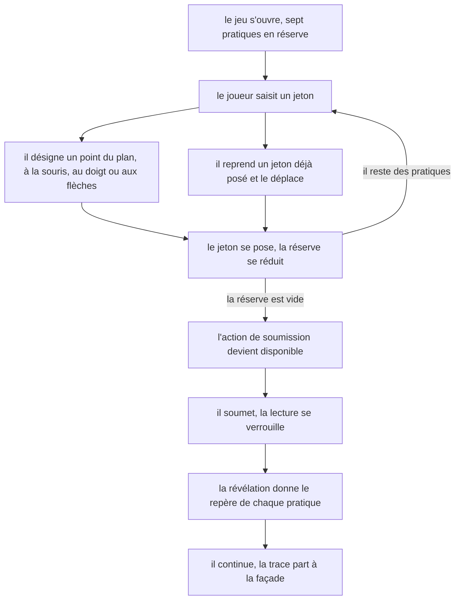
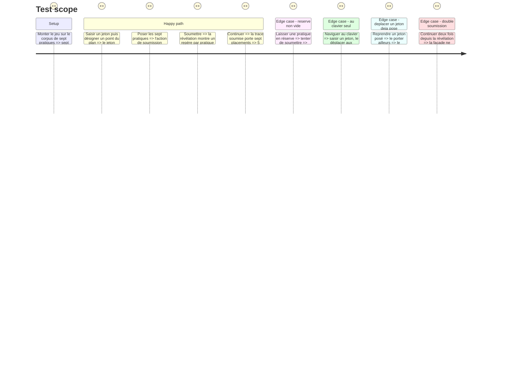

# Instruction: Le jeu à l'écran, poser, déplacer, soumettre

## Architecture projection

> Tree of the final files. ✅ create · ✏️ modify · ❌ delete

```txt
.
├── src/games/practice-map/
│   ├── hooks/
│   │   └── use-practice-map.hook.ts   ✅ le cycle de vie React, et rien d'autre
│   └── components/
│       ├── elements/
│       │   ├── practice-token.tsx     ✅ un jeton, en réserve ou posé
│       │   └── marker-line.tsx        ✅ une ligne de repère, à la révélation
│       └── composites/
│           ├── practice-plane.tsx     ✅ le plan, ses deux axes et leurs pôles
│           ├── practice-tray.tsx      ✅ la réserve des pratiques non posées
│           └── practice-map-game.tsx  ✅ la composition, seule à connaître le hook
└── __tests__/unit/games/practice-map/
    ├── use-practice-map.test.ts       ✅
    └── practice-map-game.test.tsx     ✅
```

## User Journey



## Test Scope



## Wireframe

```txt
Temps 1 — le placement

┌──────────────────────────────────────────────────────────────────────┐
│ (1) Titre du jeu                                                     │
├──────────────────────────────────────────────────────────────────────┤
│ (2) Consigne                                                         │
├───────────────────────────────────────────┬──────────────────────────┤
│ (3) Le plan                               │ (6) La réserve           │
│      (4) pôle haut de l'axe vertical      │  ┌────────────────────┐  │
│  ┌─────────────────────────────────────┐  │  │ (7) jeton          │  │
│  │                                     │  │  ├────────────────────┤  │
│  │        ·(5)      ·(5)               │  │  │ (7) jeton          │  │
│  │                                     │  │  ├────────────────────┤  │
│  │   ·(5)                    ·(5)      │  │  │ (7) jeton          │  │
│  │                                     │  │  └────────────────────┘  │
│  └─────────────────────────────────────┘  │                          │
│      (4) pôle bas                         │  (8) ce qui reste à poser │
│  (4) pôle gauche        (4) pôle droit    │                          │
├───────────────────────────────────────────┴──────────────────────────┤
│ (9)                                          action primaire unique  │
└──────────────────────────────────────────────────────────────────────┘

Temps 2 — la révélation

┌──────────────────────────────────────────────────────────────────────┐
│ (1) Titre du jeu                                                     │
├──────────────────────────────────────────────────────────────────────┤
│ (10) Les repères                                                     │
│  ┌────────────────────────────────────────────────────────────────┐  │
│  │ (11) libellé de la pratique                                    │  │
│  │      son repère                                                │  │
│  ├────────────────────────────────────────────────────────────────┤  │
│  │ (11) libellé de la pratique                                    │  │
│  │      son repère                                                │  │
│  └────────────────────────────────────────────────────────────────┘  │
├──────────────────────────────────────────────────────────────────────┤
│ (9)                                          action primaire unique  │
└──────────────────────────────────────────────────────────────────────┘
```

1. Le titre du jeu, tel que le parcours le déclare.
2. La consigne : le cadre, jamais les critères.
3. Le plan continu, sans aucune ligne de quadrant.
4. Les quatre pôles nommés, un par extrémité d'axe : ce sont eux qui portent le cadre.
5. Un jeton posé, à sa coordonnée.
6. La réserve des pratiques encore à poser.
7. Un jeton en réserve, saisissable au pointeur comme au clavier.
8. Ce qui reste à poser, en clair.
9. L'action primaire unique de l'écran : soumettre au temps 1, continuer au temps 2.
10. La révélation, une fois la lecture soumise.
11. Une pratique et son repère — jamais sa place attendue, jamais un verdict.

## Tasks to do

### `1)` Le hook

> Le cycle de vie React d'une lecture, et rien d'autre. Aucune règle n'y vit.

1. Créer `src/games/practice-map/hooks/use-practice-map.hook.ts`, sur le gabarit de `use-hint-budget.hook.ts`.
2. Parser la configuration **une fois**, dans un `useMemo` : elle ne change pas en cours de partie.
3. État : `placements` (`Map` pratique → `{ intensity, rigor }`, ou tableau équivalent), `heldId` (le jeton saisi, ou `undefined`), `phase` (`'placing' | 'revealed'`), et un `useRef` d'appel unique pour la soumission.
4. Gestes exposés : `hold(practiceId)` saisit un jeton — en réserve ou déjà posé ; `release()` repose le jeton saisi sans le placer ; `place(intensity, rigor)` pose le jeton saisi à cette coordonnée, bornée dans `[0,1]`, et le relâche ; `nudge(axis, direction)` déplace le jeton saisi d'un pas fixe sur un axe ; `submit()` bascule sur `'revealed'` ; `advance()` appelle `onSubmit(buildPracticeMapAnswer(...))`, **une seule fois**.
5. `place` sur une pratique déjà posée **remplace** son placement : jamais de second placement pour la même pratique, la trace n'en porte qu'un par pratique par construction et non par filtrage.
6. Le hook n'expose **jamais** `expected` ni `marker` avant leur heure : les jetons rendus à l'écran ne portent que `id` et `label`, et les repères n'apparaissent dans la valeur de retour qu'en phase `'revealed'`. Ce qui n'est pas exposé ne peut pas fuiter.
7. `canSubmit` est vrai quand toutes les pratiques sont posées. Le verrou tient par l'**absence de chemin** : `submit` ne fait rien tant que la réserve n'est pas vide, et `hold` / `place` / `nudge` ne font rien en phase `'revealed'`.
8. Exposer aussi ce que l'écran doit annoncer : `positionLabel(intensity, rigor)` rend la position **en mots** — deux crans nommés par axe, tirés des pôles de la configuration — jamais un nombre. Un joueur au clavier ne doit pas obtenir une précision que le joueur à la souris n'a pas.

### `2)` Les composants

> Dumb en bas, smart en haut. La logique ne descend jamais dans un element.

1. `practice-token.tsx` : un `button` portant le libellé de la pratique. Reçoit son état de saisie et son gestionnaire ; ne connaît ni le hook, ni la configuration.
2. `practice-plane.tsx` : le plan et ses quatre pôles nommés. Reçoit les jetons posés avec leurs coordonnées, et rend un point désigné en coordonnées `[0,1]` — la conversion pixels → plan vit ici, et nulle part ailleurs. **Aucune ligne de quadrant.** Le plan est lui-même atteignable au clavier lorsqu'un jeton est saisi : les flèches appellent `nudge`, `Entrée` et `Espace` posent, `Échap` relâche.
3. `practice-tray.tsx` : la liste des pratiques non posées et ce qui reste à poser.
4. `marker-line.tsx` : une pratique et son repère, à la révélation.
5. `practice-map-game.tsx` : la composition, seule à appeler le hook, seule à connaître `GameComponentProps`.
6. Annonce : une région `aria-live="polite"` porte, à chaque `nudge` et à chaque `place`, la phrase rendue par `positionLabel`. C'est le pendant clavier du retour visuel, exigé par `DESIGN.md` pour les glissers-déposers.
7. Aucune animation : « l'avancée est un changement discret ». Un jeton qui se pose apparaît, il ne glisse pas.
8. Un état n'est jamais porté par la couleur seule : un jeton saisi le dit par son filet et son poids, pas par sa teinte.

### `3)` Les tests

> Le parcours clavier est testé au même titre que le parcours pointeur, pas en supplément.

1. `use-practice-map.test.ts` : `place` remplace un placement existant sans doublon ; `nudge` borne dans `[0,1]` aux quatre extrémités ; `submit` ne fait rien avec une réserve non vide ; `advance` n'appelle `onSubmit` qu'une fois même appelé deux fois ; aucun `marker` n'est exposé en phase `'placing'`.
2. `practice-map-game.test.tsx` : poser les sept pratiques rend l'action de soumission disponible ; le parcours **au clavier seul** — saisir, déplacer aux flèches, déposer — enregistre un placement et annonce la position en mots ; la révélation montre sept repères et aucune place attendue ; continuer soumet une trace de sept placements.

## Test acceptance criteria

| Task | Acceptance criteria |
| --- | --- |
| 1 | Reposer une pratique déjà posée remplace son placement ; la soumission reste sans effet tant qu'une pratique est en réserve ; la façade ne reçoit qu'une seule soumission ; aucun repère n'est lisible avant la révélation |
| 2 | Le plan ne porte aucune ligne de quadrant ; un jeton se saisit, se déplace et se pose au clavier seul ; la position atteinte est annoncée en mots dans une région `aria-live` ; aucun état n'est porté par la couleur seule |
| 3 | `npm run test` passe, et le parcours clavier complet est couvert par un test |
