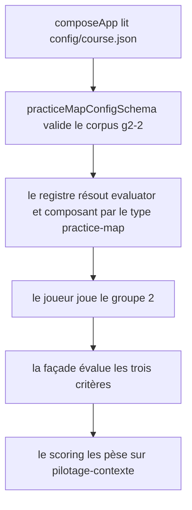
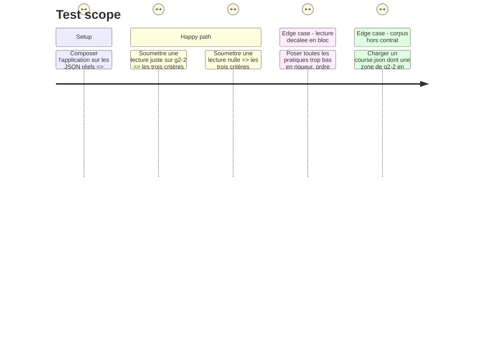

# Instruction: Le jeu dans le parcours, et son corpus

## Architecture projection

> Tree of the final files. ✅ create · ✏️ modify · ❌ delete

```txt
.
├── config/course.json                                   ✏️ le bloc g2-2 remplace le placeholder test-bench
├── src/games/register-games.ts                          ✏️ un bloc d'enregistrement de plus
├── src/games/register-components.ts                     ✏️ un bloc d'enregistrement de plus
└── __tests__/
    ├── fixtures/practice-map-answer.ts                  ✅ les traces de référence, partagées
    └── integration/course-run/practice-map-run.test.ts  ✅ le jeu de bout en bout par la façade
```

## User Journey



## Test Scope



## Tasks to do

### `1)` Les deux blocs de câblage

> Ajouter un jeu, c'est un dossier et un bloc dans chacun des deux fichiers. Rien d'autre ne bouge.

1. `src/games/register-games.ts` : enregistrer `'practice-map'` avec `PracticeMapEvaluator`, `practiceMapConfigSchema`, `practiceMapAnswerSchema`. Garder l'ordre alphabétique des imports que Biome impose.
2. `src/games/register-components.ts` : enregistrer `'practice-map': PracticeMapGame`.

### `2)` Le corpus du bloc `g2-2`

> Sept pratiques prises dans les sujets des autres jeux du parcours : c'est ce qui fait de leur lecture une lecture du parcours.

1. Dans `config/course.json`, remplacer entièrement le bloc `g2-2` — `type`, `label`, `config`, `criteria`. Le `label` reste « Où placez-vous ces pratiques ? », qui dit déjà le geste sans annoncer un critère.
2. `statement` : le cadre, jamais les critères. Il dit qu'il n'y a pas de case, que rien n'est déclaratif, et que la lecture se verrouille à la soumission. Vouvoiement, phrases courtes, aucun point d'exclamation.
3. `highRigorFrom` : `0.7`.
4. Les pôles des axes, dans la configuration : intensité de `« vous le faites »` à `« l'agent le fait seul »`, rigueur de `« rien ne la vérifie »` à `« un garde-fou la tient sans vous »`.
5. Les sept pratiques et leurs zones attendues — vérifiées deux à deux disjointes, chacune sous 12 % du plan, 40,6 % du plan couvert au total :

   | id | pratique | intensité | rigueur | jeu du parcours dont elle est le sujet |
   | --- | --- | --- | --- | --- |
   | `p1` | Relancer le même prompt quand la réponse ne convient pas | 0.50 – 0.75 | 0.00 – 0.20 | `lie-detector`, `resilience` |
   | `p2` | Relire soi-même chaque diff avant de l'accepter | 0.35 – 0.65 | 0.35 – 0.60 | `defect-hunt` |
   | `p3` | Brancher une boucle qui relance l'agent tant que la commande du projet échoue | 0.70 – 1.00 | 0.75 – 1.00 | `repo-kit` |
   | `p4` | Écrire le fichier de contexte du dépôt avant la première tâche | 0.00 – 0.25 | 0.70 – 0.95 | `hint-budget` |
   | `p5` | Confier une tâche floue à un agent en autonomie, pull request comprise | 0.80 – 1.00 | 0.00 – 0.18 | `task-board` |
   | `p6` | Écrire la fonction soi-même sans rien demander | 0.00 – 0.20 | 0.25 – 0.50 | `checkpoints`, le piège symétrique |
   | `p7` | Poser un hook qui bloque le commit et rend la main | 0.30 – 0.55 | 0.62 – 0.85 | `repo-kit`, le piège Copper/Silver |

   Deux zones sont en haute rigueur (`p3` et `p4`), deux en très basse (`p1` et `p5`) ; deux sont en forte délégation, deux en faible. Les quatre refus de répartition du schéma sont donc tenus par construction.

6. Les sept relations d'ordre, chacune soutenue par les zones — la coordonnée basse du `higher` dépasse strictement la coordonnée haute du `lower` :

   | id | axe | plus haut | plus bas | ce que la relation dit |
   | --- | --- | --- | --- | --- |
   | `o1` | rigor | `p3` | `p2` | une boucle outillée tient sans vous, une relecture manuelle non |
   | `o2` | rigor | `p4` | `p1` | poser le contexte est un garde-fou, relancer le même prompt n'en est pas un |
   | `o3` | intensity | `p5` | `p6` | l'agent autonome contre le code écrit à la main |
   | `o4` | intensity | `p3` | `p7` | la boucle agit seule, le hook rend la main |
   | `o5` | rigor | `p7` | `p1` | un hook bloquant contre une relance à l'identique |
   | `o6` | rigor | `p2` | `p1` | relire vaut mieux que relancer |
   | `o7` | intensity | `p1` | `p4` | relancer un prompt délègue, écrire le contexte non |

7. Les `marker` : une phrase par pratique, ce que la pratique demande réellement. Elle donne le « pourquoi » sans donner la place attendue. Exemple pour `p3` : « Celle-ci n'existe que si une commande du projet la relance sans vous ; sans cette commande, c'est une relance à la main. »
8. Les trois critères, tous mappés sur `pilotage-contexte` seul, le mapping `harness` du placeholder disparaît :

   | id | question affichée | règle | seuil | poids |
   | --- | --- | --- | --- | --- |
   | `g2-2-c1` | Assez de pratiques sont-elles situées là où elles se tiennent ? | `placements-in-zone-at-least` | `4` | 2 |
   | `g2-2-c2` | Une pratique de haute rigueur a-t-elle été située dans son quadrant ? | `high-rigor-zone-hit` | — | 1 |
   | `g2-2-c3` | Les pratiques sont-elles situées les unes par rapport aux autres comme elles se tiennent ? | `orderings-held-at-least` | `6` | 1 |

   Chaque question dit **exactement** l'axe que sa règle lit, et rien de plus : c'est la leçon de la scission `c2`/`c3` de `hint-budget`, appliquée d'emblée.

### `3)` Le relevé de difficulté du corpus

> Les seuils se calent au jugé ; ce qui se vérifie à froid, c'est qu'un joueur au hasard ne les tient pas.

1. Consigner en commentaire du fichier de fixtures les probabilités d'un placement uniforme au hasard : `c1` (quatre pratiques en zone) quasi nulle — l'espérance est de 0,41 pratique en zone sur sept ; `c2` environ 13 % ; `c3` (six relations sur sept) 6,25 %. Les deux derniers sont l'ordre de grandeur retenu chez `lie-detector` (15,6 %) et `hint-budget` (10,4 %).
2. Vérifier ce relevé par un test, pas seulement par le calcul : le test de fixtures pose les sept jetons empilés au même point et sur une diagonale unique, et constate que les trois critères sont manqués dans les deux cas.

### `4)` Les fixtures et le test d'intégration

> Le jeu passe par la façade réelle, pas par l'évaluateur seul.

1. `__tests__/fixtures/practice-map-answer.ts` : trois traces de référence — la lecture juste, la lecture nulle, la lecture décalée en bloc — sur le modèle de `hint-budget-answer.ts`.
2. `__tests__/integration/course-run/practice-map-run.test.ts`, sur le modèle de `hint-budget-run.test.ts` : composer l'application sur les JSON réels, soumettre chaque trace de référence à `g2-2`, vérifier les verdicts et la contribution à `pilotage-contexte`.
3. Vérifier que `__tests__/integration/config-loading/course.test.ts` passe toujours : le `course.json` réel doit rester valide de bout en bout.

## Test acceptance criteria

| Task | Acceptance criteria |
| --- | --- |
| 1 | Le type `practice-map` résout son évaluateur et son composant ; aucun autre fichier de câblage n'a bougé |
| 2 | Le `course.json` réel se charge sans erreur ; les sept zones sont disjointes, chacune sous 12 % du plan, et les sept relations sont soutenues par les zones |
| 3 | Sept jetons empilés au même point, comme sept jetons sur une diagonale unique, manquent les trois critères |
| 4 | La lecture juste satisfait les trois critères, la lecture nulle les manque, la lecture décalée en bloc manque `c1` et satisfait `c3` ; `npm run test` et `npm run typecheck` passent |

## Correction du 30/08, ajout des sept `shortLabel`

Arbitrage du chef pendant la phase 5 (détail dans `phase-1.md`, section « Correction du 30/08 ») : le plan ne peut pas rendre `label` en entier, deux pratiques partageant un préfixe devenant indiscernables une fois tronquées au même endroit. Chaque pratique de `g2-2` porte désormais un `shortLabel`, plafonné à 18 caractères par le contrat, choisi pour ne partager aucun préfixe long avec les six autres :

| `id` | `label` | `shortLabel` |
| --- | --- | --- |
| `p1` | Relancer le même prompt quand la réponse ne convient pas | Relance identique |
| `p2` | Relire soi-même chaque diff avant de l'accepter | Relire chaque diff |
| `p3` | Brancher une boucle qui relance l'agent tant que la commande du projet échoue | Boucle de relance |
| `p4` | Écrire le fichier de contexte du dépôt avant la première tâche | Fichier contexte |
| `p5` | Confier une tâche floue à un agent en autonomie, pull request comprise | Tâche en autonomie |
| `p6` | Écrire la fonction soi-même sans rien demander | Fonction soi-même |
| `p7` | Poser un hook qui bloque le commit et rend la main | Hook bloquant |

Aucune zone, aucune relation d'ordre, aucun `marker` ne bouge. Vérifié : `config/course.json` reste valide de bout en bout (`__tests__/integration/config-loading/course.test.ts`, `practice-map-run.test.ts`), et les tests unitaires de rendu sur ce corpus mis à jour continuent de passer.

## Correction du 30/08, ajout des quatre `quadrants`

Second arbitrage du chef (détail dans `phase-1.md`, section « Correction du 30/08, ajout du champ `quadrants` ») : les quatre libellés de quadrant du plan, jusque-là une combinaison des pôles déjà affichés à son bord, débordaient toute cellule du plan — une conjonction de deux phrases entières ne tient dans aucune cellule de 112px. `g2-2` porte désormais un objet `quadrants`, quatre chaînes plafonnées à 24 caractères par le contrat :

| Champ | Valeur |
| --- | --- |
| `highRigorLowIntensity` | Outillé, à la main |
| `highRigorHighIntensity` | Outillé, délégué |
| `lowRigorLowIntensity` | À la main, sans filet |
| `lowRigorHighIntensity` | Délégué, sans filet |

Ces quatre noms combinent le sens des pôles sans en recopier le texte : « outillé » porte ce qu'un garde-fou apporte (haute rigueur), « sans filet » ce que son absence coûte (basse rigueur), « à la main » et « délégué » portent les deux pôles de l'axe d'intensité déjà nommés ailleurs sur l'écran. Aucune zone, aucun `shortLabel`, aucune relation d'ordre ne bouge. Vérifié : `config/course.json` reste valide de bout en bout, et les quatre valeurs se rendent sans déborder de leur cellule à aucun gabarit (`aidd_docs/tasks/2026_08/2026_08_30_jeu-practice-map/qa/README.md`).
