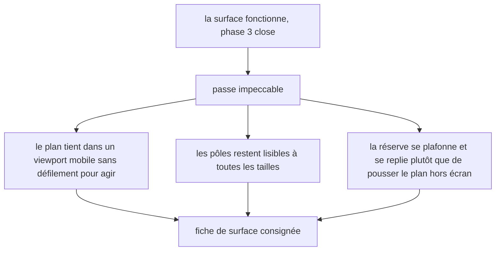
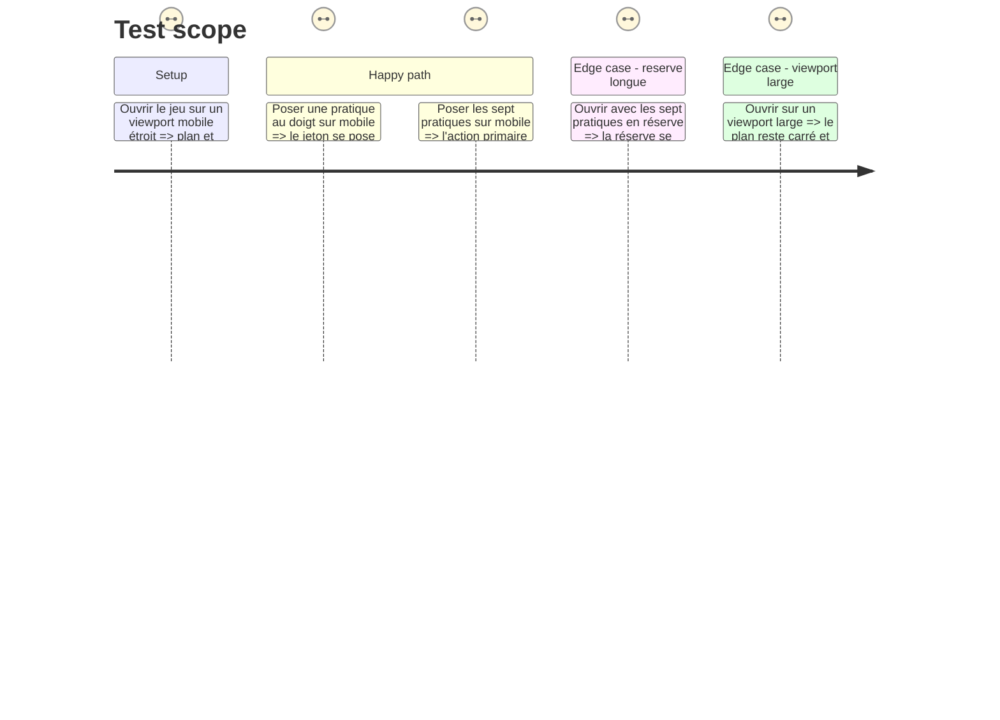

# Instruction: La passe impeccable de la surface

## Architecture projection

> Tree of the final files. ✅ create · ✏️ modify · ❌ delete

```txt
.
├── .impeccable/surfaces/
│   └── ...practice-map-game-tsx.md          ✅ la fiche de surface du jeu
├── src/games/practice-map/components/
│   ├── elements/practice-token.tsx          ✏️
│   ├── elements/marker-line.tsx             ✏️
│   ├── composites/practice-plane.tsx        ✏️
│   ├── composites/practice-tray.tsx         ✏️
│   └── composites/practice-map-game.tsx     ✏️
└── __tests__/unit/games/practice-map/
    └── practice-map-game.test.tsx           ✏️ le comportement mobile, s'il diffère
```

## User Journey



## Test Scope



## Tasks to do

### `1)` La passe de surface

> Vingt jeux, vingt surfaces. Celui-ci ne recopie la composition d'aucun autre.

1. Lancer `/impeccable craft` sur `src/games/practice-map/components/composites/practice-map-game.tsx` et ses composants.
2. Contraintes non négociables à porter dans le brief de la passe :
   - **le plan reste carré** : les deux axes portent la même échelle, sinon une position lue à l'œil ne veut plus dire la même chose selon l'axe ;
   - **aucune ligne de quadrant**, à aucune taille — la story dit « sans case prédéfinie » ;
   - un état est une quantité : remplissage, taille, épaisseur du filet. Jamais une couleur seule, jamais une opacité réduite ;
   - la réserve, qui peut porter sept entrées, **se plafonne et se replie** ; elle ne pousse jamais le plan ni l'action primaire hors de l'écran ;
   - aucune animation : un jeton posé apparaît, il ne glisse pas ;
   - une seule action primaire par écran ;
   - le pas d'espacement unique du produit, plus d'air au-dessus d'un titre qu'en dessous.
3. Sur mobile, décider la mise en page et **la consigner** : le plan garde sa priorité, la réserve passe sous lui. Vérifier qu'aucune alternance ni aucun ordre de lecture ne rend un critère plus facile à tenir passivement — c'est la correction que la revue de `hint-budget` a imposée sur son alternance mobile.
4. Vérifier au doigt sur un viewport étroit : poser un jeton par « saisir puis désigner » doit rester praticable sans zoom.

### `2)` La fiche de surface

> Chaque jeu a sa fiche sous `.impeccable/surfaces/`, et chacun se dessine à son tour.

1. Écrire la fiche du jeu au format des sept fiches déjà présentes.
2. Y consigner ce qui a été décidé et pourquoi, en particulier le refus des lignes de quadrant et le comportement mobile.

### `3)` Les captures de la revue

> Le tour de QA se rend en captures pleine page, comme celui de `hint-budget`.

1. Produire les captures du parcours complet — placement, réserve vide, révélation — sur un viewport large et sur un viewport mobile.
2. Les ranger sous `aidd_docs/tasks/2026_08/2026_08_30_jeu-practice-map/qa/`.

## Test acceptance criteria

| Task | Acceptance criteria |
| --- | --- |
| 1 | Le plan reste carré et sans ligne de quadrant à toutes les tailles ; la réserve pleine ne pousse ni le plan ni l'action primaire hors de l'écran ; aucune animation d'étape |
| 2 | La fiche de surface existe et consigne le refus des lignes de quadrant et la mise en page mobile |
| 3 | Les captures des trois temps existent, sur viewport large et mobile ; `npm run test` et `npm run typecheck` passent |
