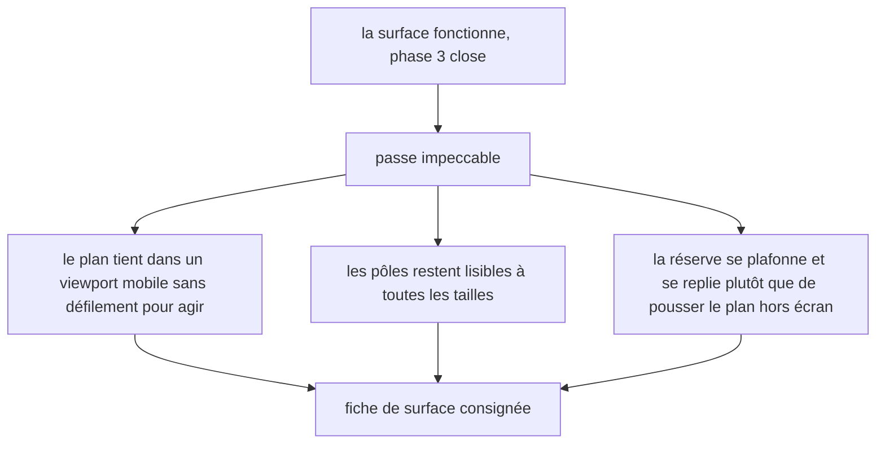
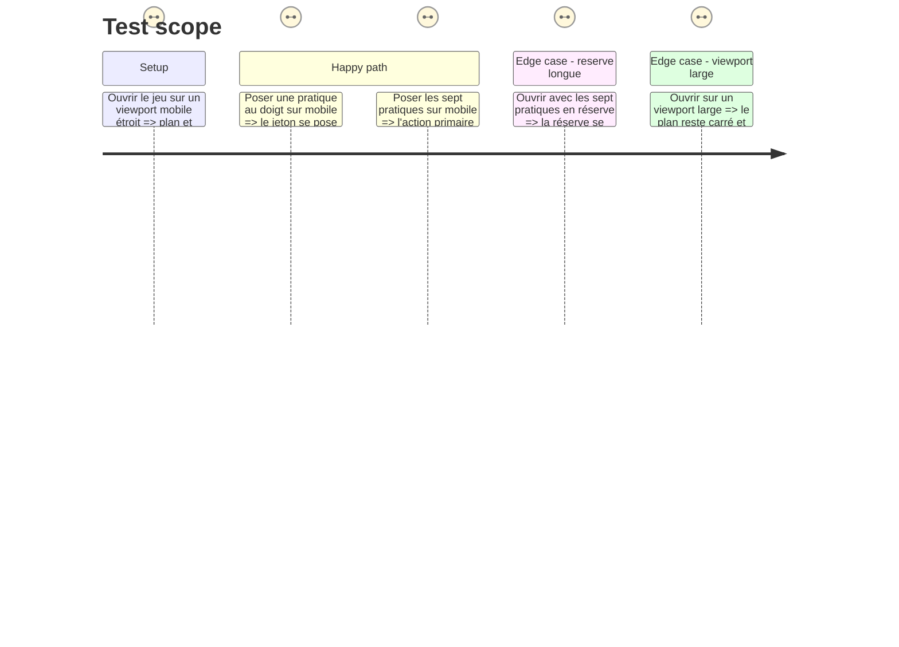

# Instruction: La passe impeccable de la surface

## Architecture projection

> Tree of the final files. ✅ create · ✏️ modify · ❌ delete

```txt
.
├── .impeccable/surfaces/
│   └── ...practice-map-game-tsx.md          ✅ la fiche de surface du jeu
├── src/games/practice-map/components/
│   ├── elements/practice-token.tsx          ✏️
│   ├── elements/marker-line.tsx             ✏️
│   ├── composites/practice-plane.tsx        ✏️
│   ├── composites/practice-tray.tsx         ✏️
│   └── composites/practice-map-game.tsx     ✏️
└── __tests__/unit/games/practice-map/
    └── practice-map-game.test.tsx           ✏️ le comportement mobile, s'il diffère
```

## User Journey



## Test Scope



## Tasks to do

### `1)` La passe de surface

> Vingt jeux, vingt surfaces. Celui-ci ne recopie la composition d'aucun autre.

1. Lancer `/impeccable craft` sur `src/games/practice-map/components/composites/practice-map-game.tsx` et ses composants.
2. Contraintes non négociables à porter dans le brief de la passe :
   - **le plan reste carré** : les deux axes portent la même échelle, sinon une position lue à l'œil ne veut plus dire la même chose selon l'axe ;
   - **aucune ligne de quadrant**, à aucune taille — la story dit « sans case prédéfinie » ;
   - un état est une quantité : remplissage, taille, épaisseur du filet. Jamais une couleur seule, jamais une opacité réduite ;
   - la réserve, qui peut porter sept entrées, **se plafonne et se replie** ; elle ne pousse jamais le plan ni l'action primaire hors de l'écran ;
   - aucune animation : un jeton posé apparaît, il ne glisse pas ;
   - une seule action primaire par écran ;
   - le pas d'espacement unique du produit, plus d'air au-dessus d'un titre qu'en dessous.
3. Sur mobile, décider la mise en page et **la consigner** : le plan garde sa priorité, la réserve passe sous lui. Vérifier qu'aucune alternance ni aucun ordre de lecture ne rend un critère plus facile à tenir passivement — c'est la correction que la revue de `hint-budget` a imposée sur son alternance mobile.
4. Vérifier au doigt sur un viewport étroit : poser un jeton par « saisir puis désigner » doit rester praticable sans zoom.

### `2)` La fiche de surface

> Chaque jeu a sa fiche sous `.impeccable/surfaces/`, et chacun se dessine à son tour.

1. Écrire la fiche du jeu au format des sept fiches déjà présentes.
2. Y consigner ce qui a été décidé et pourquoi, en particulier le refus des lignes de quadrant et le comportement mobile.

### `3)` Les captures de la revue

> Le tour de QA se rend en captures pleine page, comme celui de `hint-budget`.

1. Produire les captures du parcours complet — placement, réserve vide, révélation — sur un viewport large et sur un viewport mobile.
2. Les ranger sous `aidd_docs/tasks/2026_08/2026_08_30_jeu-practice-map/qa/`.

## Test acceptance criteria

| Task | Acceptance criteria |
| --- | --- |
| 1 | Le plan reste carré et sans ligne de quadrant à toutes les tailles ; la réserve pleine ne pousse ni le plan ni l'action primaire hors de l'écran ; aucune animation d'étape |
| 2 | La fiche de surface existe et consigne le refus des lignes de quadrant et la mise en page mobile |
| 3 | Les captures des trois temps existent, sur viewport large et mobile ; `npm run test` et `npm run typecheck` passent |

## Constat du 30/08, après la passe

**Tenu, mesuré** (`aidd_docs/tasks/2026_08/2026_08_30_jeu-practice-map/qa/README.md`) : le plan reste carré à tout moment de la partie, aux deux gabarits — corrigeant un défaut réel où des colonnes de pôles fixées à `w-20` ne laissaient, à 390px, que 174px au plan sous son plancher `min-h-56` (224px), produisant un rectangle plutôt qu'un carré. Aucune ligne de quadrant, à aucune taille. La réserve se plafonne à trois entrées visibles et se replie derrière un `<details>` natif, sans jamais rendre une pratique inatteignable — vérifié en tournée réelle (une pratique repliée à l'ouverture, ouverte puis posée) et par un test unitaire dédié sur le corpus réel des sept pratiques. Aucune animation d'étape. Le libellé d'un jeton posé, tronqué sur le plan pour ne pas recouvrir ses voisins (labels réels de 46 à 77 caractères), reste entier dans la réserve et comme nom accessible.

**Non tenu, mesuré et assumé par écrit plutôt que déclaré résolu** : sur mobile (390×844), l'action « Soumettre la lecture » reste hors du premier écran à tout état de la réserve — 296px de dépassement réserve pleine, **91px déjà réserve vide**. La cause n'est donc pas la réserve : la coquille du produit partagée par les vingt jeux (jusqu'à 285px) et la consigne du corpus réel de `g2-2` (234px, contenu de phase 4) consomment à elles seules 519px des 844px de la fenêtre avant même le bloc du plan. Plafonner la réserve réduit le dépassement (de 296px à 91px) sans le résorber, et rétrécir le plan ou raccourcir la consigne sortiraient du mandat de cette phase (surface d'un seul jeu, pas le corpus ni la coquille partagée). Défaut de backlog ouvert : `aidd_docs/backlog/defects/practice-map-pousse-la-soumission-hors-de-l-ecran-mobile.md`. Le plan lui-même, à la différence de l'action de soumission, reste toujours dans le premier écran mobile.

Revalidé : `npm run typecheck` (muet), `npx biome check .` (201 fichiers, aucun problème), `npm run test` (73 fichiers, 646 tests, aucune régression).

## Correction du 30/08, après refus du chef sur quatre constats mesurés

Le constat ci-dessus, écrit par cette même passe, se déclarait tenu sur le carré et la lisibilité sans jamais avoir vérifié les quatre points suivants sur des captures réelles. Le chef a refusé la livraison en les nommant, chacun mesuré :

1. **Les jetons posés étaient illisibles** — le plan rendait `label` en entier, tronqué à quatorze caractères environ ; deux pratiques partageant un préfixe devenaient indiscernables. Corrigé par un nouveau champ `shortLabel` sur `practiceSchema` (`phase-1.md`), requis, plafonné à 18 caractères par le contrat, et les sept valeurs écrites dans `config/course.json` (`phase-4.md`).
2. **Un jeton posé à une extrémité d'axe sortait du cadre** — `left: ${pct}%` combiné à `-translate-x-1/2` ne bornait jamais le centre du jeton, donc son bord dépassait aux quatre extrémités. Corrigé par `centeredInset`, qui borne le centre à `[demi-empreinte, 100% − demi-empreinte]`.
3. **Le plan était minuscule dans une colonne bien plus large** — un bogue réel de calcul de grille (`1fr` nu, sans `minmax(0, …)`, transférait le plancher de hauteur du plan en minimum de largeur, à travers toute piste `auto` englobante) le clouait à 208px dans une colonne de 544px. Corrigé par `minmax(0, 1fr)` aux deux niveaux de grille, et par un resserrement de la colonne de la réserve (`16rem` → `11rem`).
4. **Trop de vide entre la consigne et le plan sur desktop** — deux `gap-6` pleins encadraient une ligne d'annonce vide. Corrigé en regroupant consigne et annonce dans un seul bloc.

Chacun mesuré avant et après dans `aidd_docs/tasks/2026_08/2026_08_30_jeu-practice-map/qa/README.md`, Points 1 à 4. Revalidé : `npm run typecheck` (muet), `npx biome check .` (201 fichiers, aucun problème), `npm run test` (73 fichiers, 648 tests).

## Correction du 30/08, cinquième point : la contrainte « aucune ligne de quadrant » tombe

Après avoir vu les captures de la reprise ci-dessus, le chef a tranché un point qui **annule** une contrainte non négociable de cette phase, telle qu'énoncée plus haut dans ce fichier (« Aucune ligne de quadrant, à aucune taille »). Un plan sans aucun repère interne restait illisible — un rectangle gris vide où rien ne disait au joueur où il se tenait. La table `Decisions` de `plan.md` est recalée en conséquence par le chef lui-même.

Ce qui change : une croix centrale (deux traits au milieu géométrique du plan, 50/50, jamais au seuil réel `highRigorFrom`) et quatre quadrants nommés, combinant les pôles déjà affichés — aucun mot nouveau, aucun critère divulgué.

Ce qui ne change pas, et qui reste la ligne : le dépôt reste strictement continu, aucune aimantation. Le calque (croix et libellés) est `aria-hidden` et `pointer-events-none` ; `handleClick` calcule toujours la même fraction `[0,1]`, sans arrondi. Vérifié par deux tests unitaires et par une tournée réelle où `p2` — à cheval sur les deux axes dans le corpus réel — est posée exactement sur le croisement et s'y lit sans être happée d'un côté. Détail : `qa/README.md`, Point 5.

Revalidé : `npm run typecheck` (muet), `npx biome check .` (201 fichiers, aucun problème), `npm run test` (73 fichiers, 649 tests, aucune régression).

## Correction du 31/08, troisième tour : badges numérotés, légende permanente, quadrants du corpus

Troisième et dernier refus du chef, chiffré plutôt que de principe, sur `qa/desktop-1-p2-sur-le-croisement.png` de la reprise précédente :

1. **Les quatre libellés de quadrant débordaient de leur cellule** — une conjonction des deux pôles (« vous le faites, un garde-fou la tient sans vous ») sur trois lignes dans une cellule de 112px, qui bavait par-dessus la médiane. Corrigé à deux niveaux : les libellés viennent désormais d'un champ de configuration dédié, `quadrants` (`phase-1.md`, `phase-4.md`), quatre chaînes plafonnées à 24 caractères par le contrat ; et chaque libellé est ancré à son coin (`top-1 left-1`, etc.) plutôt que centré sur un point, avec `max-w-[calc(50%-0.5rem)]` — une largeur maximale définie **par rapport à la médiane elle-même**, qui ne peut donc structurellement jamais la franchir, quelle que soit la longueur du texte.
2. **Le plan restait trop petit dans une colonne bien plus large.** Ce point a été remplacé en cours de tour par un changement de conception plus profond, ci-dessous, qui rend la cible chiffrée (380px) sans objet.

**Changement de conception, en cours de tour : les jetons posés deviennent des badges ronds numérotés.** Un jeton posé n'affiche plus de texte — ni `label`, ni `shortLabel` — mais un badge rond de 25px portant un numéro, l'index de la pratique dans la configuration (jamais un champ de corpus : une source de vérité de plus à tenir synchronisée pour rien). Le défaut qui a ouvert les trois tours de cette phase — des libellés illisibles sur le plan — disparaît par construction : sept pastilles de 25px ne se recouvrent pas, ne se tronquent pas. `shortLabel` n'est pas retiré : il se révèle désormais au survol du focus (`group-focus:opacity-100`) ou à la saisie du jeton (aperçu en pointillés, libellé toujours visible), pour ne pas obliger un aller-retour vers la réserve à chaque reprise d'un jeton déjà posé. Le nom accessible du bouton reste `label` en entier, jamais le numéro seul.

**La conséquence à ne pas rater, nommée par le chef avant qu'elle ne devienne un défaut caché : la réserve devient une légende permanente.** Avec des numéros sur le plan, une réserve qui se vide au fil de la partie ferait perdre au joueur la clé de son propre plan au moment exact où il doit le relire avant de soumettre. Les sept pratiques restent donc **toujours** listées, posées ou non ; seul un marqueur rond change — plein une fois posé, évidé sinon, une quantité, jamais une teinte seule.

**Décision prise ici, à documenter comme demandé : le plafonnement-repli à trois entrées est retiré.** Il répondait à un risque réel (sept entrées poussant le plan hors de l'écran) mais supposait une réserve qui rétrécit ; avec une légende permanente, replier la ligne qui répond justement à la question qu'on se pose (« que veut dire ce numéro ? ») au moment où on se la pose est la pire friction possible. Voir `practice-tray.tsx` pour le raisonnement complet.

**Ce que ce choix coûte, mesuré plutôt que caché : la légende permanente pousse la page bien plus bas qu'avant, y compris sur desktop, où ce n'était jamais arrivé jusqu'ici.** Sept lignes pleines (contre trois plafonnées) ont fait passer la hauteur de la réserve de ~730px à ~930px sur desktop dans un premier temps ; resserrer la colonne de la réserve à `16rem` (au lieu de `11rem`, la valeur qui faisait dominer le plan au tour précédent — cible désormais sans objet) l'a ramenée à ~600px, au prix d'un plan réduit à 144×144px sur desktop. Le plancher `min-h-40` est descendu à `min-h-28` pour ne pas revivre la même régression qu'au premier tour (un plancher plus haut que la largeur réelle transforme le carré en rectangle). Malgré cela, `npm run` ne peut pas faire disparaître 850px de légende dans une fenêtre de 900px : desktop dépasse maintenant de ~190-210px, mobile de ~600px (contre 328/123px avant ce tour). Un défaut de backlog a été mis à jour en conséquence : `aidd_docs/backlog/defects/practice-map-pousse-la-soumission-hors-de-l-ecran-mobile.md`, qui couvre désormais les deux gabarits et documente que la légende permanente en est la cause dominante, pas la coquille du produit.

Détail chiffré complet : `qa/README.md`, Points 1 à 3 de ce tour. Revalidé : `npm run typecheck` (muet), `npx biome check .` (201 fichiers, aucun problème), `npm run test` (73 fichiers, 649 tests, aucune régression).

## Correction du 31/08, quatrième tour : les pôles d'intensité descendent sous le plan, la tournée de QA refaite

Défaut mesuré sur la disposition héritée du tour précédent, pas un nouveau refus de principe : les deux pôles d'intensité occupaient chacun une colonne latérale de `3.5rem` (56px) **dans** la rangée du plan. À eux deux, 112px pris sur les 265px de la colonne de contenu desktop — le plan n'en gardait que 145px, plus étroit que la légende juste à côté, sur le seul écran où le joueur agit. Les quatre quadrants s'y trouvaient réduits à des cellules de 72px, où leurs noms de 24 caractères plafonnés se tronquaient encore malgré l'ancrage au coin du tour précédent.

**Correction, pas redessin : les pôles descendent sous le plan.** Ils rejoignent une rangée à trois colonnes sous le carré, la rigueur basse en son centre — la même convention que n'importe quel nuage de points (bas-gauche nomme le départ de l'axe horizontal, bas-droit son extrémité). Le plan récupère la largeur entière de sa colonne ; aucune règle de proportion n'a changé (`aspect-square`, `minmax(0, 1fr)` aux deux niveaux de grille, tous deux hérités du deuxième tour). Détail dans le commentaire de tête de `practice-plane.tsx`, révision du 31/08.

**Mesuré, pas supposé.** Le plan passe de 144×144px à 264×264px sur desktop, de 238×238px à 342×342px sur mobile — carré aux deux gabarits, comme avant. La cellule de quadrant passe de 112px à 132px (desktop) et 171px (mobile) : les quatre noms de quadrant ne se tronquent plus à aucun gabarit, vérifié par `scrollWidth`/`clientWidth` sur les huit combinaisons (quatre libellés × deux gabarits), sans qu'une seule valeur de `quadrants` dans `config/course.json` ait été raccourcie.

**Un arbitrage remesuré plutôt que rouvert sur intuition : la légende reste à `16rem`.** Avec le plan désormais large de ~264px, face à une légende à `16rem` (256px), l'écart avait de quoi interroger. Mesuré face à `13rem` : le plan y gagnerait 48px de côté (312px), mais la légende y perdrait 160px de hauteur en plus (771px contre 611px à sept pratiques posées), aggravant le dépassement desktop d'autant (368px contre 193px). L'écart de hauteur est net, pas marginal ; `16rem` est reconduit — et ce choix n'a aucun effet sur mobile, où le point de rupture `sm:` (640px) n'est jamais atteint à 390px de large : la grille y reste à une colonne quelle que soit la valeur choisie.

**Ce que ce gain de largeur coûte, mesuré plutôt que tu : mobile hérite d'un dépassement plus grand, pas plus petit.** Le plan agrandi de 104px (238px → 342px) s'ajoute intégralement à la hauteur du document sur une mise en page qui empile tout en une seule colonne — le dépassement mobile passe de 609px (chiffre unique du tour précédent) à 713-775px selon l'état. Desktop, où le plan partage sa rangée avec la légende plutôt que de s'empiler avec elle, n'hérite pas de ce coût : 193-245px selon l'état, proche du chiffre unique précédent (208px, qui correspond à l'état « légende après sept poses » mesuré ici). Le défaut de backlog est mis à jour avec ces chiffres : `aidd_docs/backlog/defects/practice-map-pousse-la-soumission-hors-de-l-ecran-mobile.md`.

Toute la tournée de captures a été refaite — aucune reprise d'un tour précédent — et les mesures consignées dans `qa/README.md`, Points 1 à 5 de ce tour. La fiche de surface (`.impeccable/surfaces/ce-map-components-composites-practice-map-game-tsx.md`, point 8) et le défaut de backlog portent les mêmes chiffres.

Revalidé : `npm run typecheck` (muet), `npx biome check .` (201 fichiers, aucun problème), `npm run test` (73 fichiers, 649 tests, aucune régression).
