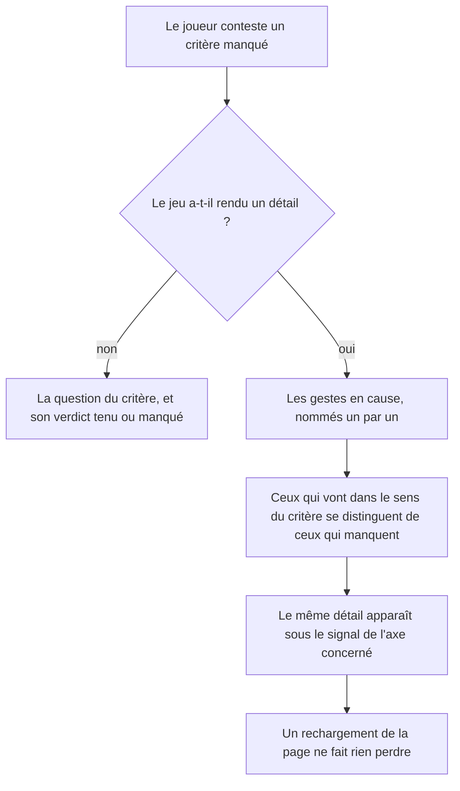
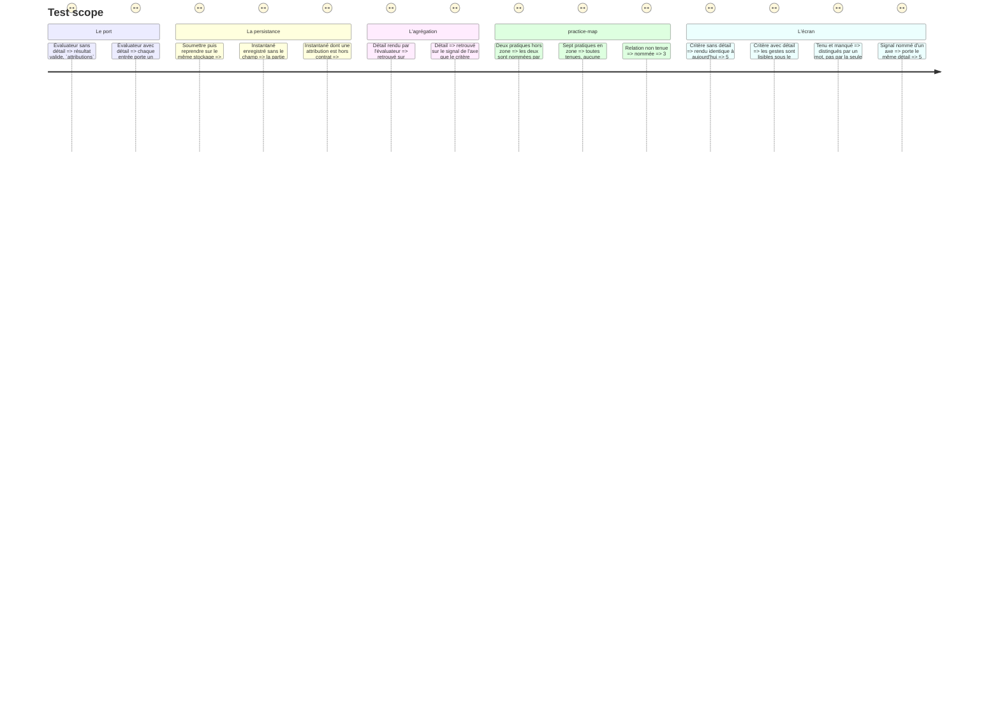

# Instruction: Le port porte le détail, et il traverse jusqu'à l'écran

## Architecture projection

> Tree of the final files. ✅ create · ✏️ modify · ❌ delete

```txt
.
├── src/core/ports/
│   └── game-evaluator.interface.ts           ✏️ `attributions` optionnel sur `CriterionResult`
├── src/core/contracts/
│   └── session-snapshot.schema.ts            ✏️ le contrat d'instantané accepte le détail
├── src/core/entities/
│   └── evaluation-result.entity.ts           ✏️ `CriterionOutcome` conserve le détail
├── src/core/scoring/helpers/
│   └── axis-proof.helper.ts                  ✏️ `AxisSignal` porte le détail de son critère
├── src/games/practice-map/
│   └── practice-map.evaluator.ts             ✏️ premier porteur : nomme les pratiques hors zone
├── src/features/scoring-summary/components/
│   ├── elements/
│   │   └── attribution-list.tsx              ✅ les gestes en cause, tenus et manqués distingués
│   ├── composites/axis-proof-row.tsx         ✏️ le signal nommé porte son détail
│   └── composites/criteria-trail.tsx         ✅ la trace critère → jeu → groupe, extraite de la section
├── src/features/scoring-summary/components/
│   └── sections/summary-view.tsx             ✏️ délègue la trace au composite
└── __tests__/
    ├── unit/core/entities/evaluation-result.test.ts       ✏️ le détail traverse l'agrégation
    ├── unit/core/scoring/axis-proof.test.ts               ✏️ le signal porte son détail
    ├── unit/core/session/game-session.facade.test.ts      ✏️ le détail survit à une reprise
    ├── unit/games/practice-map/evaluator.test.ts          ✏️ les pratiques hors zone sont nommées
    └── unit/features/scoring-summary/
        ├── attribution-list.test.tsx                      ✅ tenus et manqués ne se confondent pas
        └── criteria-trail.test.tsx                        ✅ un critère sans détail reste lisible
```

## Ce qu'on construit

### 1. Le port rend ce que le jeu sait déjà

`src/core/ports/game-evaluator.interface.ts` :

```ts
export type CriterionAttribution = {
  /** Le geste ou l'objet en cause, nommé pour le joueur — jamais un id. */
  label: string
  /** Vrai quand ce geste va dans le sens du critère. */
  held: boolean
}

export type CriterionResult = {
  criterionId: string
  satisfied: boolean
  /** Ce qui a produit ce verdict, quand le jeu a mieux qu'un booléen. */
  attributions?: readonly CriterionAttribution[]
}
```

Optionnel, et il le reste. Un critère réellement binaire n'invente rien.

### 2. Le détail survit à un rechargement

`session-snapshot.schema.ts` : `criterionResultSchema` accueille `attributions`, **optionnel**, chaque entrée `{ label: string.min(1), held: boolean }`.

Sans ça, une partie reprise perdrait le détail et le verdict serait plus pauvre après un rechargement qu'avant. Optionnel pour la même raison que `repository` : une partie enregistrée avant ce champ n'en porte pas, et un instantané hors contrat est ignoré en silence — toutes ces parties disparaîtraient.

**Écris le test qui le prouve** : soumettre, persister, reprendre par une nouvelle façade sur le même stockage, et retrouver le détail dans le verdict.

### 3. Le détail traverse l'agrégation sans être recalculé

`CriterionOutcome` (dans `evaluation-result.entity.ts`) conserve `attributions`. `AxisSignal` (dans `axis-proof.helper.ts`) le porte jusqu'à la preuve d'axe. Rien n'est recalculé à la lecture — c'est la règle de l'entité depuis le début.

### 4. `practice-map` est le premier porteur

C'est le cas que le défaut nomme : `readPlacements` calcule un `inZone` **par pratique** et sait exactement lesquelles des sept étaient mal situées ; `c1` sort « manqué » et la liste disparaît.

L'évaluateur remplit `attributions` pour ses critères de placement et de relation, en résolvant le **libellé de la pratique** depuis la config — jamais `p3`. Le helper de lecture n'est pas touché : il rend déjà ce qu'il faut.

### 5. L'écran nomme les gestes là où le joueur conteste

`attribution-list.tsx` (element, dumb) rend une liste de gestes où tenu et manqué se distinguent par un mot et une forme, jamais par la seule couleur — même règle que la marque de mesure.

Deux points d'affichage, et deux seulement :

- sous le signal nommé d'un axe, dans `axis-proof-row.tsx` ;
- sous le critère, dans la trace « Ce qui a produit ce niveau ».

Cette trace vit aujourd'hui en JSX inline dans `summary-view.tsx`, sur une cinquantaine de lignes. Extrais-la en `criteria-trail.tsx` avant de l'étendre : la section est déjà la plus longue de l'écran, et lui ajouter un niveau de détail sans l'extraire la rendrait illisible.

Un critère sans détail s'affiche exactement comme aujourd'hui. L'ajout ne dégrade rien.

## User Journey



## Test Scope



## Wireframe

```txt
DANS LA TRACE « CE QUI A PRODUIT CE NIVEAU »
┌───────────────────────────────────────────────────────────────┐
│ Placer les pratiques sur deux axes                            │
│ ▪ Les pratiques sont-elles dans leur zone ?          manqué   │
│   ├ ✓ Revue de diff avant merge                               │ (1)
│   ├ ✓ Fichier de contexte projet                              │
│   ├ ✗ Boucle de relance sur commande                          │ (2)
│   ├ ✗ Hook bloquant avant commit                              │
│   └ ✗ Agent spécialisé versionné                              │
│ ▪ Les relations d'ordre tiennent-elles ?             tenu     │
└───────────────────────────────────────────────────────────────┘

(1) Nommé par son libellé de config, jamais par `p3`.
(2) Le mot « manqué » accompagne la forme : le sens ne tient pas à la couleur.
```

## Definition of done

- `npm run typecheck`, `npm run test`, `biome check` au vert.
- Aucun autre évaluateur n'est touché : ils arrivent en phase 2, et le champ est optionnel exprès pour que ce soit possible.
- Un critère sans détail rend un écran identique à celui d'avant cette phase.
