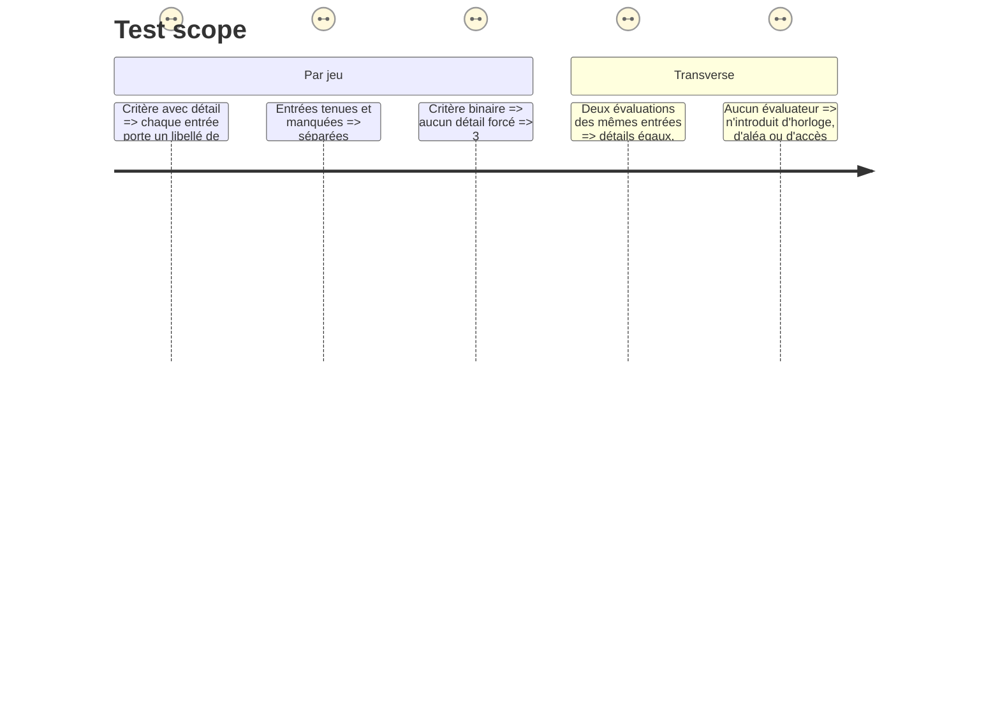

# Instruction: Les sept autres jeux cessent de jeter ce qu'ils savent

## Architecture projection

> Tree of the final files. ✅ create · ✏️ modify · ❌ delete

```txt
.
├── src/games/
│   ├── checkpoints/checkpoints.evaluator.ts        ✏️ nomme l'étape de chaque reprise
│   ├── confidence-bet/confidence-bet.evaluator.ts  ✏️ nomme chaque pari et son issue
│   ├── defect-hunt/defect-hunt.evaluator.ts        ✏️ nomme chaque défaut vu ou raté
│   ├── hint-budget/hint-budget.evaluator.ts        ✏️ nomme chaque situation et l'indice acheté
│   ├── lie-detector/lie-detector.evaluator.ts      ✏️ nomme chaque affirmation et le verdict rendu
│   ├── test-bench/test-bench.evaluator.ts          ✏️ nomme chaque proposition retenue ou écartée
│   └── three-tracks/three-tracks.evaluator.ts      ✏️ nomme chaque chantier et son sort
└── __tests__/unit/games/*/evaluator.test.ts        ✏️ un test de détail par jeu
```

## Ce qu'on construit

Le port porte déjà `attributions` (phase 1) et `practice-map` le remplit. Les sept autres évaluateurs calculent le même genre de détail et le jettent au moment de rendre leur booléen.

Règles, identiques pour les sept :

- **Le libellé est destiné au joueur, résolu depuis la config.** Jamais `p3`, `step-4`, `t2`. Chaque jeu a la config sous la main au moment d'évaluer.
- **`held` dit si ce geste va dans le sens du critère**, pas s'il est « bon » dans l'absolu. Sur un critère qui mesure une absence — ne pas retenir une proposition non vérifiable — l'entrée tenue est celle qu'on a bien écartée.
- **Un critère réellement binaire reste sans détail.** « La feature entière est-elle livrée dans le budget ? » n'a rien à attribuer : ne force pas une liste à une entrée.
- **Aucune horloge, aucun aléa, aucun accès extérieur.** Deux évaluations des mêmes entrées rendent le même détail, dans le même ordre — c'est la condition du rejeu.
- **Le helper de lecture de chaque jeu n'est pas touché** : il rend déjà ce qu'il faut. Seul l'évaluateur change, parce que c'est lui le point de contact avec le port.

## Test Scope



## Definition of done

- `npm run typecheck`, `npm run test`, `biome check` au vert.
- Les sept évaluateurs rendent un détail sur au moins un critère chacun, sauf là où le critère est réellement binaire — et dans ce cas, la raison est écrite dans le commentaire.
- Aucun libellé technique n'atteint l'écran.
