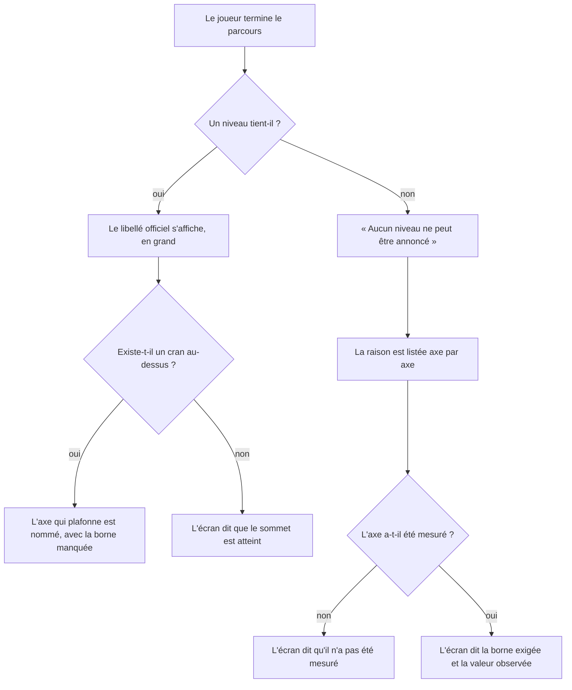
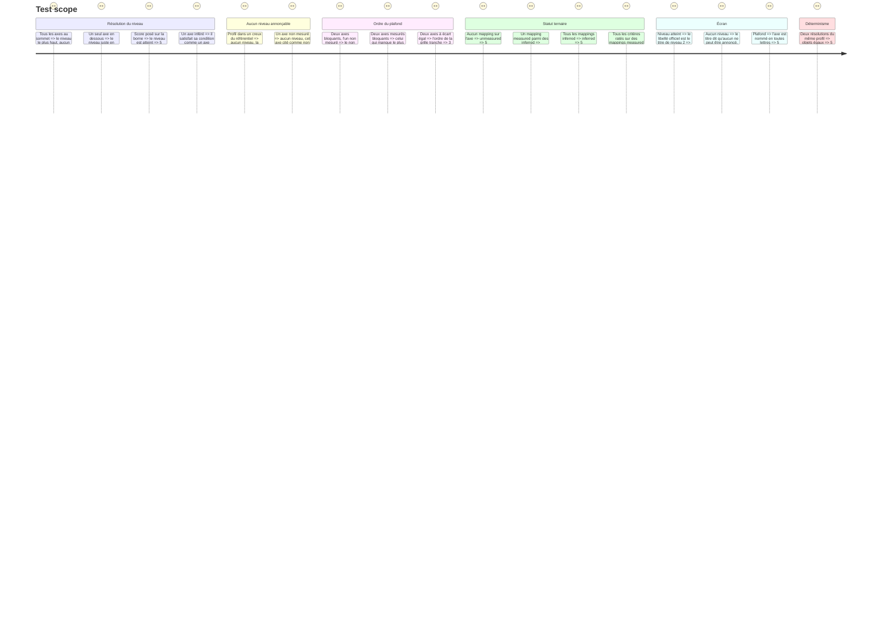

# Instruction: Le niveau assume ce qu'il ignore, et nomme son plafond

## Architecture projection

> Tree of the final files. ✅ create · ✏️ modify · ❌ delete

```txt
.
├── src/core/contracts/
│   └── course.schema.ts                      ✏️ `evidence` optionnel sur le mapping, `'measured'` par défaut
├── src/core/ports/
│   └── scoring-strategy.interface.ts         ✏️ `measured: boolean` → `measurement: MeasurementStatus`, `evidence` sur la contribution
├── src/core/scoring/
│   ├── weighted-mapping.strategy.ts          ✏️ résout le statut ternaire depuis les contributions
│   └── helpers/
│       └── level-resolver.helper.ts          ✏️ plus de repli ; état non classé, conditions bloquantes, axe qui plafonne
├── src/features/scoring-summary/components/
│   ├── composites/
│   │   ├── level-block.tsx                   ✅ le niveau, ou l'absence de niveau et sa raison
│   │   └── capping-axis.tsx                  ✅ l'axe qui plafonne et la borne manquée
│   ├── composites/dimension-row.tsx          ✏️ suit le renommage de `measured` (refonte en phase 2)
│   └── sections/summary-view.tsx             ✏️ rend le bloc de niveau et l'axe qui plafonne
├── config/
│   └── course.json                           ✏️ `evidence: "inferred"` sur les mappings de renfort
└── __tests__/unit/
    ├── core/scoring/level-resolver.test.ts   ✏️ le repli devient l'état non classé ; plafond et conditions bloquantes
    ├── core/scoring/weighted-mapping.test.ts ✏️ statut ternaire
    ├── core/session/game-session.facade.test.ts ✏️ suit le renommage
    └── features/scoring-summary/
        └── level-block.test.tsx              ✅ le niveau nommé, l'absence de niveau expliquée, le plafond nommé
```

## Ce qu'on construit

### 1. Le mapping déclare sa nature de preuve

Dans `course.schema.ts` :

```ts
export const mappingEvidenceSchema = z.enum(['measured', 'inferred'])

export const criterionMappingSchema = z.object({
  dimension: z.string().min(1),
  weight: z.number().positive(),
  evidence: mappingEvidenceSchema.default('measured'),
})
```

Additif : les mappings existants restent valides et prennent `'measured'`.

Puis, dans `config/course.json`, poser `"evidence": "inferred"` sur les mappings de **renfort** — ceux dont le jeu lit un jugement et non un résultat, ou dont le groupe n'a pas cet axe pour sujet :

| Jeu(x) | Mappings à marquer `inferred` |
| --- | --- |
| `g2-3` | **tous** ses mappings (`pilotage-contexte` et `harness`) : le jeu est un banc |
| `g3-1`, `g3-2`, `g3-3` | **tous** leurs mappings (`resilience` et `harness`) : trois bancs |
| `g4-1`, `g4-2` | **tous** leurs mappings (`verification` et `intervention`) : ce groupe est un banc |
| `g5-1`, `g5-2` | tous leurs mappings vers `taille` |
| `g6-1`, `g6-2` | tous leurs mappings vers `harness` |
| `g7-3`, `g7-4`, `g7-5` | tous leurs mappings : bancs tenant lieu de `task-board`, `scope-break`, `repo-kit` |

Les mappings de `g1-*`, `g2-1`, `g2-2`, `g7-1`, `g7-2` restent `measured` : jeux réels sur leur propre axe.

La règle porte sur le **jeu**, pas sur le couple jeu × axe : un `test-bench` lit un jugement quel que soit l'axe qu'il vise. `pilotage-contexte` reste `measured` par `g2-1` et `g2-2`, qui sont de vrais jeux.

> Attendu après ce marquage : `intervention`, `parallele`, `verification`, `pilotage-contexte` mesurés ; `taille`, `harness`, `initiative`, `resilience` inférés. Vérifier ce tableau, il est l'acceptance de la phase 2.

### 2. Le statut de mesure devient ternaire

Dans `scoring-strategy.interface.ts` :

```ts
export type MeasurementStatus = 'measured' | 'inferred' | 'unmeasured'
```

`DimensionContribution` gagne `evidence: MappingEvidence`. `DimensionScore` remplace `measured: boolean` par `measurement: MeasurementStatus`.

`WeightedMappingStrategy` le résout : aucune contribution → `unmeasured` ; au moins une `'measured'` → `measured` ; sinon → `inferred`. Le statut ne dépend **jamais** de `satisfied` : il dit comment la valeur a été obtenue, pas ce qu'elle vaut.

### 3. Le résolveur cesse de mentir

`level-resolver.helper.ts` :

```ts
export type ConditionGap = {
  condition: LevelCondition
  dimension: DimensionScore | undefined
  /** L'écart à la borne violée. Absent quand l'axe n'a pas été mesuré. */
  gap: number | undefined
}

export type LevelVerdict = {
  /** Absent quand même le niveau le plus bas ne tient pas. */
  level: Level | undefined
  /** Ce qui empêche d'annoncer un niveau. Absent dès qu'un niveau est atteint. */
  unranked: readonly ConditionGap[] | undefined
  satisfiedConditions: readonly LevelCondition[]
  /** Les conditions de la cible qui ne tiennent pas, la plus bloquante en tête. */
  blocking: readonly ConditionGap[]
  /** Ce que le niveau atteint dit pour monter. Absent quand aucun n'est atteint. */
  hint: string | undefined
  nextLevel: Level | undefined
}
```

> **Écart avec le code livré** (revue du 2026-08-31, résidus C2/C3/C6) :
> `capping` a disparu du type. L'écran lit l'axe qui plafonne sur `plan[0]`
> (la tête du plan de progression), pas sur un champ dédié qui dupliquait la
> même information sous deux formes. `LevelVerdict` porte aussi
> `noNextLevelReason: 'summit' | 'unreachable' | undefined`, absent de ce
> plan initial : `resolveClimbTarget` peut ne retenir aucune cible (toute la
> grille au-dessus de la position courante viole une borne `max`), et
> l'écran doit distinguer ce cas du sommet du référentiel atteint plutôt que
> de les confondre dans une phrase unique.

Règles :

- `holds` refuse une dimension absente ou `unmeasured` ; `inferred` passe comme `measured`.
- Aucun niveau ne tient → `level: undefined`, `nextLevel` = la cible atteignable en montant (jamais un repli sur le niveau le plus bas), `unranked` et `blocking` = les conditions non tenues respectivement du niveau le plus bas et de la cible, `hint: undefined`.
- Un niveau tient → `blocking` = les conditions non tenues de la cible atteignable au-dessus. Sans cible (sommet atteint, ou aucune atteignable en montant), `nextLevel` est absent et `blocking` est vide.
- Tri de `blocking` : `gap === undefined` (axe non mesuré) d'abord, puis `gap` décroissant, puis l'ordre des dimensions dans `grid.dimensions`.
- `gap` : pour une borne `min` violée, `min - score` ; pour une borne `max` violée, `score - max`.
- Aucune horloge, aucun aléa : deux appels sur les mêmes entrées rendent le même objet.

### 4. L'écran dit le niveau, ou dit qu'il ne peut pas

`level-block.tsx` (dumb) reçoit `LevelVerdict` et rend :

- niveau atteint → le libellé officiel en titre de niveau 2, et le cran suivant nommé s'il existe ;
- aucun niveau → « Aucun niveau ne peut être annoncé » en titre de niveau 2, suivi de la raison construite sur `unranked` : chaque axe en cause, sa borne exigée, et — pour un axe non mesuré — le fait qu'il ne l'a pas été.

`capping-axis.tsx` (dumb) reçoit la tête du plan de progression (`plan[0]`) et nomme l'axe, sa borne exigée et la valeur observée. Sans axe qui plafonne, il distingue le sommet atteint de l'absence de cran atteignable en montant, sur `LevelVerdict.noNextLevelReason`.

Aucun pourcentage dans ces deux composants.

## User Journey



## Test Scope



## Wireframe

```txt
NIVEAU ATTEINT                          AUCUN NIVEAU ANNONÇABLE
┌──────────────────────────────────┐   ┌──────────────────────────────────┐
│ NIVEAU ATTEINT                   │   │ NIVEAU                           │
│                                  │   │                                  │
│ 🟢 Green                         │   │ Aucun niveau ne peut             │
│ ──────────────────────────────── │   │ être annoncé                     │
│ Mener trois chantiers de front…  │   │ ──────────────────────────────── │
│                                  │   │ Le référentiel demande, pour     │
│ CE QUI PLAFONNE                  │   │ son premier cran :               │
│ Chantiers menés en parallèle     │   │                                  │
│ demandait 3 chantiers et plus ;  │   │ · Taille — au plus « aucune      │
│ le parcours en a lu 2.       (1) │   │   feature livrée », lu à S   (2) │
│                                  │   │ · Initiative — non mesuré    (3) │
│ NIVEAU SUIVANT · 🥉 Copper       │   │                                  │
└──────────────────────────────────┘   └──────────────────────────────────┘

(1) L'axe qui plafonne est nommé, pas déduit d'une barre.
(2) La borne exigée et la valeur lue, dans les mots de la grille.
(3) Un axe non mesuré passe devant : aucune action ne l'ouvre.
```

## Definition of done

- `npm run typecheck` et `npm run test` au vert.
- Aucun `measured: boolean` ne subsiste dans `src/`.
- Aucun profil ne peut plus afficher « ❖ White » sans en remplir les conditions.
- Le tableau des statuts attendus (section 1) est vérifié sur `config/course.json` réel.
