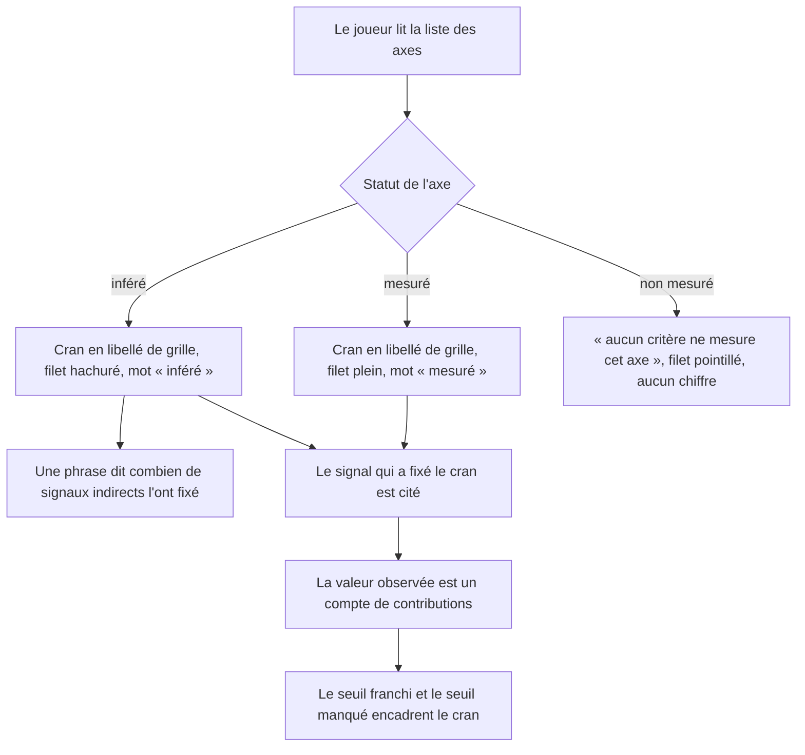
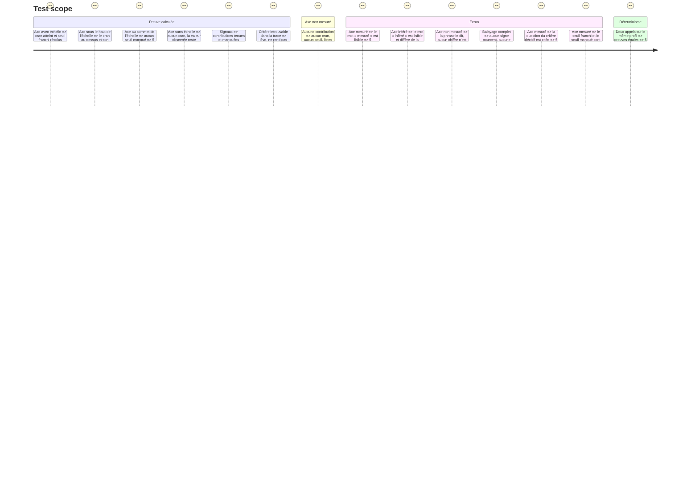

# Instruction: Chaque axe porte sa preuve et son statut de mesure

## Architecture projection

> Tree of the final files. ✅ create · ✏️ modify · ❌ delete

```txt
.
├── src/core/scoring/helpers/
│   └── axis-proof.helper.ts                  ✅ cran atteint, seuil franchi, seuil manqué, signaux décisifs
├── src/core/session/
│   └── game-session.facade.ts                ✏️ `Verdict.proof`, `SignatureReading.proof`
├── src/features/scoring-summary/components/
│   ├── elements/
│   │   └── measurement-mark.tsx              ✅ la marque du statut, en toutes lettres et en structure
│   ├── composites/
│   │   ├── axis-proof-row.tsx                ✅ un axe : cran, signal, valeur observée, seuils
│   │   └── dimension-row.tsx                 ❌ remplacé
│   └── sections/summary-view.tsx             ✏️ rend les axes par leur preuve
├── aidd_docs/memory/
│   └── architecture.md                       ✏️ note sur les trois axes qui montent sur des bancs
└── __tests__/unit/
    ├── core/scoring/axis-proof.test.ts       ✅ seuils, signaux, statut
    └── features/scoring-summary/
        └── axis-proof-row.test.tsx           ✅ les trois statuts se lisent, aucun pourcentage
```

## Ce qu'on construit

### 1. La preuve d'un axe, calculée une fois

`src/core/scoring/helpers/axis-proof.helper.ts` :

```ts
export type AxisSignal = {
  criterionId: string
  gameId: string
  question: string
  weight: number
  satisfied: boolean
  evidence: MappingEvidence
}

export type AxisProof = {
  dimensionId: string
  label: string
  measurement: MeasurementStatus
  /** Le cran atteint, dans les mots de la grille. Absent sans échelle. */
  band: string | undefined
  /** Le cran juste au-dessus, manqué. Absent au sommet de l'échelle. */
  missedBand: { label: string } | undefined
  /** La valeur observée, en contributions — jamais un pourcentage. */
  earned: number
  possible: number
  /** Ce qui a fixé le cran : les contributions tenues, la plus lourde en tête. */
  held: readonly AxisSignal[]
  /** Ce qui a manqué : les contributions non tenues, la plus lourde en tête. */
  missed: readonly AxisSignal[]
}

export const proveAxes = (
  grid: Grid,
  dimensions: readonly DimensionScore[],
  criteria: readonly CriterionOutcome[],
): AxisProof[]
```

> **Écart avec le code livré** (revue du 2026-08-31, résidu C6) : `crossed`
> et `missedBand.from` ont disparu. Une fois le seuil franchi rendu comme le
> libellé de bande déjà en tête de ligne (`proof.band`), `crossed` dupliquait
> la même donnée sous un second nom sans consommateur ; `missedBand.from`
> n'en avait jamais eu, l'écran ne lisant que `.label`.

- `question` se résout depuis `criteria` par `criterionId` ; un critère introuvable est une incohérence de câblage, pas un cas nominal — lever, comme `buildGameOutcome` le fait déjà.
- Tri de `held` et `missed` : poids décroissant, puis `criterionId` pour rester déterministe.
- Un axe `unmeasured` a `band` et `missedBand` absents et `held` / `missed` vides.
- Pur : aucune horloge, aucun aléa, aucun accès réseau.

La façade expose `proof` sur le verdict et sur la lecture de signature — mêmes axes, même helper.

### 2. La ligne d'axe dit sa preuve, pas son pourcentage

`axis-proof-row.tsx` remplace `dimension-row.tsx`. Ce qu'elle porte, dans cet ordre de lecture :

1. **Le cran atteint**, en libellé de grille, en gros. C'est l'objet le plus grand de la ligne — pas un chiffre.
2. **Le libellé de l'axe.**
3. **Le signal qui l'a fixé** : la question du critère tenu le plus lourd. Rien à afficher quand aucun n'est tenu.
4. **La valeur observée** : `earned` sur `possible` contributions.
5. **Les seuils** : le seuil franchi, et le seuil manqué avec le cran qu'il ouvrait.

**Aucun pourcentage nulle part.**

### 3. Trois statuts, trois marques qui ne s'empruntent rien

`measurement-mark.tsx` rend le statut. Chaque état porte **un mot** et **une forme**, jamais une simple variation d'opacité — un lecteur doit distinguer les trois sans comparer deux lignes :

| Statut | Mot | Forme |
| --- | --- | --- |
| `measured` | « mesuré » | filet plein, pleine hauteur |
| `inferred` | « inféré » | filet hachuré, hauteur réduite |
| `unmeasured` | « non mesuré » | filet pointillé creux |

Le mot est visible, pas seulement accessible : la distinction est le sujet de la story, elle ne se cache pas dans un `aria-label`.

Un axe `unmeasured` affiche « aucun critère ne mesure cet axe » à la place du cran, et **aucun chiffre** — ni `0`, ni `—` là où un cran bas s'écrirait.

Un axe `inferred` dit d'où vient l'inférence en une phrase : le nombre de signaux indirects qui l'ont fixé.

### 4. La dette rendue visible se consigne

Ajouter à `aidd_docs/memory/architecture.md`, sous la règle « Le déclaratif ne monte jamais un niveau » : `taille`, `harness` et `initiative` montent aujourd'hui sur des bancs de jugement faute de `scope-break`, `repo-kit` et `task-board`. L'écran les marque `inféré`. La dette se solde en construisant les trois jeux, pas en changeant la règle.

## User Journey



## Test Scope



## Wireframe

```txt
┌───────────────────────────────────────────────────────────────┐
│ LES AXES DU RÉFÉRENTIEL                                       │
├───────────────────────────────────────────────────────────────┤
│ L — multi-étapes                              inféré      ▨   │ (1)
│ Taille de la plus grosse feature livrée avec l'IA             │
│ fixé par « La découpe tient-elle l'ordre des dépendances ? »  │ (2)
│ 5 sur 6 contributions · franchi 0.75 · manqué 1 → XL          │ (3)
│ 4 signaux indirects, aucune mise en situation dédiée          │ (4)
├───────────────────────────────────────────────────────────────┤
│ aux étapes clés                               mesuré      ▮   │
│ Reprise humaine du travail de l'IA                            │
│ fixé par « La reprise la plus lourde a-t-elle eu lieu… ? »    │
│ 7 sur 7 contributions · franchi 0.75 · manqué 1 → jamais      │
├───────────────────────────────────────────────────────────────┤
│ aucun critère ne mesure cet axe            non mesuré     ┆   │ (5)
│ Initiative des agents                                         │
└───────────────────────────────────────────────────────────────┘

(1) Le cran prend la place du pourcentage : c'est le mot de la grille.
(2) Le signal décisif, cité tel qu'il est posé dans le parcours.
(3) La valeur observée est un compte, encadrée par ses deux seuils.
(4) Un axe inféré dit pourquoi il l'est.
(5) Aucun chiffre : un cran inconnu n'est pas un cran bas.
```

## Definition of done

- `npm run typecheck` et `npm run test` au vert.
- `dimension-row.tsx` supprimé, aucun import résiduel.
- Un balayage du rendu de `SummaryView` ne trouve ni `%` ni valeur en pourcentage sur les axes.
- Les trois statuts se distinguent sans lire une couleur.
