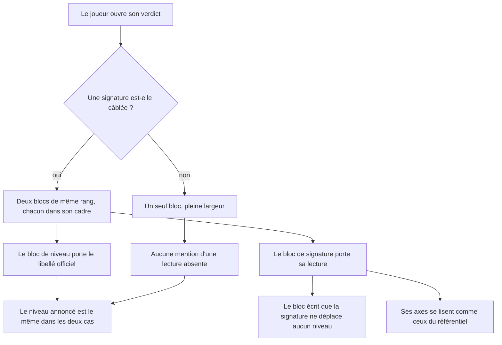
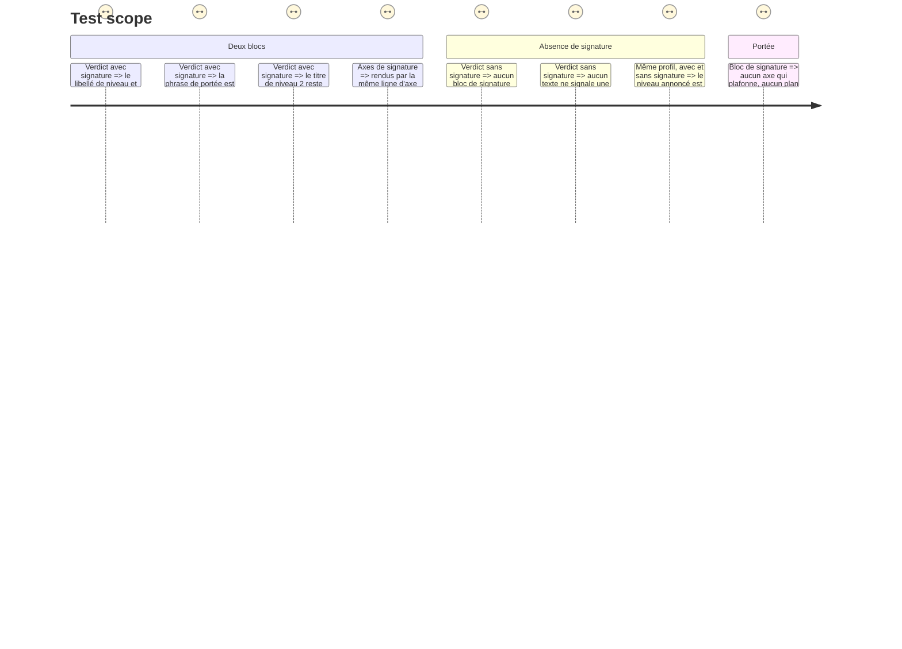

# Instruction: La signature tient son propre bloc

## Architecture projection

> Tree of the final files. ✅ create · ✏️ modify · ❌ delete

```txt
.
├── src/features/scoring-summary/components/
│   ├── composites/
│   │   └── signature-block.tsx               ✅ la signature dans son cadre, avec sa phrase de portée
│   └── sections/summary-view.tsx             ✏️ deux blocs côte à côte, jamais imbriqués
└── __tests__/unit/features/scoring-summary/
    └── signature-block.test.tsx              ✅ deux blocs distincts, la phrase de portée, l'absence de fichier
```

## Ce qu'on construit

### 1. Deux blocs, pas une section subordonnée

Aujourd'hui la signature est une section coincée entre les axes et le détail des critères, introduite par « Lecture complémentaire ». Elle se lit comme une annexe du niveau alors qu'elle en est le pendant.

`summary-view.tsx` rend désormais, en tête d'écran, **deux blocs de même rang** :

- le bloc de niveau (`level-block.tsx`, posé en phase 1) ;
- le bloc de signature (`signature-block.tsx`).

Chacun porte son propre cadre. Aucun n'est imbriqué dans l'autre, aucun n'est introduit comme le complément du premier. Côte à côte sur large écran, empilés sur mobile.

### 2. La portée de la signature est écrite, pas sous-entendue

Le bloc de signature porte, en toutes lettres et visible : **la signature ne déplace aucun niveau**. C'est une acceptance, pas une nuance de style — un lecteur sur la défensive doit lire que cette seconde étiquette ne l'a pas fait descendre.

Le bloc rend :

- le libellé de la lecture de signature (`Vibe coder`, `AIDD en route`, `AIDD confirmé`) ;
- la phrase de portée ;
- ses axes, par le même `axis-proof-row` que le référentiel — une seule façon de lire un axe dans le produit.

La signature n'affiche **pas** d'axe qui plafonne, et **pas** de plan de progression : elle ne gate rien.

### 3. Sans fichier de signature, l'écran ne signale pas un manque

`config/signature.json` est optionnel — c'est déjà une décision d'architecture en place. Quand `signature` est absent du verdict, le bloc n'est pas rendu : ni cadre vide, ni « aucune lecture complémentaire disponible ». Le bloc de niveau occupe alors toute la largeur et l'écran reste cohérent, sans trou de mise en page.

Le fait que l'écran soit identique au caractère près sur le niveau, avec ou sans signature, se teste.

## User Journey



## Test Scope



## Wireframe

```txt
AVEC SIGNATURE                                    SANS SIGNATURE
┌────────────────────────┬────────────────────┐  ┌──────────────────────────────┐
│ NIVEAU ATTEINT         │ SIGNATURE          │  │ NIVEAU ATTEINT               │
│                        │                    │  │                              │
│ 🟢 Green               │ AIDD en route      │  │ 🟢 Green                     │
│ ────────────────────── │ ────────────────── │  │ ──────────────────────────── │
│ Mener trois chantiers  │ La signature ne    │  │ Mener trois chantiers de     │
│ de front le même jour… │ déplace aucun      │  │ front le même jour…          │
│                        │ niveau.        (1) │  │                              │
│ CE QUI PLAFONNE        │                    │  │ CE QUI PLAFONNE              │
│ Chantiers en parallèle │ vérifie après coup │  │ Chantiers en parallèle       │
│                        │ Jugement critique  │  │                          (2) │
│ SUIVANT · 🥉 Copper    │ …                  │  │ SUIVANT · 🥉 Copper          │
└────────────────────────┴────────────────────┘  └──────────────────────────────┘

(1) Écrit, pas sous-entendu : c'est ce qui empêche de lire la signature comme une sanction.
(2) Aucun cadre vide, aucune phrase d'absence. Le bloc de niveau prend la largeur.
```

## Definition of done

- `npm run typecheck` et `npm run test` au vert.
- Le libellé de signature n'est jamais rendu par le titre de niveau 2 de l'écran.
- Un verdict sans signature produit un écran sans aucune occurrence du mot « signature ».
