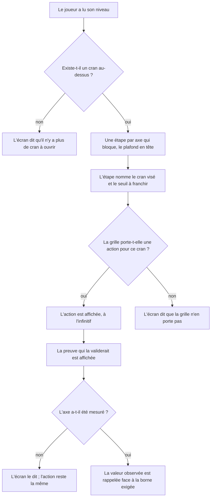
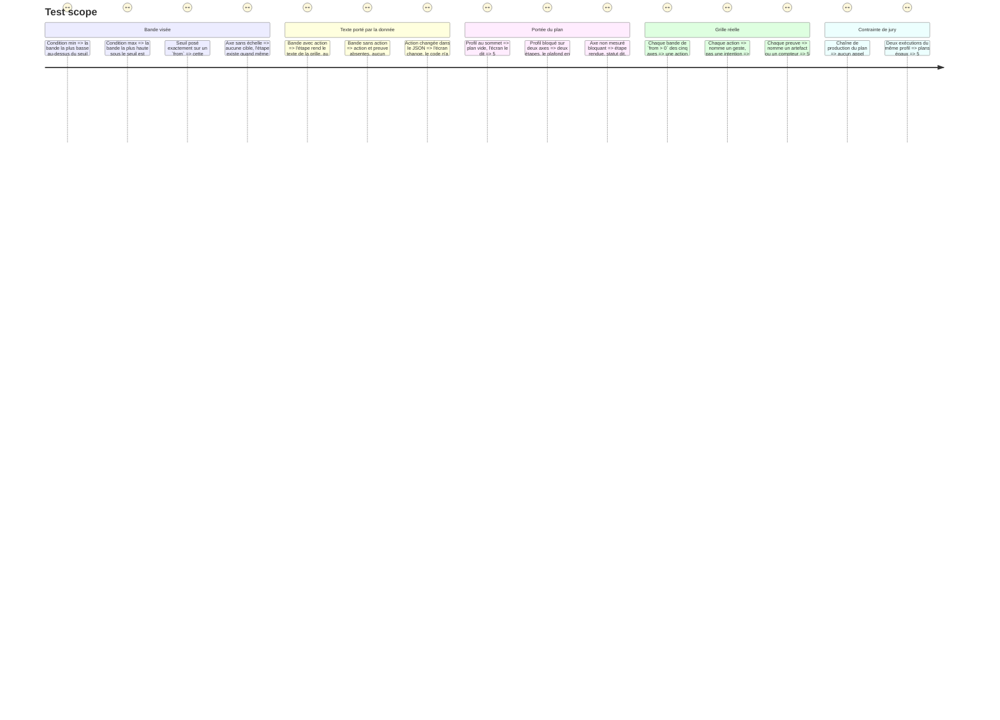

# Instruction: Le plan de progression, écrit dans la grille

## Architecture projection

> Tree of the final files. ✅ create · ✏️ modify · ❌ delete

```txt
.
├── src/core/contracts/
│   └── grid.schema.ts                        ✏️ `action` et `proof` optionnels sur la bande
├── src/core/scoring/helpers/
│   └── progression-plan.helper.ts            ✅ une étape par axe qui bloque le cran suivant
├── src/core/session/
│   └── game-session.facade.ts                ✏️ `Verdict.plan`
├── src/features/scoring-summary/components/
│   ├── composites/
│   │   └── progression-step.tsx              ✅ l'action, sa preuve, le cran qu'elle ouvre
│   └── sections/summary-view.tsx             ✏️ rend le plan sous le niveau
├── config/
│   └── grid.json                             ✏️ une action et une preuve par bande, sur les cinq axes
└── __tests__/
    ├── unit/core/scoring/progression-plan.test.ts  ✅ bande cible, absence d'action, bornes max
    ├── unit/features/scoring-summary/
    │   └── progression-step.test.tsx               ✅ l'action et sa preuve se lisent
    └── integration/config-loading/grid.test.ts     ✏️ chaque bande atteignable porte une action et une preuve
```

## Ce qu'on construit

### 1. La bande porte ce qu'il faut faire pour y entrer

`grid.schema.ts` :

```ts
export const dimensionBandSchema = z.object({
  from: z.number().min(0).max(1),
  label: z.string().min(1),
  /** Le geste qui fait entrer dans cette bande. Donnée, jamais code. */
  action: z.string().min(1).optional(),
  /** Ce qui validerait ce geste : un artefact ou un compteur observable. */
  proof: z.string().min(1).optional(),
})
```

Additif : une grille tierce sans `action` charge toujours.

### 2. Le plan se déduit des conditions bloquantes

`src/core/scoring/helpers/progression-plan.helper.ts` :

```ts
export type PlanStep = {
  dimensionId: string
  label: string
  measurement: MeasurementStatus
  /** Le cran visé et le seuil à franchir. Absent quand l'axe n'a pas d'échelle. */
  target: { label: string; from: number } | undefined
  /** Le geste, lu sur la bande visée. Absent quand la grille n'en porte pas. */
  action: string | undefined
  /** La preuve, lue sur la bande visée. Absente quand la grille n'en porte pas. */
  proof: string | undefined
  /** La valeur observée. Absente quand l'axe n'a pas été mesuré. */
  observed: number | undefined
  /** La borne exigée par la condition qui bloque. */
  required: number
}

export const planProgression = (
  grid: Grid,
  blocking: readonly ConditionGap[],
): PlanStep[]
```

Résolution de la bande visée :

- borne `min` : la bande la plus **basse** dont `from >= min` ;
- borne `max` : la bande la plus **haute** dont `from <= max`.

L'ordre des étapes suit celui de `blocking` : l'axe qui plafonne en tête.

**Rien n'est inventé en code.** Une bande sans `action` produit une étape dont `action` et `proof` sont absents ; l'écran dit alors que la grille ne porte pas d'action pour ce cran. Aucun modèle n'est appelé, aucune horloge n'est lue, aucun texte n'est composé par concaténation de fragments codés en dur.

Au sommet du référentiel, `blocking` est vide et le plan l'est aussi : l'écran dit qu'il n'y a plus de cran à ouvrir.

### 3. Les actions et leurs preuves, écrites dans `config/grid.json`

Poser `action` et `proof` sur **chaque bande de `from > 0`** des cinq axes du référentiel — la bande initiale n'a pas d'action, on y est déjà.

Deux règles de rédaction, non négociables :

- **L'action nomme un geste observable.** « Poser une boucle de relance qui rejoue l'IA tant que `npm test` échoue » passe. « Améliorer son harness » ne passe pas : rien ne permet de dire si c'est fait.
- **La preuve nomme un artefact ou un compteur qu'on peut aller regarder.** « Un script versionné dans le dépôt, et une exécution où il relance au moins deux fois avant le vert » passe. « Se sentir plus à l'aise » ne passe pas.

Les textes sont en français, à l'infinitif pour l'action, en groupe nominal pour la preuve. Ils s'adressent au joueur, jamais au jury.

Les bandes de `config/signature.json` restent sans action : la signature ne gate aucun niveau, il n'y a rien à y ouvrir.

### 4. L'écran rend le plan sous le niveau

`progression-step.tsx` (dumb) rend, par étape :

- l'axe et le cran visé, en libellé de grille ;
- l'action, en toutes lettres ;
- la preuve qui la validerait, introduite comme telle ;
- pour un axe non mesuré, le fait qu'il ne l'a pas été — l'action reste affichée, elle est la même.

Le plan se place sous le bloc de niveau et l'axe qui plafonne, avant la liste des axes : c'est ce que le joueur vient chercher.

Une bande sans action rend une étape qui le dit — l'écran ne comble pas un trou de données par une phrase de son cru.

### 5. Le gardien de la grille

`__tests__/integration/config-loading/grid.test.ts` gagne une garde sur la grille **réelle** : toute bande de `from > 0` des cinq axes porte une `action` et une `proof` non vides. Une grille éditée qui oublie une bande casse la construction, pas l'écran du jour J.

## User Journey



## Test Scope



## Wireframe

```txt
┌───────────────────────────────────────────────────────────────┐
│ CE QUI VOUS FERAIT MONTER                                     │
├───────────────────────────────────────────────────────────────┤
│ Chantiers menés en parallèle → 3 chantiers et plus        (1) │
│                                                               │
│ Mener trois chantiers de front le même jour, chacun jusqu'au  │
│ merge.                                                    (2) │
│                                                               │
│ Preuve : trois PR mergées dans la même journée, sur trois     │
│ branches ouvertes en même temps.                          (3) │
│                                                               │
│ Lu à 2 chantiers, le cran demande 3 chantiers et plus.    (4) │
├───────────────────────────────────────────────────────────────┤
│ Initiative des agents → les agents prennent les tâches        │
│                                                               │
│ Laisser un agent ouvrir lui-même une PR sur une tâche qu'un   │
│ humain n'a pas lancée.                                        │
│                                                               │
│ Preuve : une PR dont l'auteur est l'agent, sur une tâche      │
│ prise dans la file sans intervention.                         │
│                                                               │
│ Cet axe n'a pas été mesuré.                               (5) │
└───────────────────────────────────────────────────────────────┘

(1) L'axe qui plafonne ouvre le plan.
(2) Le texte vient de `config/grid.json`, bande par bande.
(3) La preuve est un artefact qu'on peut aller regarder.
(4) La valeur observée face à la borne exigée, dans les mots de la grille.
(5) Un axe non mesuré le dit ; l'action reste la même, elle ne dépend pas de la mesure.
```

## Definition of done

- `npm run typecheck` et `npm run test` au vert.
- `grep -rn "action\|proof" src/core/scoring/helpers/progression-plan.helper.ts` ne montre aucun littéral de texte joueur.
- Modifier une `action` dans `config/grid.json` change l'écran sans toucher à un `.ts`.
- Les cinq axes du référentiel ont une action et une preuve sur chaque bande atteignable.
