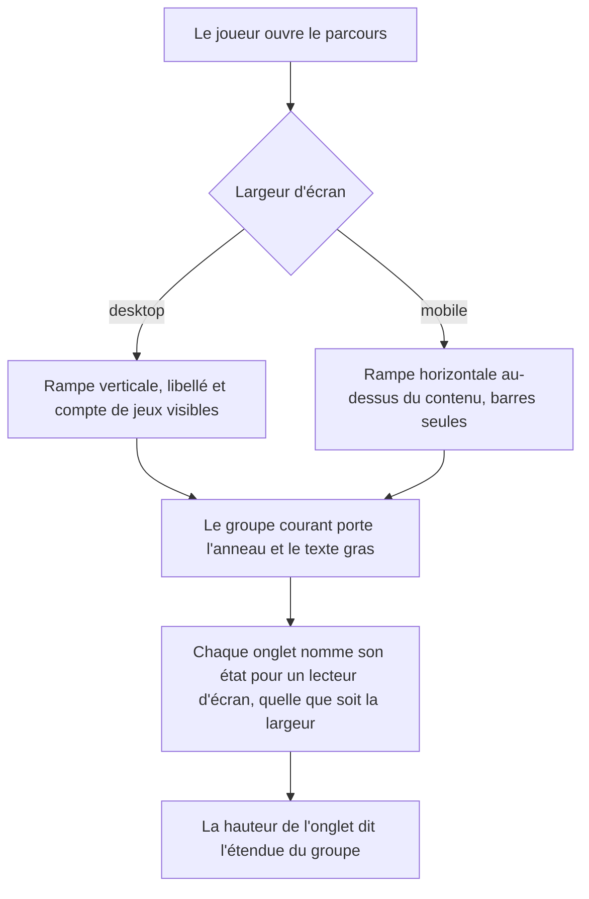
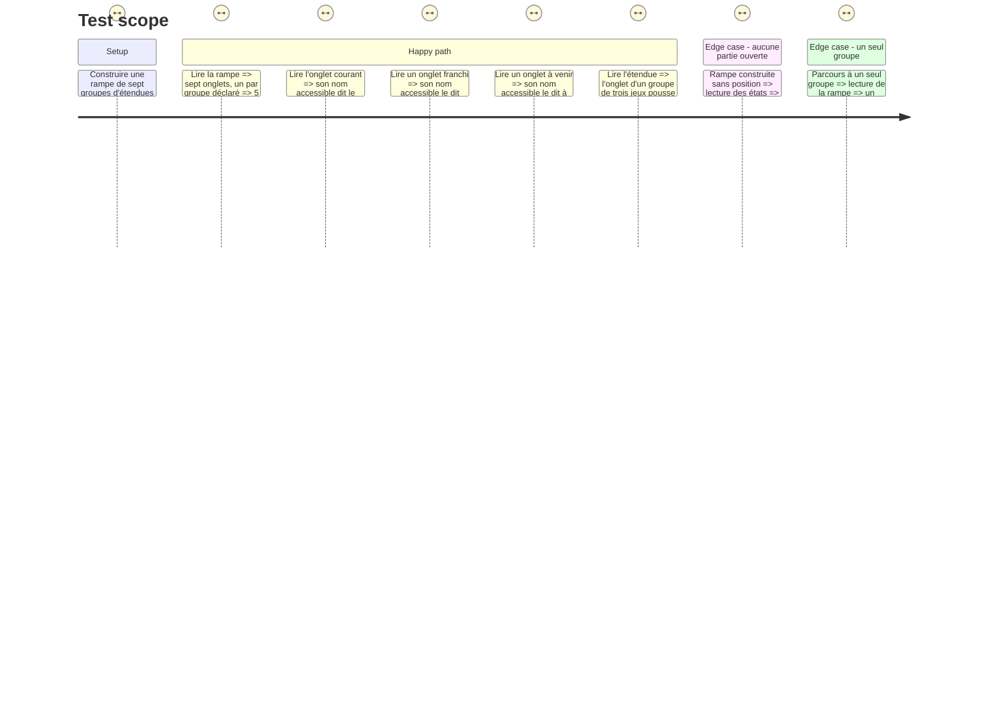

# Instruction: La rampe se lit sans la couleur, et sur mobile aussi

## Architecture projection

> Tree of the final files. ✅ create · ✏️ modify · ❌ delete

```txt
.
├── src/components/group-rail/composites/
│   └── group-rail.tsx                    ✏️ chaque onglet porte son état en toutes lettres, y compris quand le libellé est masqué
└── __tests__/unit/components/group-rail/
    └── group-rail.test.tsx               ✅ la rampe se lit hors de tout écran : sept groupes, un seul courant, un état nommé par onglet
```

## User Journey



## Test Scope



## Wireframe

```txt
DESKTOP                              MOBILE
┌──────────────┬───────────────────┐ ┌───────────────────────────────┐
│ ▌ Groupe 1   │                   │ │ ▄▄▄▄ ▄▄▄▄ ▄▄▄▄▄▄ ▄▄▄▄ ┄┄┄ ┄┄┄ │ (1)
│   2 jeux     │                   │ ├───────────────────────────────┤
│ ▌ Groupe 2   │   contenu du jeu  │ │                               │
│   2 jeux     │                   │ │   contenu du jeu              │
│ ▌ Groupe 3   │                   │ │                               │
│ ▌  3 jeux    │                   │ │                               │
│ ┆ Groupe 4   │                   │ └───────────────────────────────┘
│   2 jeux     │                   │
└──────────────┴───────────────────┘
      (2)             (3)

(1) La rampe passe en rangée au-dessus du contenu ; les libellés tombent, l'état doit rester lisible autrement.
(2) L'onglet du groupe 3 est plus haut : trois jeux contre deux. Le groupe 4, à venir, est en filet pointillé.
(3) Le contenu du jeu, inchangé par cette phase.
```

## Tasks to do

### `1)` Chaque onglet dit son état en toutes lettres

> Un onglet dont le sens ne tient qu'à sa couleur et à son trait ne dit rien à qui ne les voit pas, et ne dit rien du tout sur mobile où le libellé est masqué.

1. Dans `group-rail.tsx`, donner à chaque `li` un nom accessible complet : le libellé du groupe, son compte de jeux, et son état en mot — terminé, en cours, à venir.
2. Le texte d'état est porté par un élément visuellement masqué mais lu (`sr-only`), pas par un `title` ni un `aria-label` sur la barre `aria-hidden`.
3. Le bloc de libellé visible reste `hidden md:flex` : la phase ne change pas la mise en page desktop ni mobile, elle ajoute le canal manquant.
4. La liste porte un nom : c'est la progression dans le parcours, pas une liste anonyme.
5. Ne rien rendre interactif. Un onglet n'est pas un bouton — le verrou de la phase 3 en dépend.

### `2)` Le banc de la rampe

> La rampe n'a aucun test propre aujourd'hui : elle n'est vérifiée qu'indirectement, par les états que `use-course` calcule.

1. Créer `__tests__/unit/components/group-rail/group-rail.test.tsx`, qui rend `GroupRail` sur des groupes littéraux, sans façade ni store.
2. Couvrir les trois états, le compte d'onglets, et le cas sans position.
3. Vérifier l'étendue sur le style de croissance de l'onglet, pas sur une classe de hauteur — c'est la propriété que la story nomme.

## Test acceptance criteria

| Task | Acceptance criteria |
| --- | --- |
| 1 | [x] Chaque onglet de la rampe est trouvable par son nom accessible, qui contient le libellé du groupe et son état ; le résultat est identique quelle que soit la largeur simulée |
| 1 | [x] Le groupe courant reste distingué par l'anneau et le poids de texte, jamais par la seule couleur |
| 1 | [x] Aucun onglet n'expose de rôle interactif |
| 2 | [x] `npm run test` couvre la rampe seule : sept groupes rendus, un seul courant, les précédents terminés, les suivants à venir, et aucun courant quand aucune position n'est donnée |
| 2 | [x] Un groupe de trois jeux occupe une part de rampe trois fois supérieure à celle d'un groupe d'un jeu |
