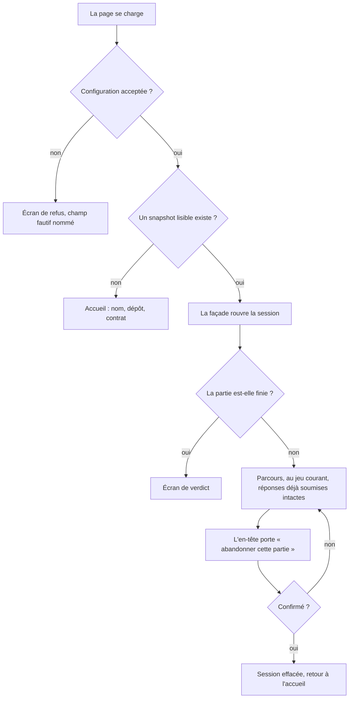
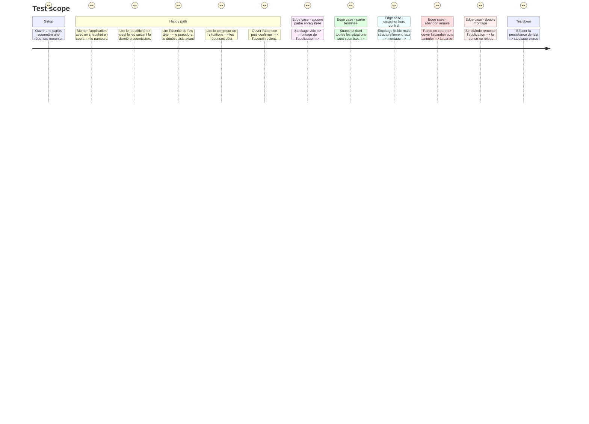

# Instruction: Le rechargement ramène au jeu courant

## Architecture projection

> Tree of the final files. ✅ create · ✏️ modify · ❌ delete

```txt
.
├── src/features/session-restore/
│   ├── hooks/
│   │   └── use-restore-run.hook.ts            ✅ au montage, rouvre la partie enregistrée et pose l'écran d'arrivée
│   └── components/
│       ├── sections/
│       │   └── abandon-run.tsx                ✅ smart : la seule sortie d'une partie en cours
│       └── composites/
│           └── abandon-run-dialog.tsx         ✅ dumb : la confirmation, sans savoir ce qu'elle détruit
├── src/
│   └── App.tsx                                ✏️ appelle la reprise avant d'aiguiller, et donne l'action à l'en-tête
├── src/components/layout/app-layout/
│   └── app-layout.tsx                         ✏️ un emplacement d'action dans la carte de relevé
├── src/features/onboarding/
│   ├── hooks/use-onboarding.hook.ts           ✏️ perd `storedRun`, `resume` et `discard` : plus personne ne les atteint
│   └── components/
│       ├── sections/onboarding-view.tsx       ✏️ perd la carte de reprise et son libellé conditionnel
│       └── composites/resume-run.tsx          ❌ inatteignable dès qu'une partie existe
├── __tests__/unit/features/session-restore/
│   ├── use-restore-run.test.tsx               ✅ la reprise au montage, ses trois issues, et son unicité
│   └── abandon-run.test.tsx                   ✅ la sortie confirmée, et le refus de sortir sans confirmation
├── __tests__/unit/features/onboarding/
│   ├── use-onboarding.test.ts                 ✏️ retire ce qui portait la reprise manuelle
│   └── onboarding-view.test.tsx               ✏️ idem
├── __tests__/unit/
│   └── app.test.tsx                           ✏️ l'aiguillage part désormais d'un snapshot, pas seulement du store
└── aidd_docs/memory/
    ├── navigation.md                          ✏️ l'écran d'arrivée d'un rechargement change
    └── codebase-map.md                        ✏️ une quatrième fonctionnalité sous `features/`
```

## User Journey



## Test Scope



## Wireframe

```txt
┌──────────────────────────────────────────────────────────────┐
│ LAIVEL-UP-EVAL   Alice · alice/atelier   3/14 situations  [⋯] │ (1)
├──────────────────────────────────────────────────────────────┤
│ ┌──────────┐  SITUATION 4 SUR 14                             │
│ │ ▌ Gr. 1  │  Reprendre la main aux bons moments             │ (2)
│ │ ▌ Gr. 2  │  ┌────────────────────────────────────────────┐ │
│ │ ▌ Gr. 3  │  │  la surface du jeu courant                 │ │
│ │ ┆ Gr. 4  │  └────────────────────────────────────────────┘ │
│ └──────────┘                                                 │
└──────────────────────────────────────────────────────────────┘

        ┌──────────────────────────────────────────┐
        │  Abandonner cette partie ?               │ (3)
        │  Les 3 réponses déjà soumises seront     │
        │  effacées. Rien ne permet de revenir.    │
        │                    [ Annuler ] [ Effacer ]│
        └──────────────────────────────────────────┘

(1) L'emplacement d'action de l'en-tête. Discret, à droite du statut, jamais un bouton primaire.
(2) L'écran d'arrivée après un rechargement : le jeu courant, pas le premier du groupe.
(3) La confirmation. Elle chiffre ce qu'elle détruit, et son action destructrice n'est pas celle par défaut.
```

## Tasks to do

### `1)` La reprise au montage

> La position vit dans le snapshot. Personne ne la lit au démarrage : l'application ouvre l'accueil et attend un clic qui, désormais, n'existe plus.

1. Créer `use-restore-run.hook.ts` dans `features/session-restore/hooks/`. Il appelle la façade par `useSessionFacade`, jamais l'adapter.
2. Au premier montage seulement : si la façade n'a pas déjà de session et que `resume()` rend `true`, poser l'identité et la position dans le store, puis basculer sur le verdict si la partie est finie.
3. Une seule exécution, y compris sous `StrictMode` qui monte deux fois. Rouvrir deux fois ne doit ni dupliquer une soumission ni déplacer la position.
4. `resume()` faux — stockage vide ou snapshot hors contrat — laisse l'accueil en place, sans exception remontée.
5. Le hook ne rend rien. Il ne décide pas de l'écran de destination : il pose l'état, `App` aiguille comme il le fait déjà.

### `2)` L'aiguillage part de l'état restauré

> `App` aiguille bien, mais sur un store qui démarre toujours vide.

1. Appeler le hook de reprise dans `App`, après le cas `invalid-config` — une configuration refusée n'ouvre aucune session, donc aucune reprise.
2. Vérifier que l'ordre des écrans reste : refus, puis accueil, parcours ou verdict selon `screen`.
3. Ne pas déplacer la logique de reprise dans `App` : elle reste dans son hook, `App` ne fait qu'aiguiller.

### `3)` L'échappatoire dans l'en-tête

> Sans la carte d'accueil, plus rien ne permet de recommencer. Une partie devient une impasse.

1. Ajouter à `AppLayout` un emplacement `action` optionnel dans la carte de relevé, rendu à droite du statut. Le layout reste dumb : il place, il ne sait pas ce qu'il place.
2. Créer `abandon-run-dialog.tsx`, dumb : titre, conséquence chiffrée, annuler, confirmer. Il reçoit le compte de réponses soumises et les deux gestes ; il ne connaît ni façade ni store.
3. Créer `abandon-run.tsx`, smart : il tient l'ouverture du dialogue, appelle `resetSession()` sur la façade puis `reset()` sur le store à la confirmation.
4. `App` passe l'action au layout sur les écrans parcours et verdict, jamais sur l'accueil — il n'y a rien à abandonner avant d'avoir commencé.
5. L'action destructrice n'est pas le geste par défaut du dialogue : la fermeture au clavier annule.

### `4)` Retirer la reprise manuelle

> Deux chemins vers la même reprise, dont un que personne n'emprunte plus, c'est une doublure qui divergera.

1. Supprimer `resume-run.tsx` et son rendu dans `onboarding-view.tsx`.
2. Retirer `storedRun`, `resume` et `discard` de `use-onboarding.hook.ts`, et le commentaire « La reprise n'est jamais automatique » qui ne décrit plus le produit.
3. Le libellé du champ nom redevient inconditionnel.
4. Garder la ligne « Une partie interrompue se reprend dans ce navigateur » : elle reste vraie et c'est le seul endroit qui l'annonce à un primo-arrivant.
5. Retirer des tests d'onboarding ce qui exerçait la reprise manuelle. Ne pas transformer un test mort en test vert : ce que la reprise doit prouver est prouvé par le banc de la tâche 1.

### `5)` Recaler la mémoire projet

> `navigation.md` décrit un aiguillage qui change, `codebase-map.md` liste trois fonctionnalités sur quatre.

1. Dans `navigation.md`, dire où un rechargement atterrit désormais, et redessiner le schéma d'écrans avec l'entrée par snapshot. La contrainte « aucun écran adressable » reste intacte et doit rester écrite.
2. Dans `codebase-map.md`, ajouter `session-restore/` à la liste des fonctionnalités.

## Test acceptance criteria

| Task | Acceptance criteria |
| --- | --- |
| 1 | [x] Une application montée sur une persistance portant une partie en cours affiche le parcours, au jeu qui suit la dernière soumission |
| 1 | [x] Le compteur de situations et la trace des réponses soumises survivent au remontage |
| 1 | [x] Une persistance vide, ou porteuse d'un snapshot hors contrat, laisse l'accueil s'afficher sans exception ni écran blanc |
| 1 | [x] Un double montage ne déplace pas la position et ne duplique aucune soumission |
| 2 | [x] Une configuration refusée affiche l'écran de refus et n'ouvre aucune session, même avec un snapshot présent |
| 2 | [x] Un snapshot de partie terminée affiche le verdict, pas un parcours sans situation |
| 3 | [x] Depuis le parcours, l'abandon confirmé ramène à l'accueil avec un stockage vierge |
| 3 | [x] L'abandon annulé laisse la partie et sa position intactes |
| 3 | [x] L'accueil ne porte aucune action d'abandon |
| 4 | [x] Aucun import ne référence plus `resume-run`, et `npm run typecheck` passe |
| 4 | [x] L'accueil d'un joueur ayant déjà une partie n'est plus atteignable par le chargement, et le suite de tests ne prétend plus le contraire |
| 5 | [x] `navigation.md` décrit l'écran d'arrivée réel d'un rechargement et `codebase-map.md` liste `session-restore/` |
