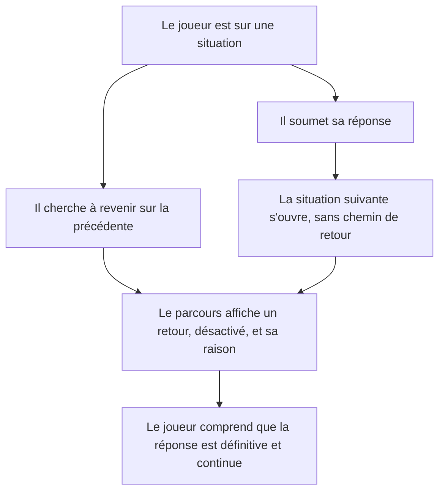
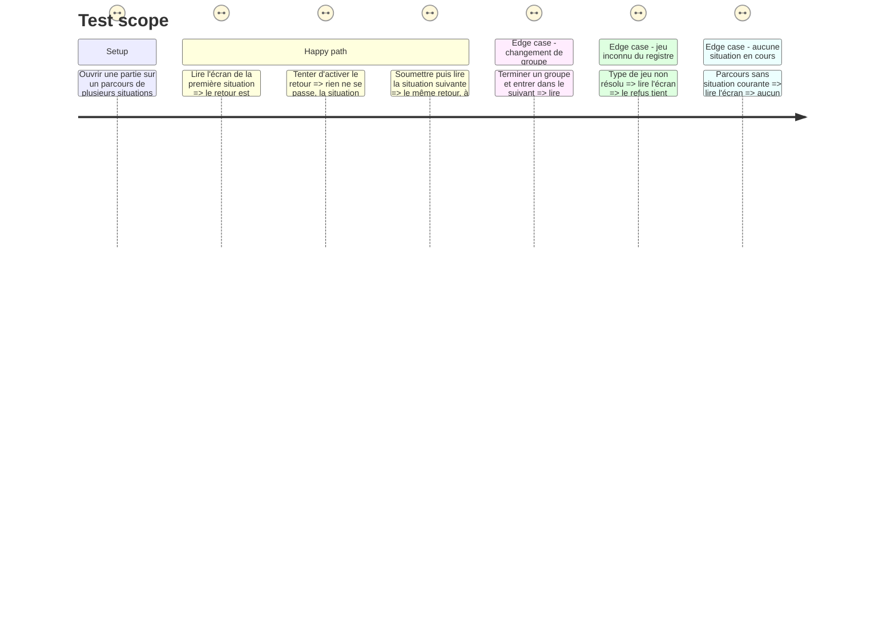

# Instruction: Une réponse soumise est définitive, et ça se voit

## Architecture projection

> Tree of the final files. ✅ create · ✏️ modify · ❌ delete

```txt
.
├── src/features/group-navigation/components/
│   ├── elements/
│   │   └── locked-answer-notice.tsx        ✅ dumb : le retour refusé, nommé, avec sa raison
│   └── sections/
│       └── course-view.tsx                 ✏️ rend le refus une fois pour tous les jeux
├── __tests__/unit/features/group-navigation/
│   └── course-view.test.tsx                ✅ le refus est là, il est inerte, et il est le même partout
└── aidd_docs/backlog/
    ├── epics/deroule-du-parcours.md        ✏️ l'inconnue du retour arrière devient une décision
    └── stories/
        ├── avancer-en-sachant-ou-j-en-suis.md          ✏️ statut
        ├── retrouver-ma-place-apres-un-rechargement.md ✏️ statut
        └── revenir-sur-un-jeu-deja-soumis.md           ✏️ statut, et la décision qu'elle attendait
```

## User Journey



## Test Scope



## Wireframe

```txt
┌──────────────────────────────────────────────────────────────┐
│ LAIVEL-UP-EVAL   Alice · alice/atelier   3/14 situations  [⋯] │
├──────────────────────────────────────────────────────────────┤
│ ┌──────────┐  SITUATION 4 SUR 14                             │
│ │ ▌ Gr. 1  │  Reprendre la main aux bons moments             │
│ │ ▌ Gr. 2  │  ┌ ─ ─ ─ ─ ─ ─ ─ ─ ─ ─ ─ ─ ─ ─ ─ ─ ─ ─ ─ ─ ┐   │
│ │ ▌ Gr. 3  │   ⟵ Revenir en arrière  ·  une réponse         │ (1)
│ │ ┆ Gr. 4  │   soumise est définitive                       │
│ │ ┆ Gr. 5  │  └ ─ ─ ─ ─ ─ ─ ─ ─ ─ ─ ─ ─ ─ ─ ─ ─ ─ ─ ─ ─ ┘   │
│ └──────────┘  ┌────────────────────────────────────────────┐ │
│               │  la surface du jeu courant                 │ │ (2)
│               └────────────────────────────────────────────┘ │
└──────────────────────────────────────────────────────────────┘

(1) Le refus, sous l'en-tête de situation et au-dessus du jeu. Présent, inerte, et sa raison est à côté de lui — pas dans une infobulle.
(2) La surface du jeu, inchangée. Aucun jeu ne rend ce refus lui-même : c'est ce qui le rend identique partout.
```

## Tasks to do

### `1)` Le refus, rendu une fois

> Le parcours n'offre aucun retour et n'en a jamais offert. Le joueur, lui, le cherche, et l'absence ne lui répond rien.

1. Créer `locked-answer-notice.tsx` dans `features/group-navigation/components/elements/` : un affordance de retour désactivé et le texte de sa raison, dans le même bloc.
2. Le composant est dumb et sans propriété : le verrou ne varie pas, et une propriété inviterait un jeu à le faire varier.
3. Le rendre dans `course-view.tsx`, entre l'en-tête de situation et la surface du jeu, uniquement quand une situation est en cours.
4. Le refus est lisible par un lecteur d'écran : le contrôle est désactivé et sa raison lui est rattachée, pas seulement posée à côté visuellement.
5. Ne pas toucher aux composants de jeu. Aucun d'eux ne doit avoir à connaître le verrou, ni pouvoir y déroger.

### `2)` Le banc du parcours

> `CourseView` n'a aucun test de rendu : seul son hook est couvert.

1. Créer `__tests__/unit/features/group-navigation/course-view.test.tsx`, monté sur la façade de test comme `app.test.tsx` le fait.
2. Vérifier la présence du refus, son état inerte, et sa persistance après une soumission et après un changement de groupe.
3. Vérifier qu'il ne s'affiche pas quand aucune situation n'est en cours.

### `3)` Consigner la décision là où elle manquait

> La story se déclare en attente d'une décision d'épique. Livrer le code sans inscrire la décision laisse le blocage écrit et la raison orale.

1. Dans `deroule-du-parcours.md`, faire passer la ligne « Le joueur peut vouloir revenir sur un jeu déjà soumis » de `unknown` à `décision`, en portant ce qui a été tranché : réponse définitive, refus visible, aucune exception par jeu.
2. Dans `revenir-sur-un-jeu-deja-soumis.md`, remplacer la clause d'attente par la décision retenue et sa date, et passer le statut à `done`.
3. Passer les deux autres stories de la tâche à `done`.
4. Ne pas retoucher `aidd_docs/tasks/2026_08/2026_08_30_jeu-practice-map/phase-3.md` : sa justification s'appuie sur l'ancienne hypothèse, mais c'est un document livré, et la décision fait foi dans l'épique.

## Test acceptance criteria

| Task | Acceptance criteria |
| --- | --- |
| 1 | [x] Sur chaque situation du parcours, un contrôle de retour est présent, désactivé, et sa raison est lisible sans interaction |
| 1 | [x] Activer ce contrôle ne change ni la situation affichée, ni le compteur, ni la trace |
| 1 | [x] Aucun composant de jeu ne rend de contrôle de retour, et aucun n'en reçoit la responsabilité |
| 2 | [x] `npm run test` prouve que le refus est identique sur la première situation, après une soumission, et après un changement de groupe |
| 2 | [x] Aucune situation en cours : aucun refus rendu |
| 3 | [x] L'épique ne porte plus d'inconnue sur le retour arrière, et les trois stories de la tâche sont `done` |
