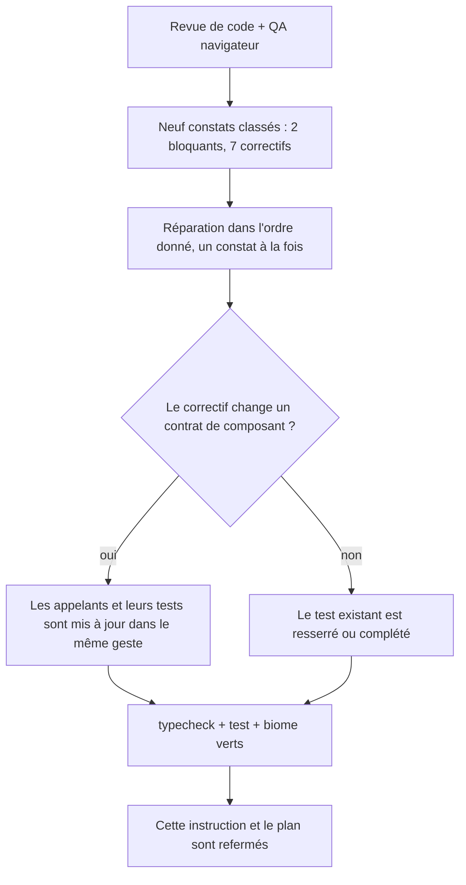
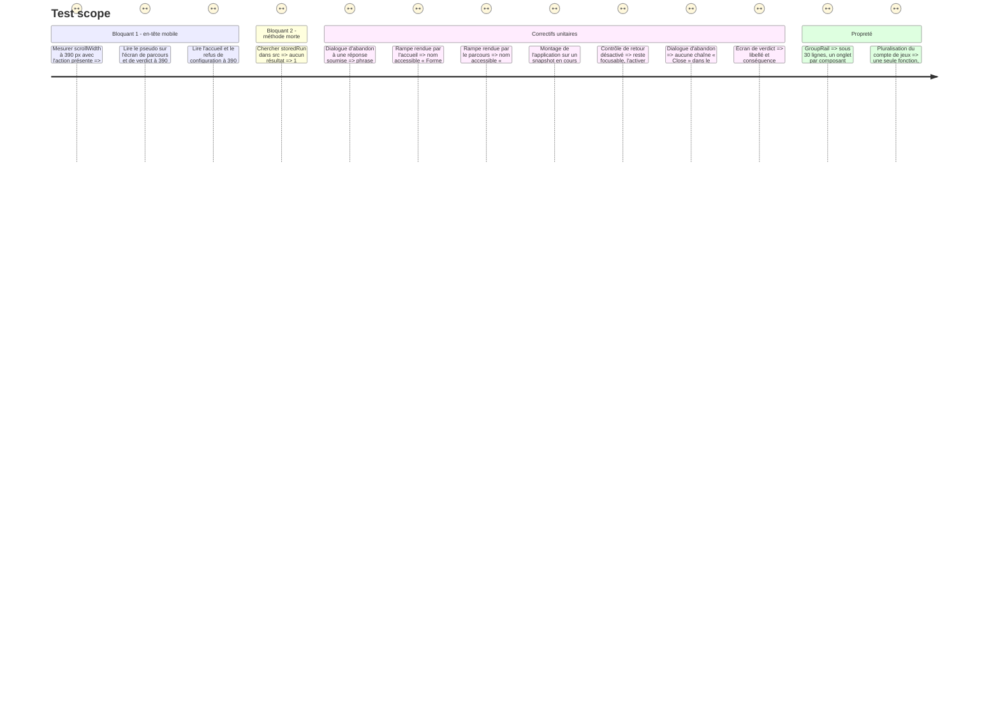

# Instruction: Réparer ce que la revue et la QA navigateur ont trouvé

## Architecture projection

> Tree of the final files. ✅ create · ✏️ modify · ❌ delete

```txt
.
├── src/components/layout/app-layout/
│   └── app-layout.tsx                        ✏️ en-tête sur deux lignes sous `md`, une rangée à partir de `md`
├── src/components/group-rail/
│   ├── composites/group-rail.tsx             ✏️ `accessibleName` en prop obligatoire, le rendu d'un onglet délégué
│   └── elements/
│       └── rail-tab.tsx                      ✅ dumb : l'onglet extrait, la pluralisation à une seule source
├── src/core/session/
│   └── game-session.facade.ts                ✏️ `storedRun()` et son docblock supprimés
├── src/features/session-restore/components/
│   ├── composites/abandon-run-dialog.tsx     ✏️ pluralisation correcte, titre et conséquence reçus, `showCloseButton={false}`
│   └── sections/abandon-run.tsx              ✏️ libellé, titre et conséquence en props, ne lit plus rien pour deviner
├── src/features/session-restore/hooks/
│   └── use-restore-run.hook.ts               ✏️ `useLayoutEffect` au lieu de `useEffect`
├── src/features/group-navigation/components/
│   ├── elements/locked-answer-notice.tsx     ✏️ `aria-disabled` au lieu de `disabled`, reste atteignable au clavier
│   └── sections/course-view.tsx              ✏️ passe `accessibleName="Progression dans le parcours"`
├── src/features/onboarding/components/sections/
│   └── onboarding-view.tsx                   ✏️ passe `accessibleName="Forme du parcours"`
├── src/App.tsx                               ✏️ décide le libellé d'abandon par écran, parcours vs verdict
├── aidd_docs/
│   └── TECHNICAL.md                          ✏️ perd la mention de `storedRun()`
├── __tests__/unit/
│   ├── core/session/game-session.facade.test.ts        ✏️ retire les cinq assertions sur `storedRun()`
│   ├── app.test.tsx                                    ✏️ le verdict porte un libellé d'abandon distinct
│   ├── components/group-rail/group-rail.test.tsx       ✏️ `accessibleName` requis à chaque rendu
│   ├── features/group-navigation/course-view.test.tsx  ✏️ `aria-disabled`, atteignabilité clavier, `...actual`, nom de la rampe
│   ├── features/onboarding/onboarding-view.test.tsx    ✏️ nom de la rampe au repos
│   ├── features/onboarding/use-onboarding.test.ts      ✏️ retire le scénario devenu inatteignable
│   └── features/session-restore/abandon-run.test.tsx   ✏️ props requises, assertion de pluralisation resserrée
└── aidd_docs/tasks/2026_08/2026_08_31_traverser-le-parcours/
    ├── plan.md                               ✏️ ligne de la phase 4, statut `implemented`
    └── phase-4.md                            ✅ cette instruction
```

## Contexte

Le code des trois premières phases était vert (773 tests) mais livré sans passage en navigateur ni revue indépendante. Une revue de code et une QA navigateur, exécutées après coup sur `feat/traverser-le-parcours-sans-se-perdre`, ont trouvé neuf défauts réels — deux bloquants — que les tests unitaires ne pouvaient pas voir : un débordement horizontal mesuré en pixels, une méthode morte gardée en vie par ses propres tests, une faute de grammaire, un mensonge d'accessibilité, un effet asynchrone masqué par `act()`, un contrôle retiré de la tabulation, une chaîne anglaise de bibliothèque, un libellé transposé d'un écran à l'autre sans relecture, et une extraction de composant qui n'avait pas suivi la limite de lignes du projet.

## User Journey



## Test Scope



## Wireframe

```txt
MOBILE (< md), action présente                MOBILE (< md), sans action
┌───────────────────────────────┐             ┌───────────────────────────────┐
│ LAIVEL-UP-EVAL  0/20 situations│             │ LAIVEL-UP-EVAL                │ (3)
│ Bob QA          [Abandonner…]  │ (1)         └───────────────────────────────┘
└───────────────────────────────┘

(1) Deux lignes sous `md` : marque + statut, puis identité + action. Le pseudo
    tient sur une largeur non nulle (≈141 px à 390 px de large), l'action
    garde son texte complet — aucun débordement, `scrollWidth === innerWidth`.
(2) À partir de `md`, les quatre cellules reviennent sur une seule rangée,
    inchangée depuis la QA desktop déjà validée.
(3) Sans action (accueil, refus de configuration) : une seule ligne, comme
    avant l'ajout de l'action — aucune régression.
```

## Tasks to do

### `1)` [BLOQUANT] L'en-tête ne déborde plus, le pseudo reste lisible

1. Dans `app-layout.tsx`, scinder la rangée en deux lignes sous `md` — marque + statut, puis identité + action — au moyen d'un séparateur `basis-full` de hauteur nulle, actif uniquement quand `identity` ou `action` est fourni.
2. À partir de `md`, réordonner les quatre cellules (`order-*`) pour retrouver exactement la rangée unique déjà validée par la QA desktop.
3. `AppLayout` reste dumb : il ne lit ni le pseudo ni le contenu de `action`, il place des cellules.
4. Ne pas changer le rendu des écrans qui ne fournissent ni `identity` ni `action` (accueil, refus de configuration).

### `2)` [BLOQUANT] `storedRun()` est mort, il est supprimé

1. Retirer `storedRun()` et son docblock de `game-session.facade.ts`.
2. Retirer les cinq assertions qui l'exerçaient dans `game-session.facade.test.ts` ; les tests qui n'exerçaient plus que lui sont supprimés entièrement, ceux qui exerçaient aussi `resume()` gardent leurs autres assertions.
3. Retirer sa mention dans `TECHNICAL.md`.

### `3)` La phrase du dialogue d'abandon bascule entière

1. Remplacer le mélange de suffixes conditionnels par une fonction qui rend la phrase complète au singulier ou au pluriel.
2. Resserrer l'assertion du test correspondant sur la phrase exacte, pas sur un fragment qui laissait passer la faute.

### `4)` Le nom accessible de la rampe est décidé à l'appel

1. Faire de `accessibleName` une prop obligatoire de `GroupRail`.
2. `CourseView` donne « Progression dans le parcours », `OnboardingView` donne « Forme du parcours ».
3. Couvrir les deux dans leurs tests respectifs.

### `5)` La reprise au montage devient synchrone avant peinture

1. Remplacer `useEffect` par `useLayoutEffect` dans `use-restore-run.hook.ts`.
2. Documenter pourquoi dans le commentaire du hook.

### `6)` Le refus de retour reste atteignable au clavier

1. Remplacer l'attribut `disabled` par `aria-disabled="true"` plus un `onClick` inerte sur le contrôle de `locked-answer-notice.tsx`.
2. Garder l'apparence désactivée par classes.
3. Ajouter au test l'assertion que le contrôle reste focalisable et que l'activer ne change rien.

### `7)` Aucune chaîne anglaise dans le dialogue d'abandon

1. Passer `showCloseButton={false}` à `DialogContent` dans `abandon-run-dialog.tsx`, sans toucher à `src/components/ui/`.

### `8)` `AbandonRun` ne ment plus sur l'écran de verdict

1. Faire recevoir à `AbandonRun` le libellé du déclencheur, le titre et la conséquence du dialogue en props, sans lire `screen`.
2. `App.tsx` fournit une formulation pour le parcours et une autre pour le verdict.
3. Mettre à jour les tests qui rendaient `AbandonRun` ou vérifiaient le libellé du verdict.

### `9)` Propreté

1. Extraire l'onglet de `GroupRail` dans `src/components/group-rail/elements/rail-tab.tsx`.
2. Réunir la pluralisation du compte de jeux dans une seule fonction, appelée par le nom accessible et par le libellé visible.
3. Retirer le test de `use-onboarding.test.ts` devenu inatteignable depuis la reprise automatique.
4. Ajouter `...actual` au retour du mock de `games/register-components` dans `course-view.test.tsx`.
5. Documenter dans `locked-answer-notice.tsx` pourquoi le bloc s'affiche dès la première situation.

### `10)` Consigner la passe

1. Créer cette instruction et l'ajouter au tableau des phases de `plan.md`.

## Test acceptance criteria

| Task | Acceptance criteria |
| --- | --- |
| 1 | [x] `document.documentElement.scrollWidth === window.innerWidth` à 390 px, sur l'écran de parcours et sur l'écran de verdict |
| 1 | [x] Le pseudo occupe une largeur non nulle à 390 px sur ces deux écrans |
| 1 | [x] L'accueil et le refus de configuration, sans `action`, ne changent pas de rendu |
| 2 | [x] `grep -rn storedRun src` ne rend plus aucun résultat |
| 2 | [x] `npm run test` reste vert après la suppression des cinq assertions |
| 3 | [x] À `submitted === 1`, le dialogue affiche « La réponse déjà soumise sera effacée. » et rien d'autre au pluriel |
| 4 | [x] `GroupRail` ne compile plus sans `accessibleName` ; le parcours et l'accueil affichent chacun le leur |
| 5 | [x] Le hook utilise `useLayoutEffect`, documenté |
| 6 | [x] Le contrôle de retour est focalisable au clavier ; l'activer ne change ni la situation, ni le compteur, ni la trace |
| 7 | [x] Aucune chaîne « Close » n'apparaît dans le DOM du dialogue d'abandon |
| 8 | [x] Le bouton d'abandon et son dialogue portent un libellé différent sur le parcours et sur le verdict, décidé dans `App.tsx` |
| 9 | [x] `GroupRail` tient sous la limite de 30 lignes ; la pluralisation du compte de jeux n'a plus qu'une source |
| 9 | [x] `use-onboarding.test.ts` ne porte plus de scénario inatteignable |
| 10 | [x] `npm run typecheck`, `npm run test` et `biome check` sont verts sur l'ensemble des fichiers touchés |
