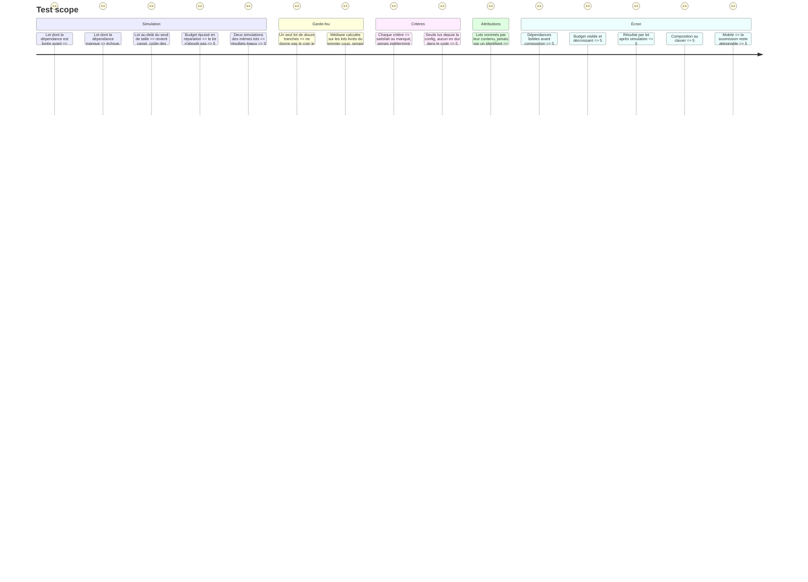

# Instruction: `scope-break` — découper une feature en lots

> Axe mesuré : `taille`. Story : `aidd_docs/backlog/stories/decouper-une-feature-en-lots.md`.

## Architecture projection

```txt
.
└── src/games/scope-break/
    ├── schema/config.schema.ts               ✅ les tranches, leurs dépendances, le budget de passes
    ├── schema/answer.schema.ts               ✅ les lots composés par le joueur
    ├── helpers/run-batches.helper.ts         ✅ la simulation : ce que chaque lot rend
    ├── actions/build-scope-break-answer.action.ts  ✅ le passage de l'état d'écran à la réponse
    ├── hooks/use-scope-break.hook.ts         ✅ l'état de composition des lots
    ├── components/elements/                  ✅ la surface propre à ce jeu
    ├── components/composites/scope-break-game.tsx  ✅ le composant enregistré
    └── scope-break.evaluator.ts              ✅ le point de contact avec le port
```

Plus les tests miroir sous `__tests__/unit/games/scope-break/`.

## La règle du jeu

Une feature arrive éclatée en **une douzaine de tranches atomiques**, chacune avec son coût et ses dépendances. Le joueur les regroupe en **lots** ; un lot est ce qu'il confierait à l'IA **en une seule passe**.

Il dépense une ressource rare : un **budget de passes**. Quand il lance la simulation, chaque lot s'exécute dans l'ordre où il est posé :

- **Lot dont une dépendance n'est pas déjà livrée** → il échoue sèchement, sur sa dépendance manquante nommée. Il consomme sa passe et ne livre rien.
- **Lot trop gros** — au-delà d'un seuil de tranches ou de coût cumulé déclaré en config → il revient cassé et coûte des **passes de réparation** avant de livrer, ou n'aboutit pas si le budget s'épuise.
- **Lot minuscule** — une seule tranche là où le budget est compté → il livre, mais gaspille une passe.
- **Lot bien dimensionné et bien ordonné** → il livre en une passe.

Le joueur voit son budget fondre. Il ne rejoue pas.

## Les critères

Déclarés dans `config/course.json` en phase 4, appliqués ici par des `rule.type` déclaratives :

| Critère | Ce qu'il lit |
| --- | --- |
| Le lot **médian livré sans réparation** atteint-il le cran visé ? | La médiane de taille des lots **livrés du premier coup**, comparée à un seuil de config |
| Aucun lot ne viole l'ordre des dépendances ? | Aucun lot n'a échoué sur une dépendance manquante |
| La feature entière est-elle livrée dans le budget de passes ? | Toutes les tranches livrées, budget non dépassé |

**Garde-fou, non négociable :** seuls les lots **qui passent** comptent dans la médiane. Un lot géant posé pour paraître XL revient cassé, et le cran retenu redescend à ce qui a tenu. Écris le test qui le prouve : un joueur qui pose un seul lot de douze tranches ne doit pas obtenir le cran le plus haut.

**Médiane, pas maximum.** C'est la formule que le référentiel emploie : un pic isolé ne fait pas un profil.

## La surface

**Ce jeu ne ressemble à aucun autre.** Ne recopie la mise en page d'aucun jeu existant — lis-en un ou deux pour le vocabulaire de jetons et les conventions, jamais pour la composition.

Ce que la surface doit rendre lisible sans texte explicatif :
- qu'une tranche a des **dépendances**, et lesquelles ;
- qu'un lot est un **regroupement**, et que son **ordre** compte ;
- que le budget de passes **se dépense** et ne revient pas ;
- après la simulation, **ce que chaque lot a rendu** : livré, réparé, échoué sur dépendance.

L'action de composition doit fonctionner au clavier autant qu'à la souris. Le sens ne repose jamais sur la seule couleur. Sur mobile, la soumission reste atteignable sans faire sortir le contenu de l'écran — trois défauts déjà relevés sur d'autres jeux portaient exactement là.

## Attributions

L'évaluateur remplit `attributions` dès l'écriture — voir `src/games/practice-map/practice-map.evaluator.ts` pour le modèle. Chaque lot est nommé par ce qu'il contient, jamais par `lot-2` :

- sur le critère de dépendances : chaque lot, tenu ou échoué, avec la dépendance manquante nommée ;
- sur le critère de médiane : chaque lot livré du premier coup, et ceux qui ont dû être réparés.

## Test Scope



## Definition of done

- `npm run typecheck`, `npm run test`, `biome check` au vert.
- Aucun seuil de notation dans le code : tout vient de la config.
- Le jeu **n'est pas câblé** ici : ni `register-games.ts`, ni `register-components.ts`, ni `config/course.json`. C'est la phase 4.
