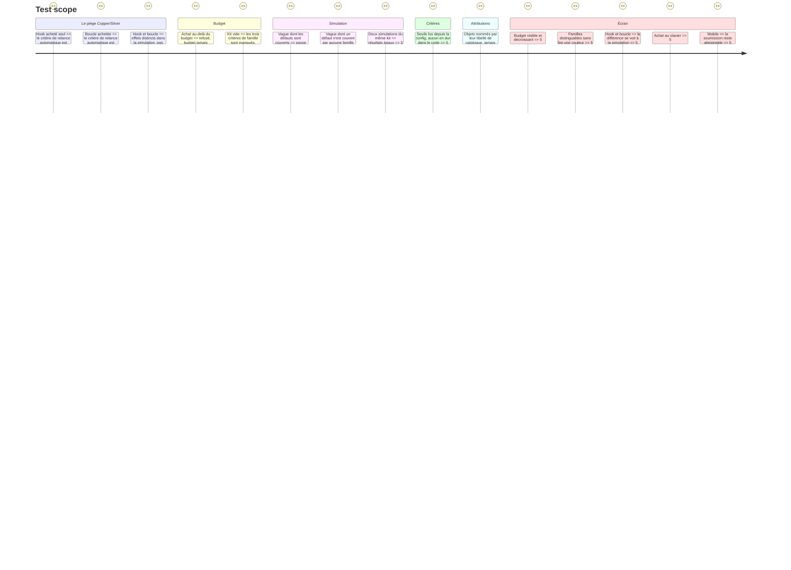

# Instruction: `repo-kit` — équiper le dépôt avant les vagues

> Axe mesuré : `harness`. Story : `aidd_docs/backlog/stories/equiper-le-depot-avant-les-vagues.md`.

## Architecture projection

```txt
.
└── src/games/repo-kit/
    ├── schema/config.schema.ts               ✅ le catalogue, les prix, le budget, les vagues
    ├── schema/answer.schema.ts               ✅ le kit acheté
    ├── helpers/run-waves.helper.ts           ✅ la simulation : ce que chaque vague rencontre
    ├── actions/build-repo-kit-answer.action.ts     ✅
    ├── hooks/use-repo-kit.hook.ts            ✅ l'état d'achat et de budget
    ├── components/elements/                  ✅ la surface propre à ce jeu
    ├── components/composites/repo-kit-game.tsx     ✅ le composant enregistré
    └── repo-kit.evaluator.ts                 ✅ le point de contact avec le port
```

Plus les tests miroir sous `__tests__/unit/games/repo-kit/`.

## La règle du jeu

Avant une série de tâches confiées à l'IA, le joueur équipe le dépôt avec un **budget de préparation fixe**. Le catalogue distingue, chacun à son prix :

| Objet | Famille | Ce qu'il fait pendant les vagues |
| --- | --- | --- |
| Fichier de contexte projet | savoir | évite les malentendus de contexte |
| Conventions | savoir | évite les défauts de forme |
| Glossaire | savoir | évite les malentendus de vocabulaire |
| Règle de comportement | comportement | arrête les défauts que le savoir seul ne prévient pas |
| Agent spécialisé | comportement | idem, sur une classe de tâches |
| Hook bloquant | reprise | **bloque et rend la main au joueur** — le défaut est arrêté, mais il coûte un tour |
| Boucle de relance sur commande | reprise | **relance l'IA jusqu'au vert**, sans rendre la main |

Puis les **vagues de défauts** passent. Chaque vague porte des défauts de familles différentes ; le kit les arrête, ou pas.

**Le point du jeu, celui qui sépare Copper de Silver :** le hook et la boucle sont **deux objets distincts, aux effets visiblement différents**. Qui achète le hook voit à l'écran qu'il doit revenir à la main. Qui achète la boucle voit l'IA relancer seule. Cette différence doit être **montrée par la simulation**, pas expliquée par une légende.

Le budget ne permet pas tout acheter. C'est le sujet.

## Les critères

| Critère | Ce qu'il lit |
| --- | --- |
| Un artefact de contexte posé avant la première vague ? | Au moins un objet de la famille `savoir` acheté |
| Un garde-fou qui agit sur le comportement, pas seulement sur le savoir ? | Au moins un objet de la famille `comportement` |
| Une relance automatique branchée sur une commande du projet ? | La **boucle**, et elle seule. Le hook ne satisfait pas ce critère |
| Le kit a-t-il arrêté assez de défauts pour tenir la dernière vague ? | La dernière vague passe, selon le seuil de config |

**Garde-fou, non négociable :** acheter le hook ne satisfait **jamais** le critère de relance automatique. Écris le test qui le prouve, et un second qui prouve que la boucle le satisfait — c'est le piège du référentiel rendu jouable, et l'accorder à tort fabrique un faux Silver.

## La surface

**Ce jeu ne ressemble à aucun autre.** Ne recopie la mise en page d'aucun jeu existant.

Ce que la surface doit rendre lisible sans texte explicatif :
- que le budget **se dépense** à l'achat, et ce qu'il reste ;
- que les objets appartiennent à des **familles** qui ne se remplacent pas ;
- pendant les vagues, **ce que chaque objet arrête** — et surtout la différence entre un hook qui rend la main et une boucle qui relance ;
- ce qui **n'a pas été arrêté**, et pourquoi.

Achat au clavier autant qu'à la souris. Le sens ne repose jamais sur la seule couleur. Sur mobile, la soumission reste atteignable sans faire sortir le contenu de l'écran.

## Attributions

L'évaluateur remplit `attributions` dès l'écriture — modèle : `src/games/practice-map/practice-map.evaluator.ts`. Chaque objet est nommé par son libellé de catalogue, jamais par `item-4` :

- sur les trois critères de famille : les objets achetés qui comptent, et ceux de la même famille qui manquaient ;
- sur le critère de dernière vague : les défauts arrêtés et ceux passés au travers.

## Test Scope



## Definition of done

- `npm run typecheck`, `npm run test`, `biome check` au vert.
- Aucun seuil de notation dans le code : tout vient de la config.
- Le jeu **n'est pas câblé** ici : ni `register-games.ts`, ni `register-components.ts`, ni `config/course.json`. C'est la phase 4.
