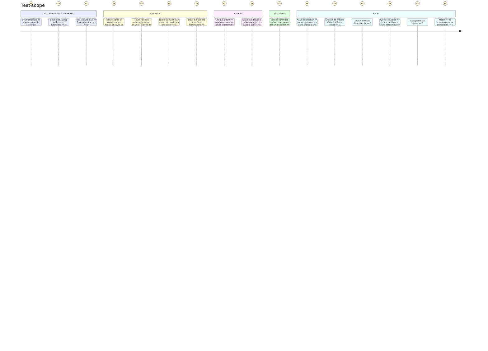

# Instruction: `task-board` — confier une tâche en autonomie

> Axe mesuré : `initiative`. Story : `aidd_docs/backlog/stories/confier-une-tache-en-autonomie.md`.

## Architecture projection

```txt
.
└── src/games/task-board/
    ├── schema/config.schema.ts               ✅ les tâches, leur cadrage réel, les tours
    ├── schema/answer.schema.ts               ✅ le mode choisi par tâche
    ├── helpers/run-board.helper.ts           ✅ la simulation : ce que chaque tâche devient
    ├── actions/build-task-board-answer.action.ts   ✅
    ├── hooks/use-task-board.hook.ts          ✅ l'état d'assignation
    ├── components/elements/                  ✅ la surface propre à ce jeu
    ├── components/composites/task-board-game.tsx   ✅ le composant enregistré
    └── task-board.evaluator.ts               ✅ le point de contact avec le port
```

Plus les tests miroir sous `__tests__/unit/games/task-board/`.

## La règle du jeu

Un tableau de tâches. Chacune porte un **cadrage de qualité inégale** — et **le joueur ne sait pas lesquels sont suffisants**. Il le devine à ce qu'il lit : une tâche dont l'énoncé nomme le fichier, le critère d'acceptation et la commande de vérification est cadrée ; une tâche qui dit « améliorer les perfs » ne l'est pas.

Pour chaque tâche, il choisit un mode :

| Mode | Ce que ça coûte | Ce que ça rend |
| --- | --- | --- |
| **Je la fais** | un tour entier | elle aboutit, toujours |
| **Je délègue en surveillant** | une partie du tour | elle aboutit, mais mobilise le joueur |
| **Je la confie en autonomie** | rien pendant le tour | elle aboutit **et ouvre sa PR** si son cadrage le permettait ; sinon elle **part en vrille de façon visible**, et coûte à réparer |

Une tâche floue confiée en autonomie ne doit pas échouer discrètement : la simulation montre où elle a dérivé.

Le joueur ne rejoue pas.

## Les critères

| Critère | Ce qu'il lit |
| --- | --- |
| Au moins une tâche aboutie en autonomie complète, PR comprise ? | Au moins une tâche en autonomie qui a abouti |
| Les tâches confiées en autonomie étaient-elles celles que leur cadrage permettait ? | La proportion de tâches confiées en autonomie qui étaient effectivement cadrées, comparée à un seuil de config |
| Plusieurs tâches abouties dans le même tour sans intervention humaine ? | Au moins deux tâches abouties en autonomie dans le même tour |

**Garde-fou, non négociable :** le deuxième critère mesure le **discernement**, pas le volume. Tout confier en autonomie fait exploser le tableau et ne monte pas l'axe. Écris le test qui le prouve : un joueur qui met les huit tâches en autonomie doit manquer ce critère, et non le satisfaire par accumulation.

Symétriquement : tout faire à la main ne monte pas l'axe non plus. L'axe mesure l'initiative des agents, pas la prudence du joueur.

## La surface

**Ce jeu ne ressemble à aucun autre.** Ne recopie la mise en page d'aucun jeu existant.

Ce que la surface doit rendre lisible sans texte explicatif :
- que chaque tâche porte un **énoncé** dont la qualité se juge à la lecture — c'est le seul indice du joueur, il doit être lisible en entier ;
- que **trois modes** existent et qu'ils ne coûtent pas la même chose ;
- que les tours **s'épuisent** ;
- après la simulation, **ce qu'est devenue chaque tâche** : aboutie, aboutie avec PR, partie en vrille — et **où** elle a dérivé.

La qualité de cadrage **ne doit jamais être révélée avant la simulation**, ni par un mot, ni par une marque, ni par une classe CSS lisible dans le DOM. C'est le sujet du jeu. Un test doit le verrouiller : avant soumission, rien dans le rendu ne permet de distinguer une tâche cadrée d'une tâche floue.

Assignation au clavier autant qu'à la souris. Le sens ne repose jamais sur la seule couleur. Sur mobile, la soumission reste atteignable sans faire sortir le contenu de l'écran.

## Attributions

L'évaluateur remplit `attributions` dès l'écriture — modèle : `src/games/practice-map/practice-map.evaluator.ts`. Chaque tâche est nommée par son titre, jamais par `t3` :

- sur le critère de discernement : les tâches confiées en autonomie qui le méritaient, et celles qui ne le méritaient pas ;
- sur le critère d'aboutissement : les tâches abouties en autonomie, et celles parties en vrille.

## Test Scope



## Definition of done

- `npm run typecheck`, `npm run test`, `biome check` au vert.
- Aucun seuil de notation dans le code : tout vient de la config.
- Aucune fuite de la qualité de cadrage avant soumission, verrouillée par un test.
- Le jeu **n'est pas câblé** ici : ni `register-games.ts`, ni `register-components.ts`, ni `config/course.json`. C'est la phase 4.
