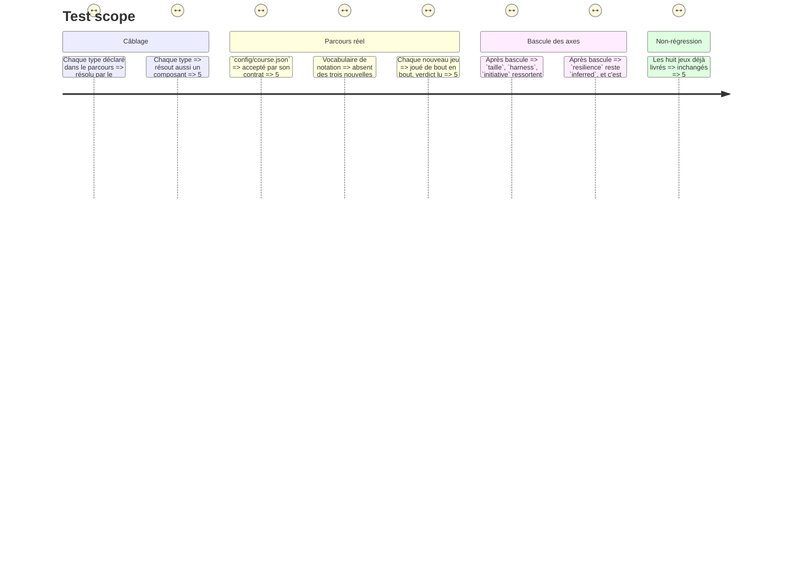

# Instruction: Le câblage et la bascule de la grille

> Vient après les phases 1 à 3. C'est la seule phase qui touche les fichiers partagés.

## Architecture projection

```txt
.
├── src/games/
│   ├── register-games.ts                     ✏️ trois blocs : évaluateur, schéma de config, schéma de réponse
│   └── register-components.ts                ✏️ trois blocs : le composant, résolu par le même `type`
├── config/
│   └── course.json                           ✏️ `g7-3`, `g7-4`, `g7-5` deviennent de vrais jeux, mappings `measured`
├── aidd_docs/memory/
│   ├── architecture.md                       ✏️ la dette des trois axes inférés est soldée
│   └── codebase-map.md                       ✏️ le catalogue passe à onze jeux
├── BUILD-ORDER.md                            ✏️ les trois stories passent à livrée
└── __tests__/integration/
    ├── config-loading/course.test.ts         ✏️ le parcours réel accepte les trois nouveaux jeux
    └── course-run/                           ✅ un parcours joué de bout en bout par jeu
```

## Ce qu'on construit

### 1. Les deux registres

Un bloc par jeu dans chacun. Rien d'autre ne bouge : c'est la promesse du système de plugins, et cette phase la vérifie.

### 2. `config/course.json` bascule

Les trois entrées `test-bench` de tenue de place — `g7-3`, `g7-4`, `g7-5` — deviennent les trois vrais jeux : nouveau `type`, nouvelle `config` conforme au schéma du jeu, nouveaux `criteria` avec leurs `rule` déclaratives et leurs seuils.

Leurs mappings passent de `"evidence": "inferred"` à `"measured"` : ce sont désormais des jeux réels sur leur propre axe.

Conserve les identifiants `g7-3`, `g7-4`, `g7-5` et les poids de mapping existants, sauf raison écrite : le reste du parcours et les tests s'y appuient.

**Vérifie mécaniquement, après bascule**, que `taille`, `harness` et `initiative` ressortent `measured` sur le parcours réel — c'est l'acceptance de tout ce programme. `resilience` reste `inferred` et c'est attendu : le groupe 3 n'a pas de jeu réel, c'est une dette distincte.

### 3. Les gardes existantes

`__tests__/integration/config-loading/course.test.ts` balaie le parcours réel, notamment contre le vocabulaire de notation (`SCORING_VOCABULARY`) : aucun libellé de jeu, aucune question de critère, aucun texte de config ne doit employer « score », « point », « seuil », « barème », « critère », « note ». Les trois nouvelles configurations passent sous cette garde — rédige-les en conséquence dès le départ.

Ajoute un parcours joué de bout en bout par jeu sous `__tests__/integration/course-run/`, sur le modèle des sept existants : démarrer, soumettre une réponse réelle, lire le verdict.

### 4. Les documents suivent le code

- `architecture.md` : la note du 31/08 disant que `taille`, `harness` et `initiative` montent sur des bancs devient fausse. Réécris-la : la dette est soldée pour ces trois axes, `resilience` reste ouverte.
- `codebase-map.md` : le catalogue passe de huit à onze jeux.
- `BUILD-ORDER.md` : les trois stories passent à **livrée**.
- Les trois fiches de story passent à `status: done`.

## Test Scope



## Definition of done

- `npm run typecheck`, `npm run test`, `biome check` au vert sur le dépôt entier.
- Le tableau des statuts d'axe est vérifié mécaniquement et rapporté.
- Aucun document ne décrit encore un catalogue à huit jeux ni trois axes inférés.
